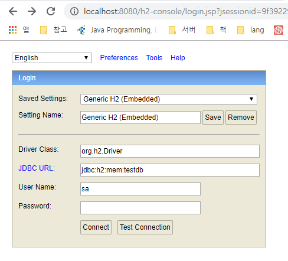
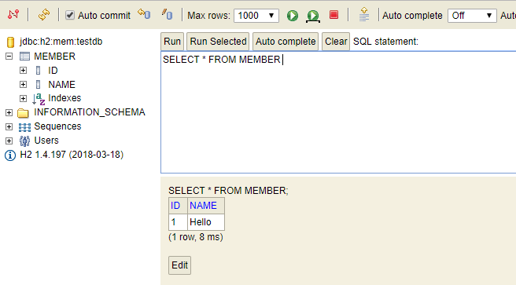
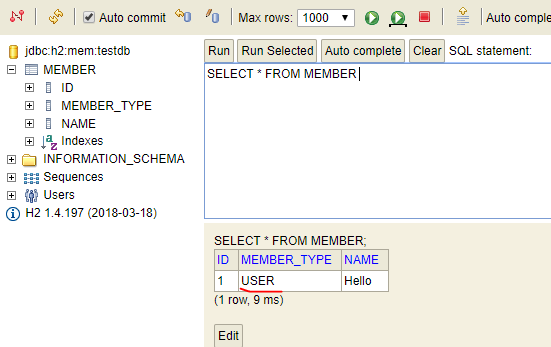
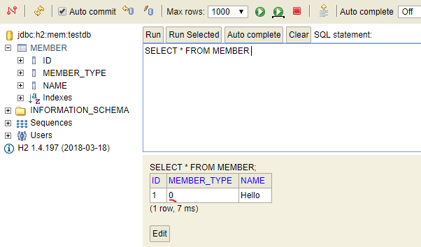
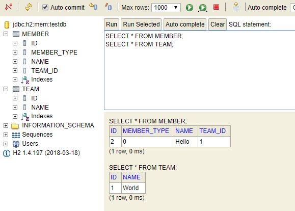

## Stream API

Stream API에 대한 자세한 정리 https://futurecreator.github.io/2018/08/26/java-8-streams/

1. 생성

주로 Collections의 stream()을 사용하여 생성한다.

https://docs.oracle.com/javase/8/docs/api/?java/util/Collection.html


```java
List<Integer> list = Arrays.asList(1,2,3,4,5,6,7,8,9,10);
Stream<Integer> stream = list.stream();
```

```java
Stream<Integer> IntStream.rangeClosed(1, 10); // 1 ~ 10 integer stream 생성
```

---

**for-each**

```java
List list = Arrays.asList(1,2,3,4,5,6,7,8,9,10);

for (int i = 0, loop = list.size(); i < loop; i++) {
    System.out.println(list.get(i));
}
```

```java
List<Integer> list = Arrays.asList(1,2,3,4,5,6,7,8,9,10);

// 1. 가장 스탠다드 케이스 (variable) -> { instructions.. }
list.stream().forEach((i) -> {
    System.out.println(i);
});

// 2. 변수가 하나면 ()가 필요 없습니다. (0개인 경우는 사용해야함)
list.stream().forEach(i -> {
    System.out.println(i);
});

// 3. 명령어가 한 줄 뿐이라면 {}가 필요 없습니다.
list.stream().forEach((i) -> System.out.println(i));

// 4. 2 + 3
list.stream().forEach(i -> System.out.println(i));

// 5. 사실 list는 forEach 사용할 때 stream()이 필요 없습니다.
list.forEach(i -> System.out.println(i));

// 6. 메서드를 파라미터로 넣을 수도 있습니다.
list.forEach(System.out::println);
```

2. 필터링

Stream의 filter를 통해 해당 stream의 요소들을 필터링할 수 있다.

```java
List<Integer> list = Arrays.asList(1,2,3,4,5,6,7,8,9,10);

for (int i = 0, loop = list.size(); i < loop; i++) {
    int num = list.get(i);

    if (num > 4) {
        System.out.println(num);
    }
}
```

```java
List<Integer> list = Arrays.asList(1,2,3,4,5,6,7,8,9,10);

// 1. 리턴 문이 있으면 {}를 써줘야 합니다.
list.stream()
    .filter(i -> {
        return i > 4;
    })
    .forEach(System.out::println);

// 2. 하지만 리턴 문이 한 줄이라면 아래와 같이 {}와 return 생략 가능합니다.
list.stream()
    .filter(i -> i > 4)
    .forEach(System.out::println);
```

3. 가공

Stream의 map을 통해 해당 stream의 요소들을 가공할 수 있다.

```java
List<Integer> list = Arrays.asList(1,2,3,4,5,6,7,8,9,10);

for (int i = 0, loop = list.size(); i < loop; i++) {
    System.out.println(i*2 + 100);
}
```

```java
List<Integer> list = Arrays.asList(1,2,3,4,5,6,7,8,9,10);

// 1. 리턴 문이 있으면 {}를 써줘야 합니다.
list.stream()
    .map(i -> {
        return i*2 + 100;
    })
    .forEach(System.out::println);

// 2. 하지만 리턴 문이 한 줄이라면 아래와 같이 {}와 return 생략 가능합니다.
list.stream()
    .map(i -> i*2 + 100)
    .forEach(System.out::println);
```

4. 결과 만들기

- List로 반환

```java
List<Integer> list = Arrays.asList(1,2,3,4,5,6,7,8,9,10);
list.stream().collect(Collectors.toList());
```

- 합 구하기
```java
List<Integer> list = Arrays.asList(1,2,3,4,5,6,7,8,9,10);
list.stream().mapToInt(Integer::intValue).sum();
```

- 최댓값 구하기
```java
List<Integer> list = Arrays.asList(1,2,3,4,5,6,7,8,9,10);
list.stream().max(Integer::compareTo).get();
```

5. 병렬 처리
```java
List<Integer> list = Arrays.asList(1,2,3,4,5,6,7,8,9,10);
list.parallelStream().forEach(System.out::println);
```

- **테스트**

> List<String> list = Arrays.asList("abc", "bbd", "adc", "abt", "acc", "tbe");
> 위 리스트에서 2번째 문자가 'b'인 문자열을 찾아 upper case로 변환 후 list에 담아라

람다를 사용하지 않은 경우

```java
List<String> list = Arrays.asList("abc", "bbd", "adc", "abt", "acc", "tbe");
List<String> collector = new ArrayList<>();

for (int i = 0, loop = list.size(); i < loop; i++) {
    String element = list.get(i);

    if ('b' == element.charAt(1)) {
        collector.add(element.toUpperCase());
    }
}
```

--- 

## Optional

null 일 수도 있는 객체를 null safe 하게 다룰 수 있게 해주는 API

```java
class PersonService {
    public Person getPerson(int i) {
        return (i < 4) ? null : new Person("Chris");
    }
}

@Data
@AllArgsConstructor
class Person {
    String name;
}
```

```java
Person person = personService.getPersonById(3); // null을 return 할 수도 있는 method

if (person.getName().equals("Chris")) { // warn : NPE 가능성 있음
    foo();
    bar();
}
```

```java
Person person = personService.getPersonById(3); // null을 return 할 수도 있는 method

// null 체크를 통한 NPE 방지
// 조건문을 한 줄로 만들 수 있지만 아래 같은 코드를 보는건 일상다반사라...
if (person != null) {
    
    if (person.getName().equals("Chris")) {
        foo();
        bar();
    }
}
```

```java
Person person = personService.getPerson(3);

String name = Optional.ofNullable(person)
        .map(Person::getName)
        .orElse("");

if (name.equals("Chris")) {
    foo();
    bar();
}
```

Optional이 null safe한 프로그래밍의 정답은 아니지만 null이 나올 수 있는 경우에 대해 다시 상기해줄 수 있으며
null이 가능한 객체의 메서드 체이닝에서 빛을 발한다.

```java
Person addressOfCTO = person.getCompany().getCTO().getAddress(); // NPE의 가능성이 매우 높음
```

```java
Person addressOfCTO = null;

// NPE를 방지하지만 너무 지저분함
if (person != null && person.getCompany() != null && person.getCompany().getCTO() != null) {
    addressOfCTO = person.getCompany().getCTO().getAddress();
} else {
    addressOfCTO = "Seoul";
}
```

```java
Person addressOfCTO = person
        .map(Person::getCompany)
        .map(Company::getCTO)
        .map(Person::getAddress)
        .orElse("Seoul");
```

---

## JPA 맛보기

MEMBER - TEAM

spring boot 프로젝트 생성

- dependency
    - H2
    - JPA
    - Web
    - Devtools

- application.properties : SQL문 보기 설정

spring.jpa.show-sql=true

- Member 생성

```java
package com.example.demo.domain;

import javax.persistence.Entity;
import javax.persistence.GeneratedValue;
import javax.persistence.Id;

@Entity
public class Member {
    @Id
    @GeneratedValue
    private Long id;
    private String name;

    public Long getId() {
        return id;
    }

    public void setId(Long id) {
        this.id = id;
    }

    public String getName() {
        return name;
    }

    public void setName(String name) {
        this.name = name;
    }
}

```

```java
package com.example.demo.repository;

import com.example.demo.domain.Member;
import org.springframework.data.jpa.repository.JpaRepository;

public interface MemberRepository extends JpaRepository<Member, Long> {
}
```

```java
package com.example.demo;

import com.example.demo.domain.Member;
import com.example.demo.repository.MemberRepository;
import org.springframework.beans.factory.annotation.Autowired;
import org.springframework.boot.CommandLineRunner;
import org.springframework.boot.SpringApplication;
import org.springframework.boot.autoconfigure.SpringBootApplication;
import org.springframework.context.annotation.Bean;

import javax.persistence.EntityManager;
import javax.persistence.EntityTransaction;

@SpringBootApplication
public class DemoApplication {

    public static void main(String[] args) {
        SpringApplication.run(DemoApplication.class, args);
    }

    @Autowired
    private MemberRepository memberRepository;

    // 앱이 실행되고 난 후 실행 됨
    @Bean
    public CommandLineRunner commandLineRunner() {
        return args -> {
            Member member = new Member();
            member.setName("Hello");

            memberRepository.save(member);
        };
    }
}
```

프로젝트 실행 후 /h2-console 접속하여 DB 확인





- Enum 필드

```java
package com.example.demo.domain.enums;

public enum  MemberType {
    USER, ADMIN
}
```

```java
package com.example.demo.domain;

import com.example.demo.domain.enums.MemberType;

import javax.persistence.*;

@Entity
public class Member {
    @Id
    @GeneratedValue
    private Long id;
    private String name;
    @Enumerated(EnumType.STRING)
    private MemberType memberType;

    public Long getId() {
        return id;
    }

    public void setId(Long id) {
        this.id = id;
    }

    public String getName() {
        return name;
    }

    public void setName(String name) {
        this.name = name;
    }

    public MemberType getMemberType() {
        return memberType;
    }

    public void setMemberType(MemberType memberType) {
        this.memberType = memberType;
    }
}
```

```java
package com.example.demo;

import com.example.demo.domain.Member;
import com.example.demo.domain.enums.MemberType;
import com.example.demo.repository.MemberRepository;
import org.springframework.beans.factory.annotation.Autowired;
import org.springframework.boot.CommandLineRunner;
import org.springframework.boot.SpringApplication;
import org.springframework.boot.autoconfigure.SpringBootApplication;
import org.springframework.context.annotation.Bean;

@SpringBootApplication
public class DemoApplication {

    public static void main(String[] args) {
        SpringApplication.run(DemoApplication.class, args);
    }

    @Autowired
    private MemberRepository memberRepository;

    @Bean
    public CommandLineRunner commandLineRunner() {
        return args -> {
            Member member = new Member();
            member.setName("Hello");
            member.setMemberType(MemberType.USER);

            memberRepository.save(member);
        };
    }
}
```

프로젝트 실행 후 /h2-console 접속하여 DB 확인



@Enumerated(EnumType.ORDINAL) 로 변경하면??



무엇을 사용해야 할까?

&rarr; Enum이 새로 추가 될 때 append 되지 않고 prepend 되면 순서가 변경된다 &rarr; 기대하는 값과 DB 값과의 불일치 발생 &rarr; STRING 권장 

- Team 생성 : 엔티티 생성 및 매핑

```java
package com.example.demo.domain;

import javax.persistence.Entity;
import javax.persistence.GeneratedValue;
import javax.persistence.Id;

@Entity
public class Team {
    @Id
    @GeneratedValue
    private Long id;
    private String name;

    public Long getId() {
        return id;
    }

    public void setId(Long id) {
        this.id = id;
    }

    public String getName() {
        return name;
    }

    public void setName(String name) {
        this.name = name;
    }
}
```

```java
package com.example.demo.repository;

import com.example.demo.domain.Team;
import org.springframework.data.jpa.repository.JpaRepository;

public interface TeamRepository extends JpaRepository<Team, Long> {
}
```

```java
package com.example.demo.domain;

import com.example.demo.domain.enums.MemberType;

import javax.persistence.*;

@Entity
public class Member {
    @Id
    @GeneratedValue
    private Long id;
    private String name;
    @Enumerated(EnumType.ORDINAL)
    private MemberType memberType;
    // 다수의 Member는 하나의 Team에 속해있다.
    @ManyToOne
    @JoinColumn(name = "TEAM_ID") // JOIN 용으로 사용되는 컬럼, DB에서는 team이 저장되는 것이 아니라 TEAM_ID로 저장됨
    private Team team;

    public Long getId() {
        return id;
    }

    public void setId(Long id) {
        this.id = id;
    }

    public String getName() {
        return name;
    }

    public void setName(String name) {
        this.name = name;
    }

    public MemberType getMemberType() {
        return memberType;
    }

    public void setMemberType(MemberType memberType) {
        this.memberType = memberType;
    }

    public Team getTeam() {
        return team;
    }

    public void setTeam(Team team) {
        this.team = team;
    }
}
```

```java
package com.example.demo;

import com.example.demo.domain.Member;
import com.example.demo.domain.Team;
import com.example.demo.domain.enums.MemberType;
import com.example.demo.repository.MemberRepository;
import com.example.demo.repository.TeamRepository;
import org.springframework.beans.factory.annotation.Autowired;
import org.springframework.boot.CommandLineRunner;
import org.springframework.boot.SpringApplication;
import org.springframework.boot.autoconfigure.SpringBootApplication;
import org.springframework.context.annotation.Bean;

@SpringBootApplication
public class DemoApplication {

    public static void main(String[] args) {
        SpringApplication.run(DemoApplication.class, args);
    }

    @Autowired
    private MemberRepository memberRepository;
    @Autowired
    private TeamRepository teamRepository;


    @Bean
    public CommandLineRunner commandLineRunner() {
        return args -> {
            Team team = new Team();
            team.setName("World");

            teamRepository.save(team);

            Member member = new Member();
            member.setName("Hello");
            member.setMemberType(MemberType.USER);
            member.setTeam(team);

            memberRepository.save(member);
        };
    }
}
```


