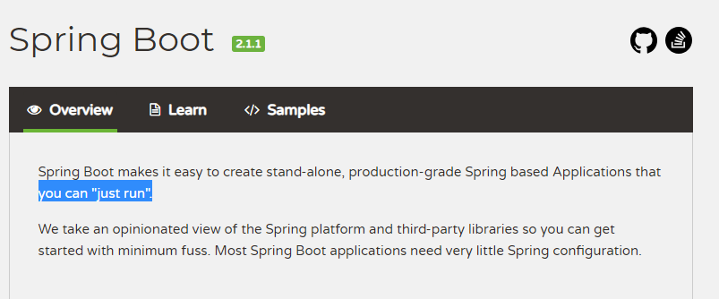
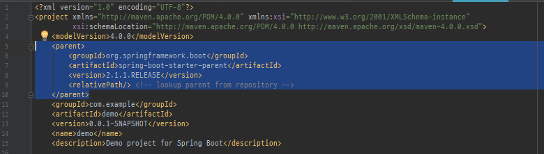
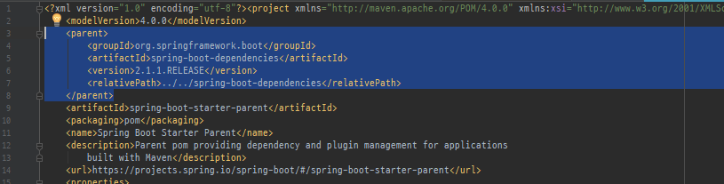
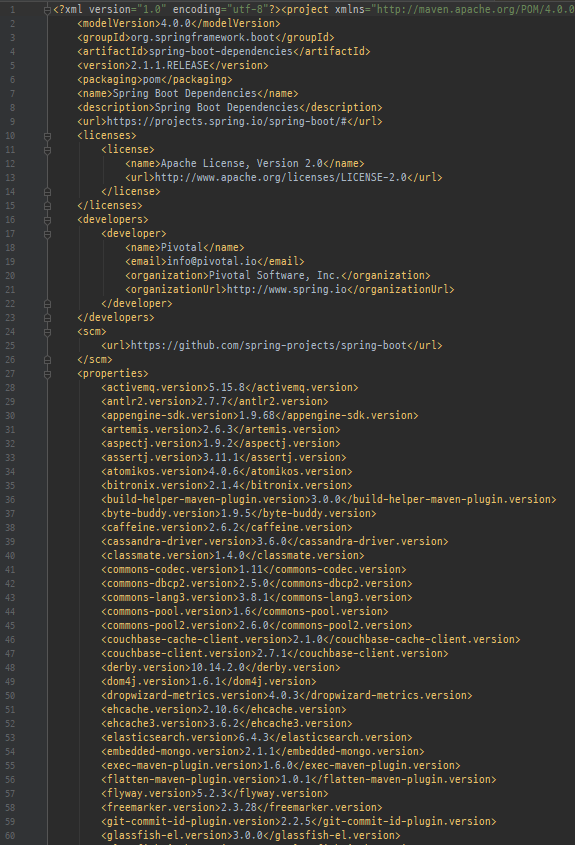
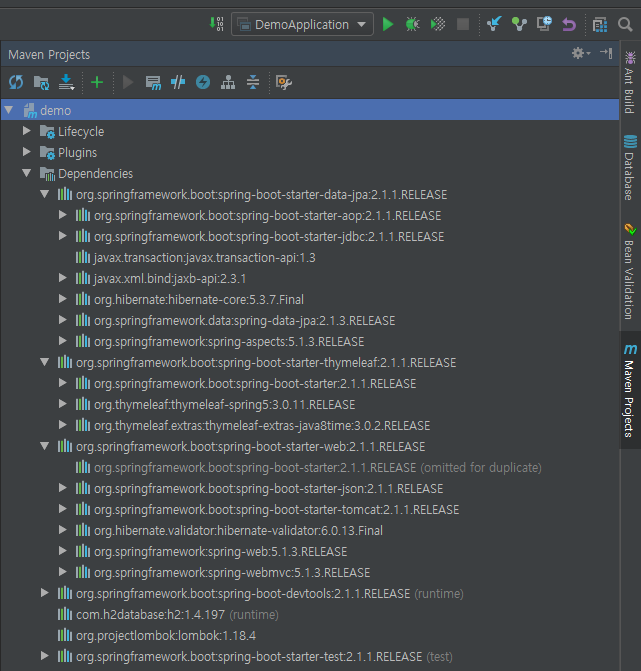
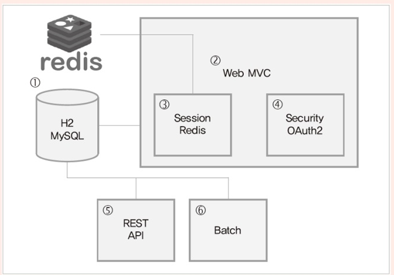

# 1. 스프링 부트 입문하기

**스프링 부트는 간단한 설정만으로도 빠르게 실행할 수 있다.**

Web application에서 스프링을 사용할 때는 Spring-Context에서 제공하는 DI 외에도 (library)
spring-security, spring-jdbc, spring-mvc와 같은 다양한 모듈의 설정을 적용 후 사용해야 한다.
이로 인해 스프링 설정 오류로 초반에 많은 시간을 허비하기도 한다. 

&rarr; *이런 문제를 해결하기 위해 스프링 부트를 만들었다*

기존 스프링을 사용할 때 dependency 추가를 할 때 해당 library 버전을 명시했지만. 스프링 부트를 사용할 때는 설정을 스프링 부트로 위임하고 버전 관리도 스프링 부트에 의해 관리된다.

**spring-boot-starter-parent, spring-boot-dependencies**

spring-boot-dependencies

**스프링부트의 특징**

- Embeded Tomcat, Jetty, Undertow를 사용하여 독립 실행이 가능한 스프링 app 개발
- 통합 starter를 제공하여 maven/gradle 구성 간소화
- starter를 통한 자동화된 스프링 설정 제공
- 번거로운 XML 설정을 요구하지 않음
- JAR를 사용하여 자바 옵션만으로도 배포 가능
- app의 모니터링과 관리를 위한 Spring Actuator 제공

**스프링 부트의 장 단점**

#### 장점

- 의존성 버전을 올리는 것이 수월하다 : boot 버전이 올라갈 때마다 각 버전 간의 호환성에 대해 충분한 테스트를 거치고 릴리즈되기 때문에 하나 씩 수동으로 버전을 관리할 때에 비해 안정적이다.
- 특정 라이브러리에 버그가 있어도 스프링팀이 버그를 고친 버전을 받기 편리함
- 복잡한 세부 설정없이 properties나 어노테이션으로 원하는 기능을 빠르게 적용할 수 있다.
- 별도의 외장 톰캣이 필요가 없고 톰캣 버전도 위와 같은 이유로 편리하게 관리 가능

#### 단점

- 설정을 커스터마이징하면 기존 스프링을 쓸때와 동일한 불편함을 겪을 수 있다.
- 특정 설정을 변경하고 싶다면 내부 설정 코드를 뜯어봐야한다.
- 자동 설정이 자신이 원하지 않는 기능일 수 있다. (e.g. JPA ddl 설정)

---

## 스프링 부트 스타터

- 스프링 부트 내부 의존성 확인

또는

https://docs.spring.io/spring-boot/docs/current/reference/htmlsingle/#using-boot-starter

- 스프링 부트 github wiki

https://github.com/spring-projects/spring-boot/wiki

---

## 앞으로 만들 커뮤니티 게시판 설계

1. 데이터 저장 RDB (H2 or MySQL)
2. Web MVC : 기본 커뮤니티 페이지
3. Session 관리용 Redis
4. Security, OAuth2 : 회원 인증 및 권한
5. Data REST : REST API 구현
6. Batch : 주기적인 Back End 작업
