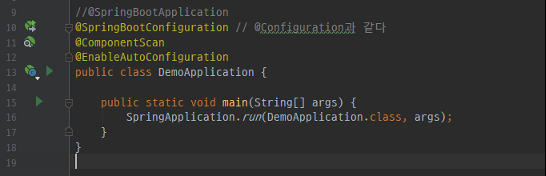

# 2. 스프링 부트 환경 설정

## 스프링 부트 시작하기

web만 의존성 체크후 Next

auto-import를 하지 않으면 gradle.build가 변경되도 자동으로 빌드가 안됨 : 개인 취향대로 설정

### boot 버전은 2.1.x 대가 최신이기 이지만 책에서 사용하는 2.0.3 버전을 사용한다.

- 프로젝트 실행 세팅

- 스프링 부트 플러그인 추가 : 해당 설정으로 세팅

---

## 그레이들 (Gradle)

1. 그레이들 Wrapper

Spring Boot 프로젝트를 생성하면 gradle-wrapper에 의해 해당 프로젝트에 그레이들이 자동으로 설치된다.

2. 그레이들 멀티 프로젝트 구성
: 멀티 프로젝트를 구성하면 코드 재사용성이 높아지고 한 서비스에 관련된 여러 프로젝트를 마치 하나의 통합 프로젝트 처럼 관리할 수 있다.

- 먼저 setting.gradle에 다음과 같이 루트 프로젝트를 추가한다.

- 테스트로 사용할 demo-web 모듈 생성

add &rarr; module

gradle에 Java 체크 후 Next

demo-web 추가 : 아래 같이 세팅 후 next &rarr; finish

그러면 이렇게 build.gradle 파일만 존재한다.

좀만 기다리면 소스 디렉토리도 생성된다.

settings.gradle 파일에 include 되있음을 확인

- demo-domain 모듈 생성도 같은 순서로 진행

---

## 자동설정 이해하기

스프링 부트 프로젝트를 실행하면 여러 설정이 콘솔에 뜬다.

&rarr; @SpringBootApplication의 @EnableAutoConfiguration 때문이다.

org.springframework.boot.autoconfigure.EnableAutoConfiguration의 spring.factories 파일

: EnableAutoConfiguration key값에 해당되는 클래스들이 bean으로 등록되어 적용된다.

