# 3. 스프링 부트 테스트

## 시작에 앞서
- TDD란?


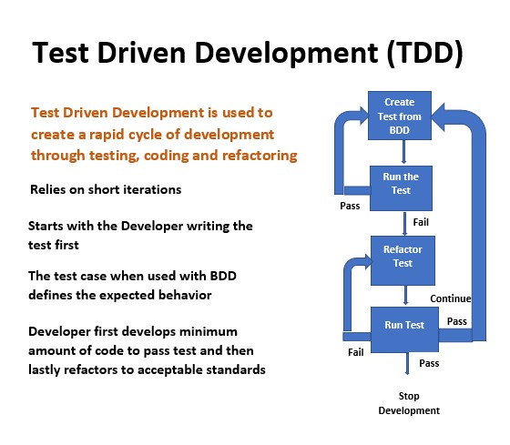

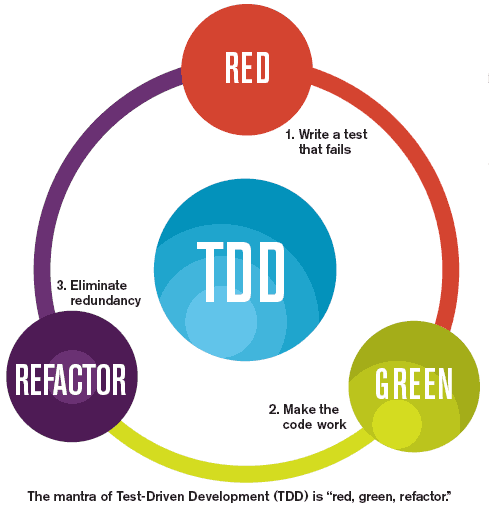

우선 개발자는 바라는 향상 또는 새로운 함수를 정의하는 (초기적 결함을 점검하는) 자동화된 테스트 케이스를 작성한다. 그런 후에, 그 케이스를 통과하기 위한 최소한의 양의 코드를 생성한다. 그리고 마지막으로 그 새 코드를 표준에 맞도록 리팩토링한다. 

- TDD를 통해 작동하는 깔끔한 코드 (Clean code that works)를 얻을 수 있다.

- 객체가 이미 존재한다고 가정하고 객체에게 어떤 메시지를 전송할 것인지에 관해 먼저 생각하라고 충고한다.

- 단순히 테스트를 작성하는 것이 아니라 책임을 수행하 객체 또는 클라이언트가 기대하는 객체의 역할이 메시지를 수신할 때 어떤 결과를 반환하고 그 광정에서 어떤 객체와 협력할 것인지에 대한 기대를 코드 형태로 작성하는 것이다.

---
여러 테스트를 하기 위해 미리 설정해 놓은 dependency

```xml
<?xml version="1.0" encoding="UTF-8"?>
<project xmlns="http://maven.apache.org/POM/4.0.0" xmlns:xsi="http://www.w3.org/2001/XMLSchema-instance"
         xsi:schemaLocation="http://maven.apache.org/POM/4.0.0 http://maven.apache.org/xsd/maven-4.0.0.xsd">
    <modelVersion>4.0.0</modelVersion>
    <parent>
        <groupId>org.springframework.boot</groupId>
        <artifactId>spring-boot-starter-parent</artifactId>
        <version>2.1.1.RELEASE</version>
        <relativePath/> <!-- lookup parent from repository -->
    </parent>
    <groupId>com.example</groupId>
    <artifactId>demo</artifactId>
    <version>0.0.1-SNAPSHOT</version>
    <name>demo</name>
    <description>Demo project for Spring Boot</description>

    <properties>
        <java.version>1.8</java.version>
    </properties>

    <dependencies>
        <dependency>
            <groupId>org.springframework.boot</groupId>
            <artifactId>spring-boot-starter-data-jpa</artifactId>
        </dependency>
        <dependency>
            <groupId>org.springframework.boot</groupId>
            <artifactId>spring-boot-starter-web</artifactId>
        </dependency>

        <dependency>
            <groupId>com.h2database</groupId>
            <artifactId>h2</artifactId>
            <scope>runtime</scope>
        </dependency>
        <dependency>
            <groupId>org.projectlombok</groupId>
            <artifactId>lombok</artifactId>
            <optional>true</optional>
        </dependency>
        <dependency>
            <groupId>org.springframework.boot</groupId>
            <artifactId>spring-boot-starter-test</artifactId>
            <scope>test</scope>
        </dependency>
    </dependencies>

    <build>
        <plugins>
            <plugin>
                <groupId>org.springframework.boot</groupId>
                <artifactId>spring-boot-maven-plugin</artifactId>
            </plugin>
        </plugins>
    </build>

</project>

```

---

## @SpringBootTest
**통합** 테스트를 제공하는 기본적인 스프링 부트 테스트 어노테이션

실제 구동되는 애플리케이션과 똑같이 애플리케이션 컨텍스트를 로드하여 테스트하기 때문에 하고 싶은 테스트를 모두 수행할 수 있지만 빈들을 모두 로드하기 때문에 느려진다. &rarr; 단위테스트에서 사용 X

기본적으로 스프링부트 프로졕트 생성시 생성돼 있음

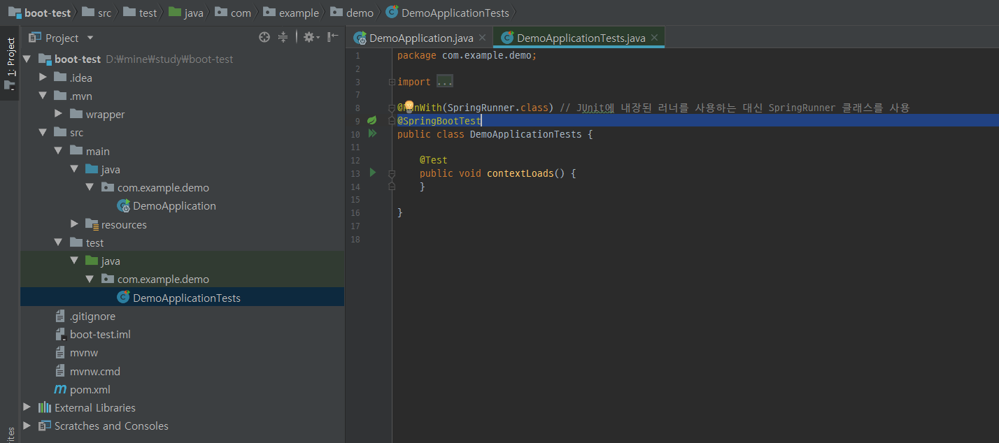

@Runwith(SpringRunner.class)
: JUnit에 내장된 러너를 사용하는 대신 SpringRunner 클래스를 사용

alt + enter로 hamcrest assertThat static import
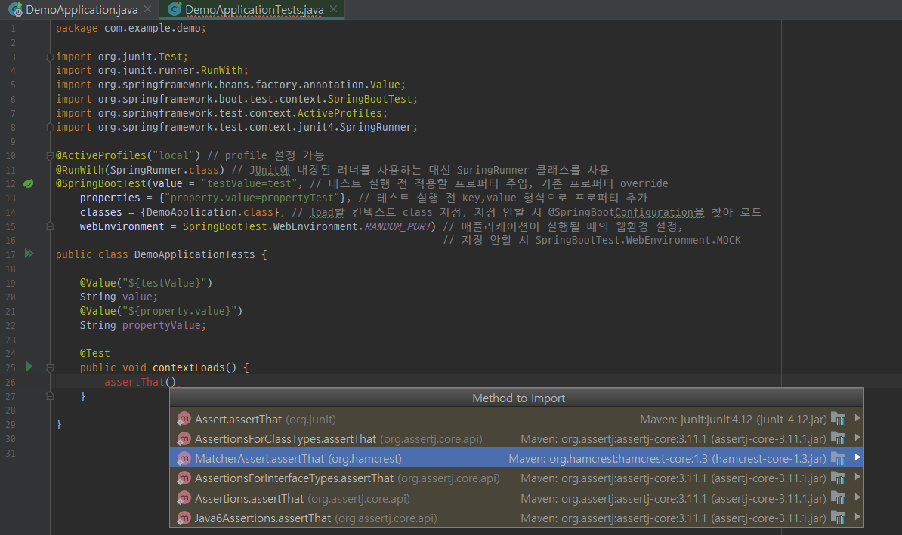

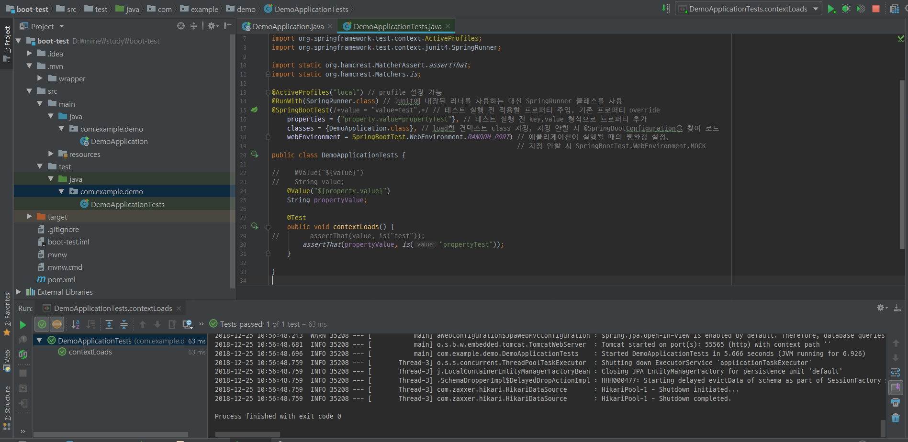


개인적으로 테스트 했을 때 value랑 properties랑 같이 할 수 없었음

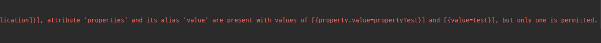

---

## @WebMvcTest

MockMvc를 이용한 테스트

webmvc 패키지에 Book, BookController 클래스를 만들고 BookService interface를 생성함

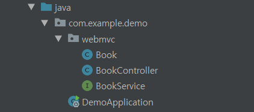

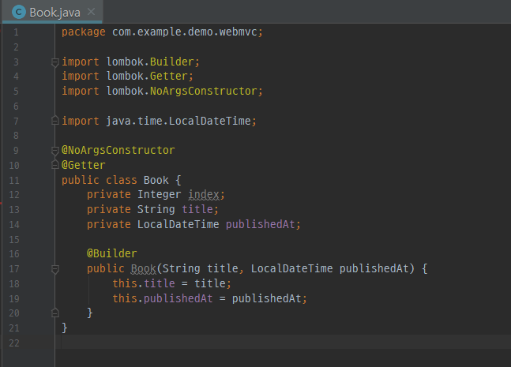

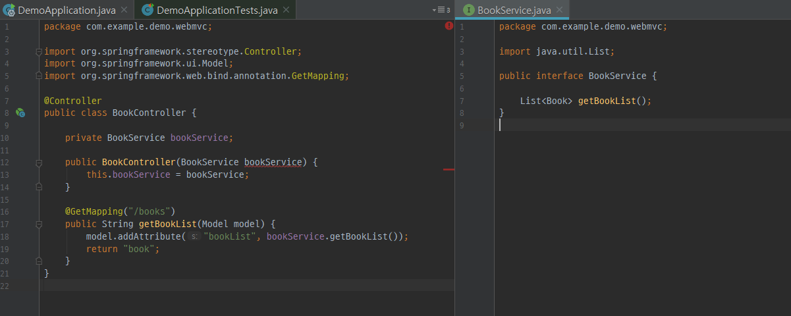

```java
import org.junit.Test;
import org.junit.runner.RunWith;
import org.springframework.beans.factory.annotation.Autowired;
import org.springframework.boot.test.autoconfigure.web.servlet.WebMvcTest;
import org.springframework.boot.test.mock.mockito.MockBean;
import org.springframework.test.context.junit4.SpringRunner;
import org.springframework.test.web.servlet.MockMvc;

import java.time.LocalDateTime;
import java.util.Collections;

import static org.hamcrest.Matchers.contains;
import static org.mockito.BDDMockito.given;
import static org.mockito.Mockito.when;
import static org.springframework.test.web.servlet.request.MockMvcRequestBuilders.get;
import static org.springframework.test.web.servlet.result.MockMvcResultMatchers.model;
import static org.springframework.test.web.servlet.result.MockMvcResultMatchers.status;
import static org.springframework.test.web.servlet.result.MockMvcResultMatchers.view;

@RunWith(SpringRunner.class)
@WebMvcTest(BookController.class) // 테스트할 Controller 지정
public class BookControllerTest {
    @Autowired
    MockMvc mockMvc;

    @MockBean
    private BookService bookService;

    @Test
    public void book_mvc_mock_테스트() throws Exception {
        Book book = Book.builder()
                .title("Hello World")
                .publishedAt(LocalDateTime.now())
                .build();

        // bookService.getBookList()를 호출하면 Collections.singletonList(book)를 리턴하도록 지정
        given(bookService.getBookList()).willReturn(Collections.singletonList(book));
//      when(bookService.getBookList()).thenReturn(Collections.singletonList(book)); // given과 결과는 같다

        mockMvc.perform(get("/books")) // /books로 get 요청
                .andExpect(status().isOk()) // 상태 200 (ok)
                .andExpect(view().name("book")) // view name은 book
                .andExpect(model().attributeExists("bookList")) // model attribute로 bookList 포함
                .andExpect(model().attribute("bookList", contains(book))); // model attribute의 bookList에 book 포함 확인
    }
}

```

주입된 MockMvc는 컨트롤러 테스트 시 모든 의존성을 로드하는 것이 아닌
BookController 관련 빈만 로드하여 가벼운 MVC 테스트를 수행한다.
위 예제는 MockMvc를 주입시켰기 때문에 전체 HTTP 서버를 실행하지 않고 테스트할 수 있다.

**green**

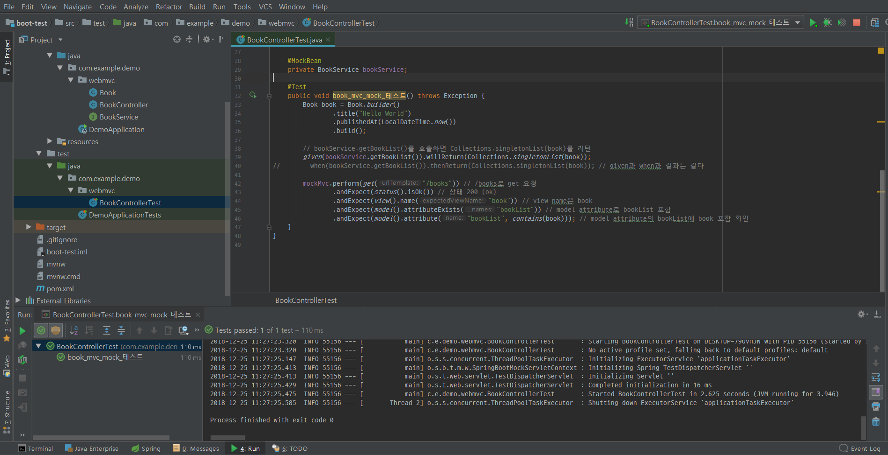

---

## @DataJpaTest

JPA관련 테스트 설정만 로드한다.
또한 내장형 데이터베이스를 사용하여 실제 데이터베이스를 사용하지 않고 테스트 데이터베이스로 테스할 수 있다.

jpa 패키지에 Phone, PhoneRepository 클래스를 생성함

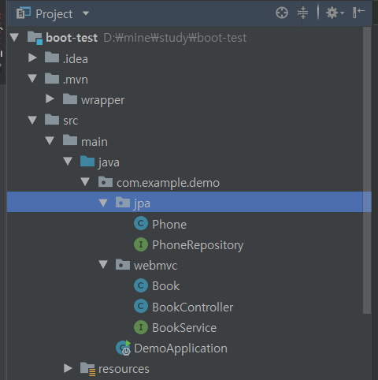

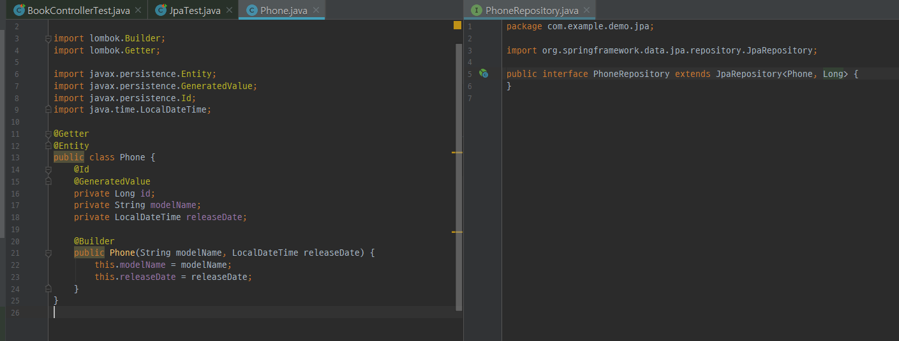

```java
import org.hamcrest.collection.IsEmptyCollection;
import org.junit.Test;
import org.junit.runner.RunWith;
import org.springframework.beans.factory.annotation.Autowired;
import org.springframework.boot.test.autoconfigure.jdbc.AutoConfigureTestDatabase;
import org.springframework.boot.test.autoconfigure.orm.jpa.DataJpaTest;
import org.springframework.test.context.ActiveProfiles;
import org.springframework.test.context.junit4.SpringRunner;

import java.time.LocalDateTime;
import java.util.Arrays;
import java.util.List;

import static org.hamcrest.MatcherAssert.assertThat;
import static org.hamcrest.Matchers.contains;
import static org.hamcrest.Matchers.hasSize;
import static org.hamcrest.Matchers.not;
import static org.hamcrest.core.Is.is;

@RunWith(SpringRunner.class)
@DataJpaTest // 테스트 끝날 때마다 자동으로 데이터 롤백
@ActiveProfiles("local")
@AutoConfigureTestDatabase(replace = AutoConfigureTestDatabase.Replace.NONE) // 사용자가 지정한 데이터소스 사용
//@AutoConfigureTestDatabase(replace = AutoConfigureTestDatabase.Replace.ANY) // 기본 내장 데이터소스 사용

public class JpaTest {

    @Autowired PhoneRepository phoneRepository;

    static final String PHONE_MODEL_NAME = "galaxy";

    @Test
    public void Phone_저장_테스트() {
        Phone phone = Phone.builder()
                .modelName(PHONE_MODEL_NAME)
                .releaseDate(LocalDateTime.now())
                .build();

        phoneRepository.save(phone);

        assertThat(phoneRepository.getOne(phone.getId()), is(phone));
    }

    @Test
    public void PhoneList_저장_후_검색_테스트() {
        Phone phone1 = new Phone(PHONE_MODEL_NAME + "1", LocalDateTime.now());
        Phone phone2 = new Phone(PHONE_MODEL_NAME + "2", LocalDateTime.now());
        Phone phone3 = new Phone(PHONE_MODEL_NAME + "3", LocalDateTime.now());

        phoneRepository.save(phone1);
        phoneRepository.save(phone2);
        phoneRepository.save(phone3);

        List<Phone> phoneList = phoneRepository.findAll();
        assertThat(phoneList, hasSize(3));
        assertThat(phoneList, contains(phone1, phone2, phone3));
    }

    @Test
    public void PhoneList_저장_후_삭제_테스트() {
        Phone phone1 = new Phone(PHONE_MODEL_NAME + "1", LocalDateTime.now());
        Phone phone2 = new Phone(PHONE_MODEL_NAME + "2", LocalDateTime.now());
        Phone phone3 = new Phone(PHONE_MODEL_NAME + "3", LocalDateTime.now());

        phoneRepository.save(phone1);
        phoneRepository.save(phone2);
        phoneRepository.save(phone3);

        phoneRepository.delete(phone1);


        List<Phone> phoneList = phoneRepository.findAll();
        assertThat(phoneList, hasSize(2));
        assertThat(phoneList, not(contains(phone1)));
        assertThat(phoneList, contains(phone2, phone3));

        phoneRepository.deleteAll();
        assertThat(phoneRepository.findAll(), IsEmptyCollection.empty());
    }

}

```

---

## @RestClientTest

REST 관련 테스트를 도와주는 어노테이션
REST 통신 데이터형으로 사용되는 JSON 형식이 예상대로 응답을 반환하는지 등을 테스트할 수 있다.

내가 이해를 못하고 왜 쓰는지 이유를 모르겠어서 추가하지 않음

---

## @JsonTest

JSON의 serialization과 deserialization을 수행하는 라이브러리인 GSON과 Jackson의 테스트를 제공

resources에 test.json 파일 추가

```json
{"index": null, "title": "스프링 부트", "publishedAt": null}
```

테스트 코드

```java
import com.example.demo.webmvc.Book;
import org.assertj.core.api.Assertions;
import org.junit.Test;
import org.junit.runner.RunWith;
import org.springframework.beans.factory.annotation.Autowired;
import org.springframework.boot.test.autoconfigure.json.JsonTest;
import org.springframework.boot.test.json.JacksonTester;
import org.springframework.test.context.junit4.SpringRunner;

import java.io.IOException;

import static org.hamcrest.MatcherAssert.assertThat;
import static org.hamcrest.Matchers.is;
import static org.hamcrest.Matchers.nullValue;

@RunWith(SpringRunner.class)
@JsonTest
public class SpringJsonTest {

    @Autowired
    private JacksonTester<Book> jacksonTester;

    @Test
    public void json_파싱_테스트() throws IOException {
        Book book = Book.builder()
                .title("스프링 부트")
                .build();

        String content = "{\"title\": \"스프링 부트\"}";
        Book bookFromJson = jacksonTester.parseObject(content);

        assertThat(bookFromJson.getTitle(), is(book.getTitle())) ;
        assertThat(bookFromJson.getPublishedAt(), nullValue());

        Assertions.assertThat(jacksonTester.write(book)).isEqualTo("/test.json"); // test.json과 같은지 확인
        Assertions.assertThat(jacksonTester.write(book)).hasJsonPathStringValue("title"); // key 중 title이 있는지 확인
        Assertions.assertThat(jacksonTester.write(book))
                .extractingJsonPathStringValue("title")
                .isEqualTo("스프링 부트"); // title의 value가 스프링 부트 인지 확인
    }
}

```