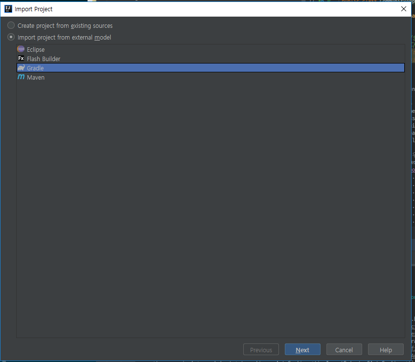
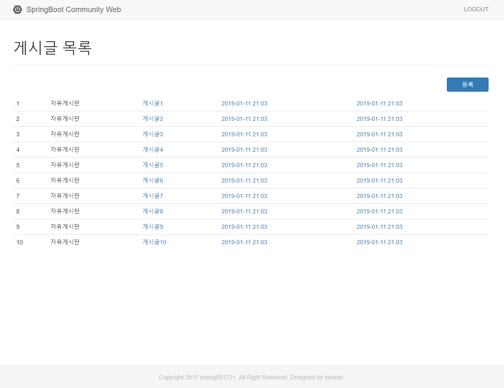

# 4. 스프링 부트 웹

## 커뮤니티 게시판 설계


## 프로젝트 생성

1. 의존성 구성


- project import




책에서는 2.0.3 으로 진행하기 때문에 Spring Boot 버전 2.0.3.RELEASE로 변경한다.

build.gradle 설명

```gradle
// 스크립트에 version, 저장소, 의존 라이브러리를 설정
buildscript {
    ext {
        springBootVersion = '2.0.3.RELEASE'
    }
    repositories {
        mavenCentral()
    }
    dependencies {
        classpath("org.springframework.boot:spring-boot-gradle-plugin:${springBootVersion}")
    }
}

// 필요 플러그인 적용
apply plugin: 'java'
apply plugin: 'eclipse'
apply plugin: 'org.springframework.boot'
apply plugin: 'io.spring.dependency-management' // 종속성 관리 플러그인

group = 'com.community'
version = '0.0.1-SNAPSHOT'
sourceCompatibility = 1.8

repositories {
    mavenCentral()
}

// 프로젝트에서 사용할 라이브러리 의존성 설정
dependencies {
    implementation('org.springframework.boot:spring-boot-starter-data-jpa')
    implementation('org.springframework.boot:spring-boot-starter-thymeleaf')
    implementation('org.springframework.boot:spring-boot-starter-web')
    runtimeOnly('org.springframework.boot:spring-boot-devtools')
    runtimeOnly('com.h2database:h2')
    compileOnly('org.projectlombok:lombok')
    testImplementation('org.springframework.boot:spring-boot-starter-test')
}
```

---

### lombok 사용을 위한 플러그인 및 setting


---

2. spring-starter-web 살펴 보기

https://github.com/spring-projects/spring-boot/blob/v2.0.3.RELEASE/spring-boot-project/spring-boot-starters/spring-boot-starter-web/pom.xml

```xml
<?xml version="1.0" encoding="UTF-8"?>
<project xmlns="http://maven.apache.org/POM/4.0.0" xmlns:xsi="http://www.w3.org/2001/XMLSchema-instance"
	xsi:schemaLocation="http://maven.apache.org/POM/4.0.0 http://maven.apache.org/xsd/maven-4.0.0.xsd">
    <modelVersion>4.0.0</modelVersion>
    <parent>
        <groupId>org.springframework.boot</groupId>
        <artifactId>spring-boot-starters</artifactId>
        <version>${revision}</version>
    </parent>
    <artifactId>spring-boot-starter-web</artifactId>
    <name>Spring Boot Web Starter</name>
    <description>Starter for building web, including RESTful, applications using Spring
        MVC. Uses Tomcat as the default embedded container</description>
    <properties>
        <main.basedir>${basedir}/../../..</main.basedir>
    </properties>
	<dependencies>
        <!-- 스프링 부트를 시작하는 기본적인 설정이 담긴 스타터 -->
        <dependency>
            <groupId>org.springframework.boot</groupId>
            <artifactId>spring-boot-starter</artifactId>
        </dependency>
        <!-- jackson 라이브러리 -->
        <dependency>
            <groupId>org.springframework.boot</groupId>
            <artifactId>spring-boot-starter-json</artifactId>
        </dependency>
        <!-- embedded tomcat -->
        <dependency>
            <groupId>org.springframework.boot</groupId>
            <artifactId>spring-boot-starter-tomcat</artifactId>
        </dependency>
        <!-- 어노테이션 기반의 표준화된 제약 조건 & 유효성 검사 규칙 표현 라이브러리 -->
        <dependency>
            <groupId>org.hibernate.validator</groupId>
            <artifactId>hibernate-validator</artifactId>
        </dependency>
        <!-- HTTP core, Servlet 등 web 관련 기능이 포함된 라이브러리 -->
        <dependency>
            <groupId>org.springframework</groupId>
            <artifactId>spring-web</artifactId>
        </dependency>
        <!-- Dispatcher 기반의 라이브러리 -->
        <dependency>
            <groupId>org.springframework</groupId>
            <artifactId>spring-webmvc</artifactId>
        </dependency>
    </dependencies>
</project>
```

---

3. 도메인 매핑

repository -> DB -> repository 데이터 처리 흐름


- User entity 생성

```java
package com.community.web.domain;

import lombok.Builder;
import lombok.Getter;
import lombok.NoArgsConstructor;

import javax.persistence.Entity;
import javax.persistence.GeneratedValue;
import javax.persistence.GenerationType;
import javax.persistence.Id;
import java.io.Serializable;
import java.time.LocalDateTime;

@Getter
@NoArgsConstructor
@Entity
public class User implements Serializable {
    @Id
    @GeneratedValue(strategy = GenerationType.IDENTITY) // IDENTITY: 키 생성을 DB에 위임
    private Long index;
    private String name;
    private String password;
    private String email;
    // LocalDateTime: 1.8부터 추가된 API로 Date, Calendar에서 부실한 날짜 연산기능을 추가로 제공
    private LocalDateTime createdDate;
    private LocalDateTime updatedDate;
    
    @Builder
    public User(String name, String password, String email, LocalDateTime createdDate, LocalDateTime updatedDate) {
        this.name = name;
        this.password = password;
        this.email = email;
        this.createdDate = createdDate;
        this.updatedDate = updatedDate;
    }
}
```

- BoardType enum 생성

```java
package com.community.web.domain.enums;

import lombok.Getter;

@Getter
public enum BoardType {
    notice("공지사항"),
    free("자유게시판");

    private String value;

    BoardType(String value) {
        this.value = value;
    }
}
```

- Board entity 생성

```java
package com.community.web.domain;

import com.community.web.domain.enums.BoardType;
import lombok.Builder;
import lombok.Getter;
import lombok.NoArgsConstructor;

import javax.persistence.*;
import java.io.Serializable;
import java.time.LocalDateTime;

@Getter
@NoArgsConstructor
@Entity
public class Board implements Serializable {
    @Id
    @GeneratedValue(strategy = GenerationType.IDENTITY) // IDENTITY: 키 생성을 DB에 위임
    private Long index;
    private String title;
    private String subTitle;
    private String content;
    @Enumerated(EnumType.STRING) //EnumType.ORDINAL은 enum의 순번으로 저장, String은 해당 enum 그대로 저장
    private BoardType boardType;
    // LocalDateTime: 1.8부터 추가된 API로 Date, Calendar에서 부실한 날짜 연산기능을 추가로 제공
    private LocalDateTime createdDate;
    private LocalDateTime updatedDate;

    @OneToOne(fetch = FetchType.LAZY) // fetch: 가지고오다, EAGER: DB에서 조회 시 바로 User 객체를 가져옴, LAZY: 조회 후 객체를 사용할 시에 가져옴
    private User user; // 실제 User 객체가 DB에 저장되는 것이 아닌 User의 ID(여기서는 index)가 record에 저장된다.

    @Builder
    public Board(String title, String subTitle, String content, BoardType boardType, LocalDateTime createdDate, LocalDateTime updatedDate, User user) {
        this.title = title;
        this.subTitle = subTitle;
        this.content = content;
        this.boardType = boardType;
        this.createdDate = createdDate;
        this.updatedDate = updatedDate;
        this.user = user;
    }
}
```

- Repository 생성

```java
package com.community.web.repository;

import com.community.web.domain.User;
import org.springframework.data.jpa.repository.JpaRepository;

import java.util.Optional;

public interface UserRepository extends JpaRepository<User, Long> {
    public Optional<User> findByEmail(String email);
}
```

```java
package com.community.web.repository;

import com.community.web.domain.Board;
import com.community.web.domain.User;
import org.springframework.data.jpa.repository.JpaRepository;

import java.util.Optional;

public interface BoardRepository extends JpaRepository<Board, Long> {
    public Optional<Board> findByUser(User user);
}
```

---

4. 도메인 테스트

```java
package com.community.web.domain;

import com.community.web.domain.enums.BoardType;
import com.community.web.repository.BoardRepository;
import com.community.web.repository.UserRepository;
import org.junit.Before;
import org.junit.Test;
import org.junit.runner.RunWith;
import org.springframework.beans.factory.annotation.Autowired;
import org.springframework.boot.test.autoconfigure.orm.jpa.DataJpaTest;
import org.springframework.test.context.junit4.SpringRunner;

import java.time.LocalDateTime;

import static org.hamcrest.MatcherAssert.assertThat;
import static org.hamcrest.Matchers.notNullValue;
import static org.hamcrest.core.Is.is;

@RunWith(SpringRunner.class)
@DataJpaTest
public class JpaMappingTest {
    private final String titleForTest = "게시판 테스트";
    private final String emailForTest = "tester@gmail.com";

    @Autowired UserRepository userRepository;
    @Autowired BoardRepository boardRepository;

    @Before
    public void init() {
        User chris = userRepository.save(User.builder()
                .name("Chris")
                .password("test1234!@")
                .email(emailForTest)
                .createdDate(LocalDateTime.now())
                .build());

        boardRepository.save(Board.builder()
                .title(titleForTest)
                .subTitle("부제 : 게시판 테스트")
                .content("테스트 중 입니다.")
                .boardType(BoardType.free)
                .createdDate(LocalDateTime.now())
                .user(chris)
                .build());
    }

    @Test
    public void User_와_Board_DB_저장_확인() {
        User user = userRepository.findByEmail(emailForTest).orElse(null);

        assertThat(user, notNullValue());
        assertThat(user.getName(), is("Chris"));
        assertThat(user.getPassword(), is("test1234!@"));
        assertThat(user.getEmail(), is(emailForTest));

        Board board = boardRepository.findByUser(user).orElse(null);

        assertThat(board, notNullValue());
        assertThat(board.getTitle(), is(titleForTest));
        assertThat(board.getSubTitle(), is("부제 : 게시판 테스트"));
        assertThat(board.getContent(), is("테스트 중 입니다."));
        assertThat(board.getBoardType(), is(BoardType.free));
    }
}
```


---

5. MVC 구조 잡기

- BoardService 생성

```java
package com.community.web.service;

import com.community.web.domain.Board;
import com.community.web.repository.BoardRepository;
import org.springframework.data.domain.Page;
import org.springframework.data.domain.PageRequest;
import org.springframework.data.domain.Pageable;
import org.springframework.stereotype.Service;

import java.util.Optional;

@Service
public class BoardService {

    private final BoardRepository boardRepository;

    public BoardService(BoardRepository boardRepository) {
        this.boardRepository = boardRepository;
    }

    /**
     * Pageable을 사용하여 해당 페이지에 해당하는 Board를 가져옴
     * @param pageable
     * @return
     */
    public Page<Board> findBoardList(Pageable pageable) {
        int pageNumber = pageable.getPageNumber() <= 0 ? 0 : pageable.getPageNumber() - 1;
        pageable = PageRequest.of(pageNumber, pageable.getPageSize());

        return boardRepository.findAll(pageable);
    }

    public Optional<Board> findBoardByIndex(Long index) {
        return boardRepository.findById(index);
    }
}
```

- BoardController 생성

```java
package com.community.web.controller;

import com.community.web.domain.Board;
import com.community.web.service.BoardService;
import org.springframework.data.domain.Page;
import org.springframework.data.domain.Pageable;
import org.springframework.data.web.PageableDefault;
import org.springframework.stereotype.Controller;
import org.springframework.ui.Model;
import org.springframework.web.bind.annotation.GetMapping;
import org.springframework.web.bind.annotation.RequestMapping;
import org.springframework.web.bind.annotation.RequestParam;

@Controller
@RequestMapping("/board")
public class BoardController {
    private final BoardService boardService;

    public BoardController(BoardService boardService) {
        this.boardService = boardService;
    }

    @GetMapping({"", "/"})
    public String board(@RequestParam(value = "index", defaultValue = "0") Long index,
                        Model model) {
        Board board = boardService.findBoardByIndex(index).orElse(null);
        model.addAttribute("board", board);

        return "board/form";
    }

    @GetMapping("/list")
    public String list(@PageableDefault Pageable pageable, Model model) { // Pageable 필드 디버깅으로 확인
        Page<Board> boardList = boardService.findBoardList(pageable);
        model.addAttribute("boardList", boardList);

        return "board/list"; // resources/templates/ + board/list + .html
    }
}
```

### ※ 왜 @Autowired를 안쓰고 Constructor인가 ??

- 의존성이 명확하다.
- 의존성을 final로 설정가능하다. (견고하고 thread-safe함)
- 의존성 설정을 위해 reflection이 필요없다.

https://stackoverflow.com/questions/40620000/spring-autowire-on-properties-vs-constructor

---

6. CommandLineRunner를 사용하여 DB에 데이터 넣기

```java
package com.community;

import com.community.web.domain.Board;
import com.community.web.domain.User;
import com.community.web.domain.enums.BoardType;
import com.community.web.repository.BoardRepository;
import com.community.web.repository.UserRepository;
import org.springframework.boot.CommandLineRunner;
import org.springframework.boot.SpringApplication;
import org.springframework.boot.autoconfigure.SpringBootApplication;
import org.springframework.context.annotation.Bean;

import java.time.LocalDateTime;
import java.util.stream.IntStream;

@SpringBootApplication
public class CommunityApplication {

    public static void main(String[] args) {
        SpringApplication.run(CommunityApplication.class, args);
    }

    /**
        * App이 실행되고 실행되는 method
        * DB에 정보를 넣는다.
        * @param userRepository
        * @param boardRepository
        * @return
        */
    @Bean
    public CommandLineRunner commandLineRunner(UserRepository userRepository, BoardRepository boardRepository) {
        return (args) -> {
            User chris = userRepository.save(User.builder()
                    .name("Chris")
                    .password("test1234!@")
                    .email("chris@naver.com")
                    .createdDate(LocalDateTime.now())
                    .build());

            // Paging을 위해 200개의 데이터를 넣는다.
            IntStream.rangeClosed(1, 200).forEach(index -> {
                boardRepository.save(Board.builder()
                        .title("게시글" + index)
                        .subTitle("순서" + index)
                        .content("테스트" + index)
                        .boardType(BoardType.free)
                        .createdDate(LocalDateTime.now())
                        .updatedDate(LocalDateTime.now())
                        .user(chris)
                        .build());
            });

        };
    }
}
```

--- 

7. 게시글 리스트 view 생성

- 시작 전에 소스를 다운받아 static resources 복사하기

https://github.com/young891221/Spring-Boot-Community-Web

- /resources/static/css, images, js
- /resources/templates/layout

---

- board list view 생성

```html
<!DOCTYPE html>
<html xmlns:th="http://www.thymeleaf.org">
<head>
    <meta charset="UTF-8">
    <title>Board List</title>
    <link rel="stylesheet" th:href="@{/css/base.css}">
    <link rel="stylesheet" th:href="@{/css/bootstrap.min.css}">
</head>
<body>

    <div th:replace="layout/header::header"></div>

    <div class="container">
        <div class="page-header">
            <h1>게시글 목록</h1>
        </div>

        <div class="pull-right" style="width: 100px; margin: 10px 0;">
            <a href="/board" class="btn btn-primary btn-block">등록</a>
        </div>

        <div>
            <table class="table table-hover">
                <thead>
                    <tr th:each="board : ${boardList}">
                        <td th:text="${board.index}"></td>
                        <td th:text="${board.boardType.value}"></td>
                        <td>
                            <a th:href="'/board?index=' + ${board.index}" th:text="${board.title}"></a>
                        </td>
                        <td>
                            <!-- 날짜 포맷 변환 : 그냥 출력 시 ISO 방식으로 출력된다 (2018-12-26T08:27:58.659) -->
                            <a th:text="${#temporals.format(board.createdDate, 'yyyy-MM-dd HH:mm')}"
                        </td>
                        <td>
                            <a th:text="${#temporals.format(board.updatedDate, 'yyyy-MM-dd HH:mm')}"
                        </td>
                    </tr>
                </thead>
            </table>
        </div>
    </div>

    <!-- Pagination -->

    <div th:replace="layout/footer::footer"></div>

</body>
</html>
```

서버 실행후 http://localhost:8080/board/list 접속 후 화면 확인



---

8. 페이징 처리

## Page, Pageable

- 로그 관련 설정 추가

application.properties 

```
logging.level.com.community=debug

spring.jpa.properties.hibernate.show_sql=true
spring.jpa.properties.hibernate.format_sql=true
```

- 로그를 통해 확인하기 (디버그 모드로도 가능하지만 몇몇 값들은 필드가 아니라 메서드로 확인해야해서 번거롭다)

BoardController

```java
@Slf4j // <- 추가
@Controller
@RequestMapping("/board")
public class BoardController {
    ....

    @GetMapping("/list")
    public String list(@PageableDefault Pageable pageable, Model model) { // Pageable 필드 디버깅으로 확인
        log.debug("요청받은 page 정보 : {}", pageable);

        Page<Board> boardList = boardService.findBoardList(pageable);
        model.addAttribute("boardList", boardList);

        log.debug("총 element 수 : {}, 전체 page 수 : {}, 페이지에 표시할 element 수 : {}, 현재 페이지 index : {}, 현재 페이지의 element 수 : {}",
                boardList.getTotalElements(), boardList.getTotalPages(), boardList.getSize(),
                boardList.getNumber(), boardList.getNumberOfElements());

        return "board/list"; // resources/templates/ + board/list + .html
    }
}
```

로그

```
요청받은 page 정보 : Page request [number: 0, size 10, sort: UNSORTED]

Hibernate: 
    select
        board0_.index as index1_0_,
        board0_.board_type as board_ty2_0_,
        board0_.content as content3_0_,
        board0_.created_date as created_4_0_,
        board0_.sub_title as sub_titl5_0_,
        board0_.title as title6_0_,
        board0_.updated_date as updated_7_0_,
        board0_.user_index as user_ind8_0_ 
    from
        board board0_ limit ?
Hibernate: 
    select
        count(board0_.index) as col_0_0_ 
    from
        board board0_

총 element 수 : 200, 전체 page 수 : 20, 페이지에 표시할 element 수 : 10, 현재 페이지 index : 0, 현재 페이지의 element 수 : 10
```

---

- view pagination 추가

```html
<!-- Pagination -->
<nav aria-label="Page navigation" style="text-align:center;">
    <ul class="pagination" th:with="startNumber=${T(Math).floor(boardList.number/10)}*10+1, endNumber=(${boardList.totalPages} > ${startNumber}+9) ? ${startNumber}+9 : ${boardList.totalPages}">
        <li><a aria-label="Previous" href="/board/list?page=1">&laquo;</a></li>
        <li th:style="${boardList.first} ? 'display:none'">
            <a th:href="@{/board/list(page=${boardList.number})}">&lsaquo;</a>
        </li>

        <li th:each="page :${#numbers.sequence(startNumber, endNumber)}" th:class="(${page} == ${boardList.number}+1) ? 'active'">
            <a th:href="@{/board/list(page=${page})}" th:text="${page}"><span class="sr-only"></span></a>
        </li>

        <li th:style="${boardList.last} ? 'display:none'">
            <a th:href="@{/board/list(page=${boardList.number}+2)}">&rsaquo;</a>
        </li>
        <li><a aria-label="Next" th:href="@{/board/list(page=${boardList.totalPages})}">&raquo;</a></li>
    </ul>
</nav>
<!-- /Pagination -->
```

- 생성된 page 버튼 클릭하여 테스트 해보기

---

9. 작성 폼 만들기

```html
<!DOCTYPE html>
<html xmlns:th="http://www.thymeleaf.org">
<head>
    <meta charset="UTF-8">
    <title>Board Form</title>
    <link rel="stylesheet" th:href="@{/css/base.css}">
    <link rel="stylesheet" th:href="@{/css/bootstrap.min.css}">
</head>
<body>

    <div th:replace="layout/header::header"></div>

    <div class="container">
        <div class="page-header">
            <h1>게시글 등록</h1>
        </div>
        <br>

        <!-- ${...?} null 체크 : null인 경우 빈값 출력 -->
        <input id="board_index" type="hidden" th:value="${board?.index}">

        <table class="table">
            <tr>
                <th style="padding: 13px 0 0 15px;">게시판 선택</th>
                <td>
                    <div class="pull-left">
                        <select id="board_type" class="form-control input-sm">
                            <option>--분류--</option>
                            <option th:value="notice" th:selected="${board?.boardType?.name() == 'notice'}">공지사항</option>
                            <option th:value="free" th:selected="${board?.boardType?.name() == 'free'}">자유게시판</option>
                        </select>
                    </div>
                </td>
            </tr>

            <tr>
                <th style="padding: 13px 0 0 15px;">생성 날짜</th>
                <td>
                    <input type="text" class="col-md-1 form-control input-sm" readonly="readonly"
                            th:value="${board?.createdDate} ? ${#temporals.format(board.createdDate, 'yyyy-MM-dd HH:mm')} : ${board?.createdDate}">
                </td>
            </tr>

            <tr>
                <th style="padding: 13px 0 0 15px;">제목</th>
                <td>
                    <input id="board_title" type="text" class="col-md-1 form-control input-sm"
                           th:value="${board?.title}">
                </td>
            </tr>

            <tr>
                <th style="padding: 13px 0 0 15px;">부제목</th>
                <td>
                    <input id="board_sub_title" type="text" class="col-md-1 form-control input-sm"
                           th:value="${board?.subTitle}">
                </td>
            </tr>

            <tr>
                <th style="padding: 13px 0 0 15px;">내용</th>
                <td>
                    <textarea id="board_content" type="text" class="col-md-1 form-control input-sm"
                           maxlength="140" rows="7" style="height: 200px;" th:text="${board?.content}"></textarea>
                    <span class="help-block"></span>
                </td>
            </tr>

            <tr>
                <td></td>
                <td></td>
            </tr>
        </table>

        <div class="pull-left">
            <a href="/board/list" class="btn btn-default">목록으로</a>
        </div>

        <div class="pull-right">
            <!-- index 없으면 작성 form이기 때문에 저장 버튼 활성화 -->
            <button id="insert" th:if="!${board?.index}" type="button" class="btn btn-primary">저장</button>
            <button id="update" th:if="${board?.index}" type="button" class="btn btn-info" >수정</button>
            <button id="delete" th:if="${board?.index}" type="button" class="btn btn-danger">삭제</button>
        </div>
    </div>

    <div th:replace="layout/footer::footer"></div>
</body>
</html>
```

board list 페이지에서 `등록` 버튼 클릭하여 form 확인

