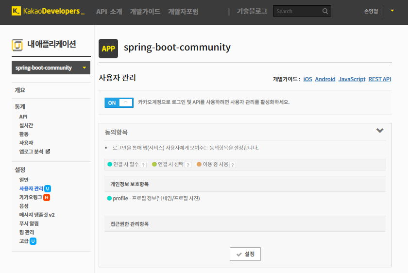
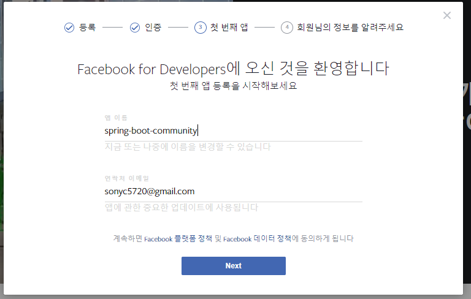
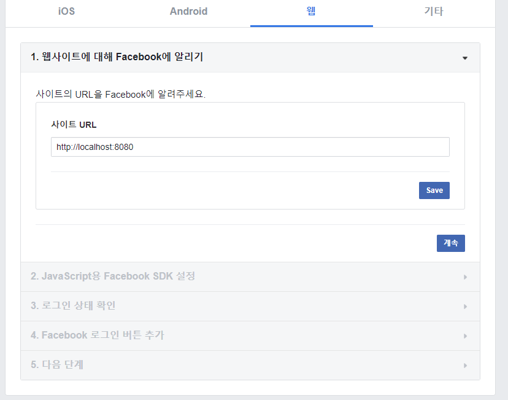
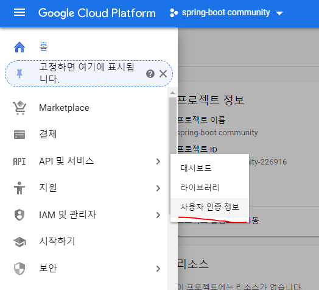

OAuth 2.0
https://www.youtube.com/watch?v=hm2r6LtUbk8&list=PLuHgQVnccGMA4guyznDlykFJh28_R08Q-

---

## SNS 개발자센터에서 클라이언트 키값 받아오기

- 카카오

https://developers.kakao.com/


`프로필 정보`의 수집목적란에 목적을 기입한다.





플랫폼과 redirect path를 추가한다. (웹 http://localhost:8080, /login/oauth2/code/kakao)


**개발 시 REST API 키를 사용한다.**

- 페이스북

https://developers.facebook.com/







개발 시에는 해당 redirection url을 적용하지 않아도 된다.


- 구글

https://console.cloud.google.com





### 실제 도메인을 사용해야됨

---

0. 스프링 시큐리티

- 스프링 부트 시큐리티에서 가장 중요한 개념은 `인증`과 `권한 부여`
    - 인증 (authentication)
    : 사용자가 애플리케이션의 특정 동작에 관하여 인증된 사용자인지를 확인하는 절차 (e.g. 로그인)

    - 권한 부여 (authorization)
    : 데이터나 프로그램 등의 특정 자원이나 서비스에 접근할 수 있는 권한을 허용하는 것 (e.g. 일반 사용자, admin)

- OAuth2 : 토큰을 사용한 범용적인 방법의 인증을 제공하는 표준 인증 프로토콜(OAuth)의 버전 2

https://tools.ietf.org/html/rfc6749#page-7


- Resource Owner
    - 인증이 필요한 사용자(자원을 갖고 있는, SNS의 계정 소유주)
- Client
    - Resource Owner의 정보를 사용하고자하는 애플리케이션
- Resource Server
    - 데이터를 가지고 있는 서버 (리소스 주인의 API 정보가 있는 서버)
- Authorization Server
    - 인증 관련 처리를 전담하는 서버

**인증, 권한 부여 과정**

1. 클라이언트가 파라미터로 client id, redirect uri, response type을 code로 지정하여 권한서버로 전달한다.
2. 권한서버로부터 받은 권한 부여 코드를 사용하여 client id, client secret, redirect uri, 인증 타입과 함께 access token을 권한 서버에 추가로 요청한다.
3. 마지막으로 응답받은 access token을 사용하여 리소스 서버에 사용자의 데이터를 요청한다.


- 세션이 있으면 그대로 세션을 사용하고 없으면 OAuth2 인증 과정을 거치게 된다.
- 이메일을 키값으로 이미 가입된 사용자인지 체크한다. 
    - 이미 등록된 사용자라면 등록된 정보 반환 후 URL 접근
    - 아니라면 새로운 정보를 저장하는 과정 진행
- 소셜미디어 마다 User 정보가 다르기 때문에 소셜미디어에 따라User 객체를 생성후 DB장저장

---

1. Security, OAuth2 dependency 추가

build.gradle

```gradle
// 스크립트에 version, 저장소, 의존 라이브러리를 설정
buildscript {
    ext {
        springBootVersion = '2.0.3.RELEASE'
    }
    repositories {
        mavenCentral()
    }
    dependencies {
        classpath("org.springframework.boot:spring-boot-gradle-plugin:${springBootVersion}")
    }
}

// 필요 플러그인 적용
apply plugin: 'java'
apply plugin: 'eclipse'
apply plugin: 'org.springframework.boot'
apply plugin: 'io.spring.dependency-management' // 종속성 관리 플러그인

group = 'com.community'
version = '0.0.1-SNAPSHOT'
sourceCompatibility = 1.8

repositories {
    mavenCentral()
}

// 프로젝트에서 사용할 라이브러리 의존성 설정
dependencies {
    implementation('org.springframework.boot:spring-boot-starter-data-jpa')
    implementation('org.springframework.boot:spring-boot-starter-thymeleaf')
    implementation('org.springframework.boot:spring-boot-starter-web')

    /* Spring Security */
    implementation('org.springframework.security:spring-security-oauth2-client') // 클라이언트 자동 인증 설정
    implementation('org.springframework.security:spring-security-oauth2-jose') // JWT(Json Web Token) 권한 전송 관련 프레임워크
    implementation('org.springframework.boot:spring-boot-starter-security')

    runtimeOnly('org.springframework.boot:spring-boot-devtools')
    runtimeOnly('com.h2database:h2')
    compileOnly('org.projectlombok:lombok')
    testImplementation('org.springframework.boot:spring-boot-starter-test')
}
```

---

2. 소셜 미디어 타입을 갖는 SocialType enum 생성

```java
package com.community.web.domain.enums;

import lombok.Getter;

@Getter
public enum SocialType {
    FACEBOOK("facebook"),
    GOOGLE("google"),
    KAKAO("kakao");

    private String name;
    private static final String ROLE_PREFIX = "ROLE_";

    SocialType(String name) {
        this.name = name;
    }

    public String getRoleType() {
        return ROLE_PREFIX + name.toUpperCase();
    }

    public boolean isEquals(String authority) {
        return this.name.equals(authority);
    }
}
```

---

3. User에 OAuth2 인증으로 제공받는 키값인 principal과 어떤 소셜 미디어로 인증 받았는지를 구분해주는 socialType 추가

```java
package com.community.web.domain;

import com.community.web.domain.enums.SocialType;
import lombok.Builder;
import lombok.Getter;
import lombok.NoArgsConstructor;

import javax.persistence.Entity;
import javax.persistence.GeneratedValue;
import javax.persistence.GenerationType;
import javax.persistence.Id;
import java.io.Serializable;
import java.time.LocalDateTime;

@Getter
@NoArgsConstructor
@Entity
public class User implements Serializable {
    @Id
    @GeneratedValue(strategy = GenerationType.IDENTITY)
    private Long index;
    private String name;
    private String password;
    private String email;
    private LocalDateTime createdDate;
    private LocalDateTime updatedDate;

    // OAuth
    private String principal; // <- 추가
    private SocialType socialType; // <- 추가

    @Builder
    public User(String name, String password, String email, LocalDateTime createdDate, LocalDateTime updatedDate, String principal, SocialType socialType) { // <- 추가
        this.name = name;
        this.password = password;
        this.email = email;
        this.createdDate = createdDate;
        this.updatedDate = updatedDate;
        this.principal = principal;
        this.socialType = socialType;
    }
}
```

---

4. OAuth2Provider

- Spring security oauth가 제공하는 CommonOAuth2Provider 살펴보기

```java
package org.springframework.security.config.oauth2.client;

import org.springframework.security.oauth2.client.registration.ClientRegistration;
import org.springframework.security.oauth2.client.registration.ClientRegistration.Builder;
import org.springframework.security.oauth2.core.AuthorizationGrantType;
import org.springframework.security.oauth2.core.ClientAuthenticationMethod;
import org.springframework.security.oauth2.core.oidc.IdTokenClaimNames;

/**
 * Common OAuth2 Providers that can be used to create
 * {@link org.springframework.security.oauth2.client.registration.ClientRegistration.Builder
 * builders} pre-configured with sensible defaults.
 *
 * @author Phillip Webb
 * @since 5.0
 */
public enum CommonOAuth2Provider {

    GOOGLE {

        @Override
        public Builder getBuilder(String registrationId) {
            ClientRegistration.Builder builder = getBuilder(registrationId,
                    ClientAuthenticationMethod.BASIC, DEFAULT_LOGIN_REDIRECT_URL);
            builder.scope("openid", "profile", "email");
            builder.authorizationUri("https://accounts.google.com/o/oauth2/v2/auth");
            builder.tokenUri("https://www.googleapis.com/oauth2/v4/token");
            builder.jwkSetUri("https://www.googleapis.com/oauth2/v3/certs");
            builder.userInfoUri("https://www.googleapis.com/oauth2/v3/userinfo");
            builder.userNameAttributeName(IdTokenClaimNames.SUB);
            builder.clientName("Google");
            return builder;
        }
    },

    GITHUB {

        @Override
        public Builder getBuilder(String registrationId) {
            ClientRegistration.Builder builder = getBuilder(registrationId,
                    ClientAuthenticationMethod.BASIC, DEFAULT_LOGIN_REDIRECT_URL);
            builder.scope("read:user");
            builder.authorizationUri("https://github.com/login/oauth/authorize");
            builder.tokenUri("https://github.com/login/oauth/access_token");
            builder.userInfoUri("https://api.github.com/user");
            builder.userNameAttributeName("id");
            builder.clientName("GitHub");
            return builder;
        }
    },

    FACEBOOK {

        @Override
        public Builder getBuilder(String registrationId) {
            ClientRegistration.Builder builder = getBuilder(registrationId,
                    ClientAuthenticationMethod.POST, DEFAULT_LOGIN_REDIRECT_URL);
            builder.scope("public_profile", "email");
            builder.authorizationUri("https://www.facebook.com/v2.8/dialog/oauth");
            builder.tokenUri("https://graph.facebook.com/v2.8/oauth/access_token");
            builder.userInfoUri("https://graph.facebook.com/me");
            builder.userNameAttributeName("id");
            builder.clientName("Facebook");
            return builder;
        }
    },

    OKTA {

        @Override
        public Builder getBuilder(String registrationId) {
            ClientRegistration.Builder builder = getBuilder(registrationId,
                    ClientAuthenticationMethod.BASIC, DEFAULT_LOGIN_REDIRECT_URL);
            builder.scope("openid", "profile", "email", "address", "phone");
            builder.userNameAttributeName(IdTokenClaimNames.SUB);
            builder.clientName("Okta");
            return builder;
        }
    };

    private static final String DEFAULT_LOGIN_REDIRECT_URL = "{baseUrl}/login/oauth2/code/{registrationId}";

    protected final ClientRegistration.Builder getBuilder(String registrationId,
                                                            ClientAuthenticationMethod method, String redirectUri) {
        ClientRegistration.Builder builder = ClientRegistration.withRegistrationId(registrationId);
        builder.clientAuthenticationMethod(method);
        builder.authorizationGrantType(AuthorizationGrantType.AUTHORIZATION_CODE);
        builder.redirectUriTemplate(redirectUri);
        return builder;
    }

    /**
        * Create a new
        * {@link org.springframework.security.oauth2.client.registration.ClientRegistration.Builder
        * ClientRegistration.Builder} pre-configured with provider defaults.
        * @param registrationId the registration-id used with the new builder
        * @return a builder instance
        */
    public abstract ClientRegistration.Builder getBuilder(String registrationId);

}
```

- CustomOAuth2Provider 생성 (CommonOAuth2Provider와 비교해보기)

```java
package com.community.web.oauth2;

import org.springframework.security.oauth2.client.registration.ClientRegistration;
import org.springframework.security.oauth2.core.AuthorizationGrantType;
import org.springframework.security.oauth2.core.ClientAuthenticationMethod;

public enum CustomOAuth2Provider {

    KAKAO {
        @Override
        public ClientRegistration.Builder getBuilder(String registrationId) {
            ClientRegistration.Builder builder = getBuilder(registrationId, 
                    ClientAuthenticationMethod.POST, DEFAULT_LOGIN_REDIRECT_URL);
            builder.scope("profile");
            builder.authorizationUri("https://kauth.kakao.com/oauth/authorize");
            builder.tokenUri("https://kauth.kakao.com/oauth/token");
            builder.userInfoUri("https://kapi.kakao.com/v1/user/me");
            builder.userNameAttributeName("id");
            builder.clientName("Kakao");
            return builder;
        }
    };

    private static final String DEFAULT_LOGIN_REDIRECT_URL = "{baseUrl}/login/oauth2/code/{registrationId}";

    /**
     * CustomOAuth2Provider enum에서 사용할 수 있는 메서드
     * @param registrationId
     * @param method
     * @param redirectUri
     * @return
     */
    protected final ClientRegistration.Builder getBuilder(String registrationId,
                                                          ClientAuthenticationMethod method, String redirectUri) {
        ClientRegistration.Builder builder = ClientRegistration.withRegistrationId(registrationId);
        builder.clientAuthenticationMethod(method);
        builder.authorizationGrantType(AuthorizationGrantType.AUTHORIZATION_CODE);
        builder.redirectUriTemplate(redirectUri);
        return builder;
    }

    /**
     * CustomOAuth2Provider enum 객체를 생성하기 위해서는 아래 abstract method를 구현해야함
     * 위 KAKAO enum 객체 또한 getBuilder를 구현하여 생성함
     * @param registrationId
     * @return
     */
    public abstract ClientRegistration.Builder getBuilder(String registrationId);
}
```

---

5. 프로퍼티 추가 및 변경 (properties -> yaml)

```yml
spring:
  security:
    oauth2:
      client:
        registration:
          google:
            client-id: google-client-id
            client-secret: google-client-secret
          facebook:
            client-id: google-client-id
            client-secret: google-client-secret
  jpa:
    properties:
      hibernate:
        show_sql: true
        format_sql: true

custom:
  oauth2:
    kakao:
      client-id: REST API KEY

logging:
  level:
    com:
      community: debug
```

--- 

6. SecurityConfig 생성하기

기본 WebSecurity 설정 WebSecurityConfigurerAdapter class

```java
package org.springframework.security.config.annotation.web.configuration;

public abstract class WebSecurityConfigurerAdapter implements
		WebSecurityConfigurer<WebSecurity> {
    // 생략

    protected void configure(HttpSecurity http) throws Exception {
        logger.debug("Using default configure(HttpSecurity). If subclassed this will potentially override subclass configure(HttpSecurity).");

        http
            .authorizeRequests()
                .anyRequest().authenticated()
                .and()
            .formLogin().and()
            .httpBasic();
        // 모두 인증이 필요하다
	}
   
   // 생략
}
```

```java
package com.community.web.config;

import com.community.web.domain.enums.SocialType;
import com.community.web.oauth2.CustomOAuth2Provider;
import org.springframework.beans.factory.annotation.Value;
import org.springframework.boot.autoconfigure.security.oauth2.client.OAuth2ClientProperties;
import org.springframework.context.annotation.Bean;
import org.springframework.context.annotation.Configuration;
import org.springframework.security.config.annotation.web.builders.HttpSecurity;
import org.springframework.security.config.annotation.web.configuration.EnableWebSecurity;
import org.springframework.security.config.annotation.web.configuration.WebSecurityConfigurerAdapter;
import org.springframework.security.config.oauth2.client.CommonOAuth2Provider;
import org.springframework.security.oauth2.client.registration.ClientRegistration;
import org.springframework.security.oauth2.client.registration.ClientRegistrationRepository;
import org.springframework.security.oauth2.client.registration.InMemoryClientRegistrationRepository;
import org.springframework.security.web.authentication.LoginUrlAuthenticationEntryPoint;
import org.springframework.security.web.csrf.CsrfFilter;
import org.springframework.web.filter.CharacterEncodingFilter;

import java.util.List;
import java.util.Objects;
import java.util.stream.Collectors;

/**
 * 각 소셜 미디어 리소스 정보를 빈으로 등록
 * @EnableWebSecurity : 웹 시큐리티 기능 사용하겠다는 어노테이션, 그냥 붙이기만할 경우 자동설정 따라감
 */
@Configuration
@EnableWebSecurity
public class WebSecurityConfig extends WebSecurityConfigurerAdapter {

    /**
     * 시큐리티 커스터마이징을 위해 override한 메서드
     * @param http
     * @throws Exception
     */
    @Override
    protected void configure(HttpSecurity http) throws Exception {
        CharacterEncodingFilter filter = new CharacterEncodingFilter();

        http.
            authorizeRequests()
                .antMatchers("/", "/oauth2/**", "/login/**", "/css/**", "/images/**", "/js/**", "/console/**")
                    .permitAll() // static resources, index, login 페이지는 접근 허용
                .antMatchers("/facebook") // 테스트용
                    .hasAuthority(SocialType.FACEBOOK.getRoleType()) // 해당 권한이 있어야 접근 가능
                .antMatchers("/google") // 테스트용
                    .hasAuthority(SocialType.GOOGLE.getRoleType())
                .antMatchers("/kakao") // 테스트용
                    .hasAuthority(SocialType.KAKAO.getRoleType())
                .anyRequest()
                    .authenticated() // 그 외 요청은 인증된 사용자만 접근 가능
            .and()
                .oauth2Login() // 구글, 페이스북, 깃허브 등 기본으로 제공되는 OAuth2 인증 방식이 적용됨
                    .defaultSuccessUrl("/loginSuccess")
                    .failureUrl("/loginFailure")
            .and()
                .headers() // 응답 header 설정
                    .frameOptions().disable() // XFrameOptionsHeaderWriter의 최적화 설정을 허용하지 않음
            .and()
                .exceptionHandling()
                    .authenticationEntryPoint(new LoginUrlAuthenticationEntryPoint("/login"))
                    // 인증되지 않은 사용자가 인증이 필요한 경로 접근 시 해당 URI로 이동시킴
            .and()
                .formLogin() // 로그인 설정
                    .successForwardUrl("/board/list") // 성공 시 포워딩 될 URI
            .and()
                .logout() // 로그아웃에 대한 설정
                    .logoutUrl("/logout") // 로그아웃이 수행될 URL
                    .logoutSuccessUrl("/") // 성공 시 포워딩될 URI
                    .deleteCookies("JSESSIONID") // JSESSIONID 삭제
                    .invalidateHttpSession(true) // 세션 invalidate
            .and()
                .addFilterBefore(filter, CsrfFilter.class) // 문자 인코딩 필터 전에 CsrfFilter 적용
                .csrf().disable();
    }

    /**
     * 시큐리티 starter에서 자동 설정되지만 카카오도 설정하기 위해 추가
     * @param oAuth2ClientProperties
     * @param kakaoClientId
     * @return
     */
    @Bean
    public ClientRegistrationRepository clientRegistrationRepository(
            OAuth2ClientProperties oAuth2ClientProperties,
            @Value("${custom.oauth2.kakao.client-id}") String kakaoClientId) { // application.yml 에 설정한 kakao client-id를 불러옴

        // 기본 제공 OAuth2 인증 정보 빌드한 결과를 List로 collect
        List<ClientRegistration> registrationList = oAuth2ClientProperties.getRegistration().keySet().stream()
                .map(client -> getRegistration(oAuth2ClientProperties, client))
                .filter(Objects::nonNull)
                .collect(Collectors.toList());

        // 커스텀 OAuth2 인증 정보 빌드한 결과를 위 list에 추가
        registrationList.add(CustomOAuth2Provider.KAKAO.getBuilder("kakao")
                .clientId(kakaoClientId) // 실제 사용은 client-id만
                .clientSecret("test") // clientSecret, jwkSetUri는 필요없지만 null일 경우 실행이 안되 추가함
                .jwkSetUri("test")
                .build());

        return new InMemoryClientRegistrationRepository(registrationList);
    }

    /**
     * Google, Facebook 인증을 위해 빌드한 ClientRegistration 리턴
     * @param oAuth2ClientProperties
     * @param client
     * @return
     */
    private ClientRegistration getRegistration(OAuth2ClientProperties oAuth2ClientProperties, String client) {
        if ("google".equals(client)) {
            OAuth2ClientProperties.Registration registration =
                    oAuth2ClientProperties.getRegistration().get("google");

            return CommonOAuth2Provider.GOOGLE.getBuilder(client)
                    .clientId(registration.getClientId())
                    .clientSecret(registration.getClientSecret())
                    .scope("email", "profile")
                    .build();
        }

        if ("facebook".equals(client)) {
            OAuth2ClientProperties.Registration registration =
                    oAuth2ClientProperties.getRegistration().get("facebook");

            return CommonOAuth2Provider.FACEBOOK.getBuilder(client)
                    .clientId(registration.getClientId())
                    .clientSecret(registration.getClientSecret())
                    // 페북의 graph API는 scope로는 필요한 필드를 반환해주지 않아 idm name, email, link를 파라미터로 넣어 요청하도록 설정
                    .userInfoUri("https://graph.facebook.com/me?fields=id,name,email,link")
                    .scope("email")
                    .build();
        }

        return null;
    }
}
```

---

7. Login view 및 LoginController 생성

template/login.html

```html
<!DOCTYPE html>
<html xmlns:th="http://www.thymeleaf.org">
<head>
    <meta charset="UTF-8">
    <title>로그인</title>
    <link rel="stylesheet" th:href="@{/css/base.css}">
    <link rel="stylesheet" th:href="@{/css/bootstrap.min.css}">
</head>
<body>
    <div th:replace="layout/header::header"></div>

    <div class="container"style="text-align: center;">
        <br>

        <h2>로그인</h2>

        <a href="javascript:;" class="btn_social" data-social="facebook">
            
        </a>
        <a href="javascript:;" class="btn_social" data-social="google">
            
        </a>
        <a href="javascript:;" class="btn_social" data-social="kakao">
            
        </a>
    </div>

    <div th:replace="layout/footer::footer"></div>

    <script th:src="@{/js/jquery.min.js}"></script>
    <script>
        $(".btn_social").click(function() {
            var socialType = $(this).data("social");
            location.href = "/oauth2/authorization/" + socialType;
        });
    </script>
</body>
</html>
```

```java
package com.community.web.controller;

import org.springframework.stereotype.Controller;
import org.springframework.web.bind.annotation.GetMapping;

@Controller
public class LoginController {

    @GetMapping("/login")
    public String login() {
        return "login";
    }
}
```

http://localhost:8080/login , http://localhost:8080/board/list 로 접속


---

8. 어노테이션 기반으로 User 정보 불러오기

```java
/**
 * Spring Boot 1.5 버전 기준 코드
 */
package com.web.controller;

import org.springframework.stereotype.Controller;
import org.springframework.web.bind.annotation.GetMapping;

@Controller
public class LoginController {

    @GetMapping("/login")
    public String login() {
        return "login";
    }

    /**
        * User 정보를 가져와 세션에 담는 과정
        * 하지만 너무 복잡하고 번거롭다.
        * @param session
        * @return
        */
    @GetMapping("/loginSuccess")
    public String loginComplete(HttpSession session) {
        OAuth2Authentication auth2Authentication =
                (OAuth2Authentication) SecurityContextHolder.getContext().getAuthentication();

        // 인증 받은 User 정보를 map에 담아 가져옴
        Map<String, String> map = (HashMap<String, String>) auth2Authentication.getUserAuthentication().getDetails();

        // 위에서 받은 map에서 user 정보를 가져온다. : <-- too complex and not type safe
        session.setAttribute("user", User.builder()
            .name(map.get("name"))
            .email(map.get("email"))
            .principal(map.get("id"))
            .socialType(SocialType.KAKAO)
            .createdDate(LocalDateTime.now())
            .build()
        );

        return "redirect:/board/list";
    }
}
```

위와 같은 경우 다른 메서드에서도 사용해야할 경우 중복코드가 발생하고 수정 사항이 발생하면 누락이 발생하기도 쉽다

그럼 서비스나 validation util을 만드는 것도 방법이지만

따로 서비스 계층을 추가하지 않고 AOP를 통해 특정 파라미터 형식을 취하면 병렬적으로 User 객체에 인증된 User 정보를 가져오는 방법에 신경 쓸 필요도 없고 로직 복붙도 필요없다.

AOP 구현 시 우리는 스프링 strategy 인터페이스 중 하나인 HandlerMethodArgumentResolver를 사용한다.

- LoginController 변경

```java
package com.community.web.controller;

import com.community.web.annotation.SocialUser;
import com.community.web.domain.User;
import org.springframework.stereotype.Controller;
import org.springframework.web.bind.annotation.GetMapping;

@Controller
public class LoginController {

    @GetMapping("/login")
    public String login() {
        return "login";
    }

    /**
     * 아래 복잡한 로직은 AOP를 통해 깔끔하게 변경 가능하다
     *
     * @see SocialUser
     * @see com.community.web.resolver.UserArgumentResolver
     * @param user
     * @return
     */
    @GetMapping("/loginSuccess")
    public String loginComplete(@SocialUser User user) {
        return "redirect:/board/list";
    }

    /**
     * User 정보를 가져와 세션에 담는 과정
     * 하지만 너무 복잡하고 번거롭다.
     * @param session
     * @return
     */
    //    @GetMapping("/{facebook|google|kakao}/complete")
    //    public String loginComplete(HttpSession session) {
    //        OAuth2Authentication auth2Authentication =
    //                (OAuth2Authentication) SecurityContextHolder.getContext().getAuthentication();
    //
    //        // 인증 받은 User 정보를 map에 담아 가져옴
    //        Map<String, String> map = (HashMap<String, String>) auth2Authentication.getUserAuthentication().getDetails();
    //
    //        // 위에서 받은 map에서 user 정보를 가져온다. : <-- too complex and not type safe
    //        session.setAttribute("user", User.builder()
    //                .name(map.get("name"))
    //                .email(map.get("email"))
    //                .principal(map.get("id"))
    //                .socialType(SocialType.KAKAO)
    //                .createdDate(LocalDateTime.now())
    //                .build()
    //        );
    //
    //        return "redirect:/board/list";
    //    }
}
```

인증된 User 객체를 가져올 수 있게 커스텀 어노테이션을 추가

```java
package com.community.web.annotation;

import java.lang.annotation.ElementType;
import java.lang.annotation.Retention;
import java.lang.annotation.RetentionPolicy;
import java.lang.annotation.Target;

@Target(ElementType.PARAMETER)
@Retention(RetentionPolicy.RUNTIME)
public @interface SocialUser {
}
```

- 커스텀 HandlerMethodArgumentResolver 생성

```java
package com.community.web.resolver;

import com.community.web.annotation.SocialUser;
import com.community.web.domain.User;
import com.community.web.domain.enums.SocialType;
import com.community.web.repository.UserRepository;
import org.springframework.core.MethodParameter;
import org.springframework.security.authentication.UsernamePasswordAuthenticationToken;
import org.springframework.security.core.authority.AuthorityUtils;
import org.springframework.security.core.authority.SimpleGrantedAuthority;
import org.springframework.security.core.context.SecurityContextHolder;
import org.springframework.security.oauth2.client.authentication.OAuth2AuthenticationToken;
import org.springframework.stereotype.Component;
import org.springframework.web.bind.support.WebDataBinderFactory;
import org.springframework.web.context.request.NativeWebRequest;
import org.springframework.web.context.request.RequestContextHolder;
import org.springframework.web.context.request.ServletRequestAttributes;
import org.springframework.web.method.support.HandlerMethodArgumentResolver;
import org.springframework.web.method.support.ModelAndViewContainer;

import javax.servlet.http.HttpSession;
import java.time.LocalDateTime;
import java.util.HashMap;
import java.util.Map;

import static com.community.web.domain.enums.SocialType.*;

/**
 * 컨트롤러에 들어오는 파라미터를 커스텀하게 가공해서 사용하고 싶을 때 사용
 */
@Component
public class UserArgumentResolver implements HandlerMethodArgumentResolver {
    private UserRepository userRepository;

    public UserArgumentResolver(UserRepository userRepository) {
        this.userRepository = userRepository;
    }

    /**
     * @SocialUser가 달려있는 User 파라미터에 해당 Resolver를 적용시킴
     * @param parameter
     * @return
     */
    @Override
    public boolean supportsParameter(MethodParameter parameter) {
        return (parameter.getParameterAnnotation(SocialUser.class) != null) &&
                parameter.getParameterType().equals(User.class);
    }

    /**
     * HttpSession에서 "user"로 저장된 User를 가져옮
     * @param parameter
     * @param mavContainer
     * @param webRequest
     * @param binderFactory
     * @return
     * @throws Exception
     */
    @Override
    public Object resolveArgument(MethodParameter parameter, ModelAndViewContainer mavContainer,
                                  NativeWebRequest webRequest, WebDataBinderFactory binderFactory) throws Exception {
        HttpSession session =
                ((ServletRequestAttributes) RequestContextHolder.currentRequestAttributes()).getRequest().getSession();

        User user = (User) session.getAttribute("user");

        return getUser(user, session);
    }

    /**
     * 파라미터 user가 null이 아닐 경우 (session에 저장된 "user" attribute가 있을 경우) 해당 객체를 그대로 return
     * 파라미터 user가 null일 경우 (session에 저장된 "user" attribute가 없을 경우)
     *      OAuth token에서 정보를 가져온 뒤 이를 기존 저장된 user에 담거나 새로 저장한 user에 담는다.
     *      정보를 담은 후 세션에 담는다.
     * @param user
     * @param session
     * @return
     */
    private User getUser(User user, HttpSession session) {
        if (user != null) {
            return user;
        }

        // SecurityContextHolder에서 OAuth token을 가져온다.
        OAuth2AuthenticationToken authenticationToken =
                (OAuth2AuthenticationToken) SecurityContextHolder.getContext().getAuthentication();
        // token에서 개인 정보를 map에 담아 가져온다.
        Map<String, Object> map = authenticationToken.getPrincipal().getAttributes();
        // token에서 가져온 개인 정보를 User 객체에 담는다.
        User convertUser = convertUser(authenticationToken.getAuthorizedClientRegistrationId(), map);

        //        user = userRepository.findByEmail(convertUser.getEmail()).orElse(null);
        //
        //        if (user == null) {
        //            user = userRepository.save(convertUser);
        //        }

        // 위 코드 리팩토링
        user = userRepository.findByEmail(convertUser.getEmail()).orElse(userRepository.save(convertUser));

        setRoleIfNotSame(user, authenticationToken, map);
        session.setAttribute("user", user);

        return user;
    }

    /**
     * 사용자의 인증 소셜 미디어 타입에 따라 User 객체 만든다.
     * @param authority
     * @param map
     * @return
     */
    private User convertUser(String authority, Map<String, Object> map) {
        if (FACEBOOK.isEquals(authority)) {
            return getModernUser(FACEBOOK, map);
        } else if (GOOGLE.isEquals(authority)) {
            return getModernUser(GOOGLE, map);
        } else if (KAKAO.isEquals(authority)) {
            return getKakaoUser(map);
        }

        return null;
    }

    /**
     * 페이스북, 구글과 같이 공통된 명명규칙을 가진 그룹을 User 객체로 매핑
     * @param socialType
     * @param map
     * @return
     */
    private User getModernUser(SocialType socialType, Map<String, Object> map) {
        return User.builder()
                .name(String.valueOf(map.get("name")))
                .email(String.valueOf(map.get("email")))
                .principal(String.valueOf(map.get("id")))
                .socialType(socialType)
                .createdDate(LocalDateTime.now())
                .build();
    }

    /**
     * 카카오 회원을 위한 메서드
     * token에서 가져온 정보를 User 객체로 매핑
     * @param map
     * @return
     */
    private User getKakaoUser(Map<String, Object> map) {
        Map<String, String> propertyMap = (HashMap<String, String>) ((Object) map.get("properties"));

        String email = String.valueOf(map.get("id")) + "@local.com";

        return User.builder()
                .name(propertyMap.get("nickname"))
                // 카카오 정책이 변경되서 email이 필수가 아니라 가져올 수 없다
//                .email(String.valueOf(map.get("kaccount_email")))
                .email(email)
                .principal(String.valueOf(map.get("id")))
                .socialType(KAKAO)
                .createdDate(LocalDateTime.now())
                .build();
    }

    /**
     * 인증이 권한을 가지고 있는지 체크하는 메서드
     * 만약 저장된 권한이 없으면 SecurityContextHolder를 사용하여 해당 소셜 미디어 타입으로 권한을 저장
     * @param user
     * @param authenticationToken
     * @param map
     */
    private void setRoleIfNotSame(User user, OAuth2AuthenticationToken authenticationToken, Map<String, Object> map) {
        if (!authenticationToken.getAuthorities().contains(new SimpleGrantedAuthority(user.getSocialType().getRoleType()))) {

            SecurityContextHolder.getContext().setAuthentication(
                    new UsernamePasswordAuthenticationToken(map, "N/A",
                            AuthorityUtils.createAuthorityList(user.getSocialType().getRoleType())));
        }
    }
}
```


---

- authenticationToken 알아보기


---

- 위 resolver을 WebMvcConfig에 등록

```java
package com.community.web.config;

import com.community.web.resolver.UserArgumentResolver;
import org.springframework.context.annotation.Configuration;
import org.springframework.web.method.support.HandlerMethodArgumentResolver;
import org.springframework.web.servlet.config.annotation.WebMvcConfigurer;

import java.util.List;

@Configuration
public class WebMvcConfig implements WebMvcConfigurer {
    private UserArgumentResolver userArgumentResolver;

    public WebMvcConfig(UserArgumentResolver userArgumentResolver) {
        this.userArgumentResolver = userArgumentResolver;
    }

    @Override
    public void addArgumentResolvers(List<HandlerMethodArgumentResolver> resolvers) {
        resolvers.add(userArgumentResolver);
    }
}
```

---

9. 테스트

- kakao로 로그인 후 h2-console과 카카오 개발자페이지를 확인하면 추가되있는 걸 볼 수 있다,


- SecurityConfig에 다음과 같이 설정했는데 이를 테스트하기 위한 테스트 코드를 추가하여 테스트 해보자


```java
package com.community.web.controller;

import org.springframework.web.bind.annotation.GetMapping;
import org.springframework.web.bind.annotation.RestController;

@RestController
public class AuthorityTestController {
    @GetMapping("/facebook")
    public String facebook() {
        return "facebook";
    }

    @GetMapping("/google")
    public String google() {
        return "google";
    }

    @GetMapping("/kakao")
    public String kakao() {
        return "kakao";
    }
}
```

서버 재시작 후 kakao로 로그인 한후 kakao는 응답을 받을 수 있지만 facebook, google은 403 에러를 볼 수 있다.


