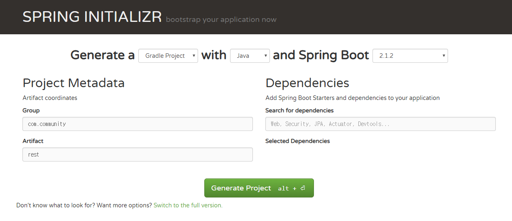
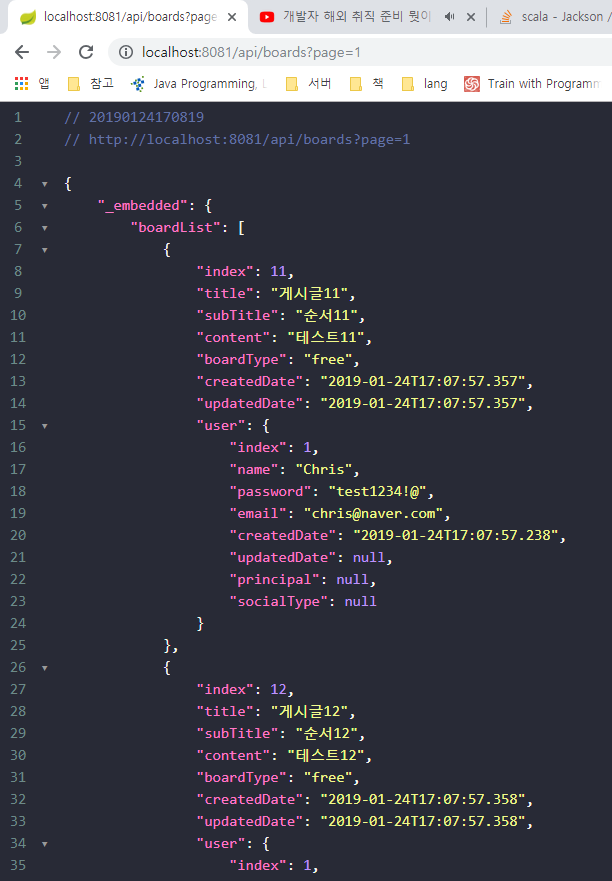

# 6. 스프링 부트 데이터 레스트
## REST WEB API 구현하기

- 스프링 부트 프로젝트 생성



### settings에서 어노테이션 사용 잊지않고 설정하기

build.gradle

```gradle
buildscript {
    ext {
        springBootVersion = '2.0.3.RELEASE'
    }
    repositories {
        mavenCentral()
    }
    dependencies {
        classpath("org.springframework.boot:spring-boot-gradle-plugin:${springBootVersion}")
    }
}

apply plugin: 'java'
apply plugin: 'eclipse'
apply plugin: 'org.springframework.boot'
apply plugin: 'io.spring.dependency-management'

group = 'com.community'
version = '0.0.1-SNAPSHOT'
sourceCompatibility = 1.8

repositories {
    mavenCentral()
}


dependencies {
    implementation('org.springframework.boot:spring-boot-starter-data-jpa')
    implementation('org.springframework.boot:spring-boot-starter-security')
    compile('com.fasterxml.jackson.datatype:jackson-datatype-jsr310')
    implementation('org.springframework.boot:spring-boot-starter-web') {
        exclude module: "jackson-databind"
    }
    implementation('org.springframework.boot:spring-boot-starter-hateoas')
    runtimeOnly('org.springframework.boot:spring-boot-devtools')
    compile('com.h2database:h2')
    compileOnly('org.projectlombok:lombok')
    testImplementation('org.springframework.boot:spring-boot-starter-test')
    testImplementation('org.springframework.security:spring-security-test')
}
```

application.yml

port, DB 설정

```yaml
server:
  port: 8081

spring:
  datasource:
    url: jdbc:h2:tcp://localhost:8082,/mem:testdb
    driverClassName: org.h2.Driver
    username: sa
    password:

  jpa:
    hibernate:
      ddl-auto: validate
```

- 필요한 class 생성 (enums, domain, repository)

```java
package com.community.rest.domain.enums;

import lombok.Getter;

@Getter
public enum BoardType {
    notice("공지사항"),
    free("자유게시판");

    private String value;

    BoardType(String value) {
        this.value = value;
    }
}
```

```java
package com.community.rest.domain.enums;

import lombok.Getter;

@Getter
public enum SocialType {
    FACEBOOK("facebook"),
    GOOGLE("google"),
    KAKAO("kakao");

    private String name;
    private static final String ROLE_PREFIX = "ROLE_";

    SocialType(String name) {
        this.name = name;
    }

    public String getRoleType() {
        return ROLE_PREFIX + name.toUpperCase();
    }

    public boolean isEquals(String authority) {
        return this.name.equals(authority);
    }
}
```

```java
package com.community.rest.domain;

import com.community.rest.domain.enums.SocialType;
import lombok.Builder;
import lombok.Getter;
import lombok.NoArgsConstructor;

import javax.persistence.Entity;
import javax.persistence.GeneratedValue;
import javax.persistence.GenerationType;
import javax.persistence.Id;
import java.io.Serializable;
import java.time.LocalDateTime;

@Getter
@NoArgsConstructor
@Entity
public class User implements Serializable {
    @Id
    @GeneratedValue(strategy = GenerationType.IDENTITY)
    private Long index;
    private String name;
    private String password;
    private String email;
    private LocalDateTime createdDate;
    private LocalDateTime updatedDate;

    // OAuth
    private String principal;
    private SocialType socialType;

    @Builder
    public User(String name, String password, String email, LocalDateTime createdDate, LocalDateTime updatedDate, String principal, SocialType socialType) {
        this.name = name;
        this.password = password;
        this.email = email;
        this.createdDate = createdDate;
        this.updatedDate = updatedDate;
        this.principal = principal;
        this.socialType = socialType;
    }
}
```

```java
package com.community.rest.domain;

import com.community.rest.domain.enums.BoardType;
import lombok.Builder;
import lombok.Getter;
import lombok.NoArgsConstructor;

import javax.persistence.*;
import java.io.Serializable;
import java.time.LocalDateTime;

@Getter
@NoArgsConstructor
@Entity
public class Board implements Serializable {
    @Id
    @GeneratedValue(strategy = GenerationType.IDENTITY) // IDENTITY: 키 생성을 DB에 위임
    private Long index;
    private String title;
    private String subTitle;
    private String content;
    @Enumerated(EnumType.STRING) //EnumType.ORDINAL은 enum의 순번으로 저장, String은 해당 enum 그대로 저장
    private BoardType boardType;
    // LocalDateTime: 1.8부터 추가된 API로 Date, Calendar에서 부실한 날짜 연산기능을 추가로 제공
    private LocalDateTime createdDate;
    private LocalDateTime updatedDate;

    @OneToOne(fetch = FetchType.EAGER) // <- EAGER 사용해야 한다 : https://stackoverflow.com/questions/24994440/no-serializer-found-for-class-org-hibernate-proxy-pojo-javassist-javassist
    private User user; // 실제 User 객체가 DB에 저장되는 것이 아닌 User의 index가 record에 저장된다.

    @Builder
    public Board(String title, String subTitle, String content, BoardType boardType, LocalDateTime createdDate, LocalDateTime updatedDate, User user) {
        this.title = title;
        this.subTitle = subTitle;
        this.content = content;
        this.boardType = boardType;
        this.createdDate = createdDate;
        this.updatedDate = updatedDate;
        this.user = user;
    }
}
```

```java
package com.community.rest.repository;

import com.community.rest.domain.User;
import org.springframework.data.jpa.repository.JpaRepository;

public interface UserRepository extends JpaRepository<User, Long> {
}
```

```java
package com.community.rest.repository;

import com.community.rest.domain.Board;
import org.springframework.data.jpa.repository.JpaRepository;

public interface BoardRepository extends JpaRepository<Board, Long> {
}
```

- HATEOAS를 적용하여 REST Controller 생성

```java
package com.community.rest.controller;

import com.community.rest.domain.Board;
import com.community.rest.repository.BoardRepository;
import org.springframework.data.domain.Page;
import org.springframework.data.domain.Pageable;
import org.springframework.data.web.PageableDefault;
import org.springframework.hateoas.PagedResources;
import org.springframework.http.MediaType;
import org.springframework.http.ResponseEntity;
import org.springframework.web.bind.annotation.*;

import static org.springframework.hateoas.mvc.ControllerLinkBuilder.linkTo;
import static org.springframework.hateoas.mvc.ControllerLinkBuilder.methodOn;

@RestController
@RequestMapping("/api/boards")
public class BoardRestController {
    private BoardRepository boardRepository;

    public BoardRestController(BoardRepository boardRepository) {
        this.boardRepository = boardRepository;
    }

    @GetMapping(produces = MediaType.APPLICATION_JSON_VALUE)
    public ResponseEntity<PagedResources<Board>> getBoards(@PageableDefault Pageable pageable) {
        Page<Board> boardList = boardRepository.findAll(pageable);

        //페이징 처리에 관한 리소스를 만드는 PagedResources 객체를 생성
        PagedResources.PageMetadata pageMetadata =
                new PagedResources.PageMetadata(pageable.getPageSize(), boardList.getNumber(), boardList.getTotalElements());

        // PagedResources 객체를 생성
        // HATEOAS가 적용되며 페이징값까지 생성된 REST 형의 데이터를 만들어 줌
        PagedResources<Board> resources = new PagedResources<>(boardList.getContent(), pageMetadata);

        // PagedResources 객체 생성 시 따로 링크를 설정하지 않았을 경우 아래와 같이 링크를 추가
        // 여기서는 Board 마다 상세정보를 불러올 수 있는 링크를 추가함
        resources.add(linkTo(methodOn(BoardRestController.class)
                .getBoards(pageable))
                .withSelfRel());

        return ResponseEntity.ok(resources);
    }
}
```

- 웹 시큐리티 설정 ( + CORS 설정)

```java
package com.community.rest.config;

import org.springframework.context.annotation.Configuration;
import org.springframework.security.config.annotation.method.configuration.EnableGlobalMethodSecurity;
import org.springframework.security.config.annotation.web.builders.HttpSecurity;
import org.springframework.security.config.annotation.web.configuration.EnableWebSecurity;
import org.springframework.security.config.annotation.web.configuration.WebSecurityConfigurerAdapter;
import org.springframework.web.cors.CorsConfiguration;
import org.springframework.web.cors.UrlBasedCorsConfigurationSource;

@Configuration
@EnableGlobalMethodSecurity(prePostEnabled = true)  // 메서드 권한 제한 (@PreAuthorize, @PostAuthorize)
@EnableWebSecurity // 웹용 시큐리티를 활성화
public class WebSecurityConfig extends WebSecurityConfigurerAdapter {
    @Override
    protected void configure(HttpSecurity http) throws Exception {
        CorsConfiguration corsConfiguration = new CorsConfiguration();
        // CorsConfiguration.ALL : CORS에서 Origin, Method, Header 별로 허용 값을 설정, ALL = *
        corsConfiguration.addAllowedOrigin(CorsConfiguration.ALL);
        corsConfiguration.addAllowedMethod(CorsConfiguration.ALL);
        corsConfiguration.addAllowedHeader(CorsConfiguration.ALL);

        UrlBasedCorsConfigurationSource source = new UrlBasedCorsConfigurationSource();
        source.registerCorsConfiguration("/**", corsConfiguration); // CORS 설정과 적용 경로를 설정

        http.httpBasic()
                .and()
                    .authorizeRequests()
                        .anyRequest().permitAll() // 모든 요청 허용
                .and()
                    .cors()
                        .configurationSource(source) // CORS 설정을 설정
                .and()
                    .csrf()
                        .disable();
    }
}
```

- get boards 체크

http://localhost:8081/api/boards?page=1




- 생성, 수정, 삭제 구현

Board Entity에 메서드 추가

```java
package com.community.rest.domain;

import com.community.rest.domain.enums.BoardType;
import lombok.Builder;
import lombok.Getter;
import lombok.NoArgsConstructor;

import javax.persistence.*;
import java.io.Serializable;
import java.time.LocalDateTime;

@Getter
@NoArgsConstructor
@Entity
public class Board implements Serializable {
    @Id
    @GeneratedValue(strategy = GenerationType.IDENTITY) // IDENTITY: 키 생성을 DB에 위임
    private Long index;
    private String title;
    private String subTitle;
    private String content;
    @Enumerated(EnumType.STRING) //EnumType.ORDINAL은 enum의 순번으로 저장, String은 해당 enum 그대로 저장
    private BoardType boardType;
    // LocalDateTime: 1.8부터 추가된 API로 Date, Calendar에서 부실한 날짜 연산기능을 추가로 제공
    private LocalDateTime createdDate;
    private LocalDateTime updatedDate;

    /************
     * 변경 됨  *
     ************/
    @OneToOne(fetch = FetchType.EAGER) // <- EAGER 사용해야 한다 : https://stackoverflow.com/questions/24994440/no-serializer-found-for-class-org-hibernate-proxy-pojo-javassist-javassist
    private User user; // 실제 User 객체가 DB에 저장되는 것이 아닌 User의 index가 record에 저장된다.

    /************
     * 추가 됨  *
     ************/
    public void setCreatedDateNow() {
        this.createdDate = LocalDateTime.now();
    }

    /************
     * 추가 됨  *
     ************/
    public void update(Board board) {
        this.title = board.getTitle();
        this.subTitle = board.getSubTitle();
        this.content = board.getContent();
        this.boardType = board.getBoardType();
        this.updatedDate = LocalDateTime.now();
    }

    @Builder
    public Board(String title, String subTitle, String content, BoardType boardType, LocalDateTime createdDate, LocalDateTime updatedDate, User user) {
        this.title = title;
        this.subTitle = subTitle;
        this.content = content;
        this.boardType = boardType;
        this.createdDate = createdDate;
        this.updatedDate = updatedDate;
        this.user = user;
    }
}
```

```java
package com.community.rest.controller;

import com.community.rest.domain.Board;
import com.community.rest.repository.BoardRepository;
import org.springframework.data.domain.Page;
import org.springframework.data.domain.Pageable;
import org.springframework.data.web.PageableDefault;
import org.springframework.hateoas.PagedResources;
import org.springframework.http.HttpStatus;
import org.springframework.http.MediaType;
import org.springframework.http.ResponseEntity;
import org.springframework.web.bind.annotation.*;

import static org.springframework.hateoas.mvc.ControllerLinkBuilder.linkTo;
import static org.springframework.hateoas.mvc.ControllerLinkBuilder.methodOn;

@RestController
@RequestMapping("/api/boards")
public class BoardRestController {
    private BoardRepository boardRepository;

    public BoardRestController(BoardRepository boardRepository) {
        this.boardRepository = boardRepository;
    }

    @GetMapping(produces = MediaType.APPLICATION_JSON_VALUE)
    public ResponseEntity<PagedResources<Board>> getBoards(@PageableDefault Pageable pageable) {
        Page<Board> boardList = boardRepository.findAll(pageable);

        //페이징 처리에 관한 리소스를 만드는 PagedResources 객체를 생성
        PagedResources.PageMetadata pageMetadata =
                new PagedResources.PageMetadata(pageable.getPageSize(), boardList.getNumber(), boardList.getTotalElements());

        // PagedResources 객체를 생성
        // HATEOAS가 적용되며 페이징값까지 생성된 REST 형의 데이터를 만들어 줌
        PagedResources<Board> resources = new PagedResources<>(boardList.getContent(), pageMetadata);

        // PagedResources 객체 생성 시 따로 링크를 설정하지 않았을 경우 아래와 같이 링크를 추가
        // 여기서는 Board 마다 상세정보를 불러올 수 있는 링크를 추가함
        resources.add(linkTo(methodOn(BoardRestController.class)
                .getBoards(pageable))
                .withSelfRel());

        return ResponseEntity.ok(resources);
    }

    @PostMapping
    public ResponseEntity<String> postBoard(@RequestBody Board board) {
        board.setCreatedDateNow();
        boardRepository.save(board);

        return new ResponseEntity<>("{}", HttpStatus.CREATED);
    }

    @PutMapping("/{index}")
    public ResponseEntity<String> updateBoard(@RequestBody Board board, @PathVariable Long index) {
        Board persistBoard = boardRepository.getOne(index);
        persistBoard.update(board);
        boardRepository.save(persistBoard);

        return ResponseEntity.ok("{}");
    }

    @DeleteMapping("/{index}")
    public ResponseEntity<String> deleteBoard(@PathVariable Long index) {
        boardRepository.deleteById(index);
        return ResponseEntity.ok("{}");
    }
}
```

---

- 8080 서버 (community 서버)에서 CRUD 체크 하기