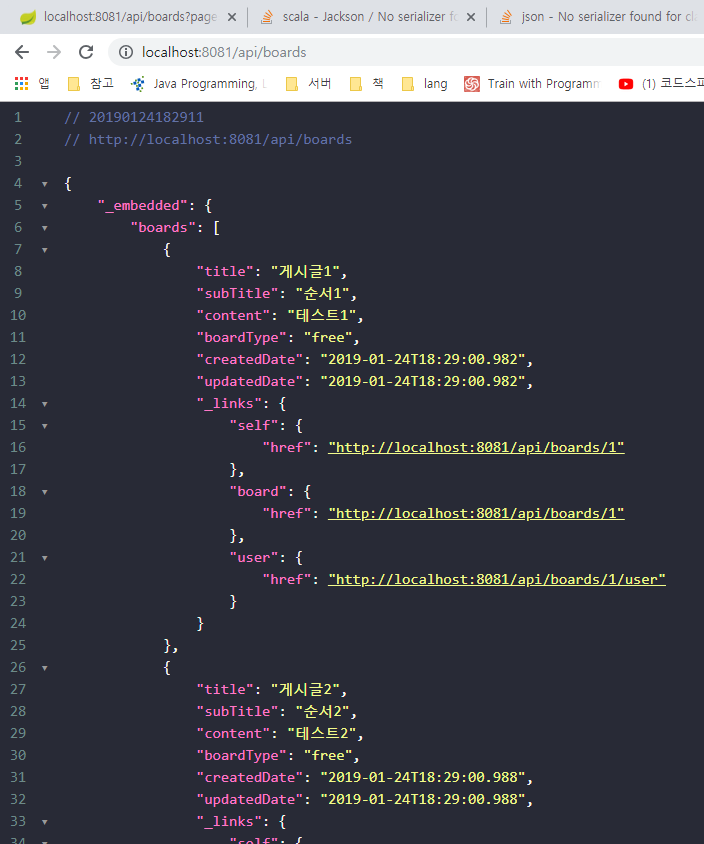

# 6. 스프링 부트 데이터 레스트
## DATA REST API 구현하기

MVC 패턴을 이용해 컨트롤러와 서비스 영역을 두면 세부적인 처리가 가능하고 복잡한 서비스도 처리할 수 있다.
하지만 복잡한 로직 없이 단순 요청을 받아 데이터를 있는 그대로 반환할 때는 비용 낭비가 될 수 있다.

=> MVC 패턴에서 VC를 생략 : 도메인과 repository로만 REST API를 제공하기 때문에 빠르고 쉽게 프로젝트를 진행할 수 있다.

- 스프링 부트 프로젝트 생성


### settings에서 어노테이션 사용 잊지않고 설정하기

```gradle
buildscript {
	ext {
		springBootVersion = '2.0.3.RELEASE'
	}
	repositories {
		mavenCentral()
	}
	dependencies {
		classpath("org.springframework.boot:spring-boot-gradle-plugin:${springBootVersion}")
	}
}

apply plugin: 'java'
apply plugin: 'eclipse'
apply plugin: 'org.springframework.boot'
apply plugin: 'io.spring.dependency-management'

group = 'com.community'
version = '0.0.1-SNAPSHOT'
sourceCompatibility = 1.8

repositories {
	mavenCentral()
}

dependencies {
	implementation('org.springframework.boot:spring-boot-starter-data-jpa')
	implementation('org.springframework.boot:spring-boot-starter-security')
	compile('com.fasterxml.jackson.datatype:jackson-datatype-jsr310')
	implementation('org.springframework.boot:spring-boot-starter-data-rest') {
		exclude module: "jackson-databind"
	}
	
	runtimeOnly('org.springframework.boot:spring-boot-devtools')
	compile('com.h2database:h2')
	compileOnly('org.projectlombok:lombok')
	testImplementation('org.springframework.boot:spring-boot-starter-test')
	testImplementation('org.springframework.security:spring-security-test')
}
```

- application.yml 설정

```yaml
server:
  port: 8081

spring:
  datasource:
    url: jdbc:h2:tcp://localhost:8082,/mem:testdb
    driverClassName: org.h2.Driver
    username: sa
    password:

  jpa:
    hibernate:
      ddl-auto: validate

  data:
    rest:
      base-path: /api
      default-page-size: 10
      max-page-size: 10
```

---

- 스프링 부트 데이터 레스트 프로퍼티
    - page-param-name : 페이지 선택하는 파라미터명을 지정
    - limit-param-name : 페이지의 아이템 수를 지정하는 파라미터명을 지정
    - sort-param-name : 페이지의 정렬를 지정하는 파라미터명을 지정
    - default-media-type : 기본 미디어 타입 지정
    - return-body-on-create : 새로운 entity를 생성한 후 Response Body 반환 여부 설정
    - return-body-on-update : entity를 수정한 이후 Response Body 반환 여부를 설정
    - enable-enum-translation : 'rest-message'라는 프포퍼티 파일을 만들어 지정한 enum 값을 사용하게 해준다.
    - detection-stratetgy : Repository 노출 전략을 설정
        - ALL : 모든 유형의 Repository를 노출
        - DEFAULT : public으로 설정된 모든 Repository를 노출한다.
        - ANNOTATION : @RestResource가 설정된 Repository만 노출
        - VISIBILITY : public 설정된 인터페이스만 노출

---

- web rest 프로젝트에서 entity, enum 클래스 복사하기

```java
package com.community.rest.domain.enums;

import lombok.Getter;

@Getter
public enum BoardType {
    notice("공지사항"),
    free("자유게시판");

    private String value;

    BoardType(String value) {
        this.value = value;
    }
}
```

```java
package com.community.rest.domain.enums;

import lombok.Getter;

@Getter
public enum SocialType {
    FACEBOOK("facebook"),
    GOOGLE("google"),
    KAKAO("kakao");

    private String name;
    private static final String ROLE_PREFIX = "ROLE_";

    SocialType(String name) {
        this.name = name;
    }

    public String getRoleType() {
        return ROLE_PREFIX + name.toUpperCase();
    }

    public boolean isEquals(String authority) {
        return this.name.equals(authority);
    }
}
```

```java
package com.community.rest.domain;

import com.community.rest.domain.enums.SocialType;
import lombok.Builder;
import lombok.Getter;
import lombok.NoArgsConstructor;

import javax.persistence.Entity;
import javax.persistence.GeneratedValue;
import javax.persistence.GenerationType;
import javax.persistence.Id;
import java.io.Serializable;
import java.time.LocalDateTime;

@Getter
@NoArgsConstructor
@Entity
public class User implements Serializable {
    @Id
    @GeneratedValue(strategy = GenerationType.IDENTITY)
    private Long index;
    private String name;
    private String password;
    private String email;
    private LocalDateTime createdDate;
    private LocalDateTime updatedDate;

    // OAuth
    private String principal;
    private SocialType socialType;

    @Builder
    public User(String name, String password, String email, LocalDateTime createdDate, LocalDateTime updatedDate, String principal, SocialType socialType) {
        this.name = name;
        this.password = password;
        this.email = email;
        this.createdDate = createdDate;
        this.updatedDate = updatedDate;
        this.principal = principal;
        this.socialType = socialType;
    }
}
```

```java
package com.community.rest.domain;

import com.community.rest.domain.enums.BoardType;
import lombok.Builder;
import lombok.Getter;
import lombok.NoArgsConstructor;

import javax.persistence.*;
import java.io.Serializable;
import java.time.LocalDateTime;

@Getter
@NoArgsConstructor
@Entity
public class Board implements Serializable {
    @Id
    @GeneratedValue(strategy = GenerationType.IDENTITY) // IDENTITY: 키 생성을 DB에 위임
    private Long index;
    private String title;
    private String subTitle;
    private String content;
    @Enumerated(EnumType.STRING) //EnumType.ORDINAL은 enum의 순번으로 저장, String은 해당 enum 그대로 저장
    private BoardType boardType;
    // LocalDateTime: 1.8부터 추가된 API로 Date, Calendar에서 부실한 날짜 연산기능을 추가로 제공
    private LocalDateTime createdDate;
    private LocalDateTime updatedDate;

    @OneToOne(fetch = FetchType.EAGER) // <- EAGER 사용해야 한다 : https://stackoverflow.com/questions/24994440/no-serializer-found-for-class-org-hibernate-proxy-pojo-javassist-javassist
    private User user; // 실제 User 객체가 DB에 저장되는 것이 아닌 User의 index가 record에 저장된다.

    public void setCreatedDateNow() {
        this.createdDate = LocalDateTime.now();
    }

    /************
     * 추가 됨  *
     ************/
    public void setUpdatedDateNow() {
        this.updatedDate = LocalDateTime.now();
    }
    
    public void update(Board board) {
        this.title = board.getTitle();
        this.subTitle = board.getSubTitle();
        this.content = board.getContent();
        this.boardType = board.getBoardType();
        this.updatedDate = LocalDateTime.now();
    }

    @Builder
    public Board(String title, String subTitle, String content, BoardType boardType, LocalDateTime createdDate, LocalDateTime updatedDate, User user) {
        this.title = title;
        this.subTitle = subTitle;
        this.content = content;
        this.boardType = boardType;
        this.createdDate = createdDate;
        this.updatedDate = updatedDate;
        this.user = user;
    }
}
```

- 스프링 부트 데이터 레스트로 REST API 구현 : @RepositoryRestResource

```java
package com.community.rest.repository;

import com.community.rest.domain.Board;
import org.springframework.data.jpa.repository.JpaRepository;
import org.springframework.data.rest.core.annotation.RepositoryRestResource;

@RepositoryRestResource // 컨트롤러와 서비스 영역 없이 미리 내부적으로 정의되어 있는 로직을 따라 처리된다.
public interface BoardRepository extends JpaRepository<Board, Long> {
}
```

```java
package com.community.rest.repository;

import com.community.rest.domain.User;
import org.springframework.data.jpa.repository.JpaRepository;
import org.springframework.data.rest.core.annotation.RepositoryRestResource;

@RepositoryRestResource // 컨트롤러와 서비스 영역 없이 미리 내부적으로 정의되어 있는 로직을 따라 처리된다.
public interface UserRepository extends JpaRepository<User, Long> {
}
```

---

- Web Security 설정하기

```java
package com.community.rest.config;

import org.springframework.context.annotation.Configuration;
import org.springframework.security.config.annotation.method.configuration.EnableGlobalMethodSecurity;
import org.springframework.security.config.annotation.web.builders.HttpSecurity;
import org.springframework.security.config.annotation.web.configuration.EnableWebSecurity;
import org.springframework.security.config.annotation.web.configuration.WebSecurityConfigurerAdapter;
import org.springframework.web.cors.CorsConfiguration;
import org.springframework.web.cors.UrlBasedCorsConfigurationSource;

@Configuration
@EnableWebSecurity
public class WebSecurityConfig extends WebSecurityConfigurerAdapter {
    @Override
    protected void configure(HttpSecurity http) throws Exception {
        CorsConfiguration corsConfiguration = new CorsConfiguration();
        corsConfiguration.addAllowedOrigin(CorsConfiguration.ALL);
        corsConfiguration.addAllowedMethod(CorsConfiguration.ALL);
        corsConfiguration.addAllowedHeader(CorsConfiguration.ALL);

        UrlBasedCorsConfigurationSource source = new UrlBasedCorsConfigurationSource();
        source.registerCorsConfiguration("/**", corsConfiguration);

        http.httpBasic()
                .and()
                    .authorizeRequests()
                    .anyRequest().permitAll() // 모든 요청 허용
                .and()
                    .cors()
                        .configurationSource(source)
                .and()
                    .csrf()
                        .disable();
    }
}
```

---

- API 호출

http://localhost:8081/api/boards



http://localhost:8081/api/boards?page=2


`_links` : Board 관련 링크 정보, Board 페이징 처리 관련 링크 정보

HATEOAS를 지키며 Web REST를 활용한 방법 보다 더 많은 링크 정보를 제공하고 있다.
=> 좀 더 최적화하고 싶다면 @RepositoryRestController 사용

- @RepositoryRestController

@RestController를 대체하는 용도로 사용하며 두 가지 주의사항이 있다.
1. 매핑하는 URL 형식이 Spring Boot data REST에서 정의하는 REST API 형식에 맞아야한다.
2. 기존에 기본으로 제공하는 URL 형식과 같게 제공해야 해당 컨트롤러의 메서드가 기존의 기본 API를 override 한다.

- @RepositoryRestController를 사용한 레스트 컨트롤러 작성

```java
package com.community.rest.controller;

import com.community.rest.domain.Board;
import com.community.rest.repository.BoardRepository;
import org.springframework.data.domain.Page;
import org.springframework.data.domain.Pageable;
import org.springframework.data.rest.webmvc.RepositoryRestController;
import org.springframework.data.web.PageableDefault;
import org.springframework.hateoas.PagedResources;
import org.springframework.hateoas.Resources;
import org.springframework.web.bind.annotation.GetMapping;
import org.springframework.web.bind.annotation.ResponseBody;

import static org.springframework.hateoas.mvc.ControllerLinkBuilder.linkTo;
import static org.springframework.hateoas.mvc.ControllerLinkBuilder.methodOn;

@RepositoryRestController
public class BoardRestController {
    private BoardRepository boardRepository;

    public BoardRestController(BoardRepository boardRepository) {
        this.boardRepository = boardRepository;
    }

    @GetMapping("/boards") // 기본 URL 형식 override
    @ResponseBody
    public Resources<Board> simpleBoard(@PageableDefault Pageable pageable) {
        Page<Board> boardList = boardRepository.findAll(pageable);

        // 페이지 정보를 담는 PageMetadata 객체를 생성
        PagedResources.PageMetadata pageMetadata =
                new PagedResources.PageMetadata(pageable.getPageSize(), boardList.getNumber(), boardList.getTotalElements());

        // 컬렉션의 페이지 리소스 정보를 추가적으로 제공하는 PagedResources 객체 생성 후 반환
        PagedResources<Board> resources = new PagedResources<>(boardList.getContent(), pageMetadata);
            // 필요한 링크를 추가 : 요청된 각각의 Board를 나타내는 'self' 하나만 임시로 추가함
        resources.add(linkTo(methodOn(BoardRestController.class).simpleBoard(pageable)).withSelfRel());

        return resources;
    }
}
```

서버 재기동 후 재접속 http://localhost:8081/api/boards


코드로 일일히 모든 링크를 추가하는 일은 굉장히 번거로운 작업이다
=> data REST는 이러한 반복 작업을 일괄적으로 제공해주기 때문에 링크를 추가하는 코드를 구현할 필요가 없다.

- H2 DB 설정 후 CUD 연동 테스트 해보기

---

GET 으로 데이터를 가져올 때 비밀번호와 같은 민감한 데이터를 다룰 때는 한정된 값만 사용하도록 제한을 걸어야한다.

http://localhost:8081/api/users


- @JsonIgnore

```java
@Getter
@NoArgsConstructor
@Entity
public class User implements Serializable {
    // 생략

    @JsonIgnore
    private String password;

    // 생략
```

서버 재시작 후 API 재호출

http://localhost:8081/api/users


---

- @Projection

상황에 따라 유동적으로 설정하고 싶다면 @Projection을 설정하여 원하는 필드만 제한할 수 있다.

```java
package com.community.rest.domain.projection;

import com.community.rest.domain.User;
import org.springframework.data.rest.core.config.Projection;

@Projection(name = "getOnlyName", types = {User.class})
public interface UserOnlyContainName {
    String getName();
}
```

```java
package com.community.rest.repository;

import com.community.rest.domain.User;
import com.community.rest.domain.projection.UserOnlyContainName;
import org.springframework.data.jpa.repository.JpaRepository;
import org.springframework.data.rest.core.annotation.RepositoryRestResource;

@RepositoryRestResource(excerptProjection = UserOnlyContainName.class) // 컨트롤러와 서비스 영역 없이 미리 내부적으로 정의되어 있는 로직을 따라 처리된다.
public interface UserRepository extends JpaRepository<User, Long> {
}
```

@JsonIgnore 지우고

서버 재기동 후 재접속 http://localhost:8081/api/users


이름과 링크만 노출되었다. 
하지만 http://localhost:8081/api/users/1 로 호출하면 다른 필드들이 다시 나온다.


**@RepositoryRestResource의 excerptProjection으로 관리되는 리소스 참조는 단일 참조 시 적용되지 않는다.**

위 경우 프로젝션 적용을 하려면 /api/users/1?projection=getOnlyName을 적용하면 된다.

---

### 메서드 권한 제한

CURD에서 실서비스에서는 사용자에 따라 서로른 다른 권한을 부여해야한다.
=> Spring Boot Data REST는 Spring Security와의 호환을 통해 이를 해결한다.

@EnableGlobalMethodSecurity(se)를 이용하면 권한을 관리할 수 있다.

가장 기본적인 방법인 @Secured는 Role 기반으로 접근을 제한할 수 있지만 권한 지정에 있어 유연성이 떨어진다.

@PreAuthorize를 사용하면 @Secured 보다 더 효율적으로 권한을 지정할 수 있다.

```java
package com.community.rest.domain.projection;

import com.community.rest.domain.Board;
import org.springframework.data.rest.core.config.Projection;

@Projection(name = "getOnlyTitle", types = {Board.class})
public interface BoardOnlyContainTitle {    
    String getTitle();
}
```

```java
package com.community.rest.repository;

import com.community.rest.domain.Board;
import com.community.rest.domain.projection.BoardOnlyContainTitle;
import org.springframework.data.jpa.repository.JpaRepository;
import org.springframework.data.rest.core.annotation.RepositoryRestResource;
import org.springframework.security.access.prepost.PreAuthorize;

@RepositoryRestResource(excerptProjection = BoardOnlyContainTitle.class) // 컨트롤러와 서비스 영역 없이 미리 내부적으로 정의되어 있는 로직을 따라 처리된다.
public interface BoardRepository extends JpaRepository<Board, Long> {

    @Override
    @PreAuthorize("hasRole('ROLE_ADMIN')")
    <S extends Board> S save(S entity);
}
```

```java
package com.community.rest.config;

@Configuration
@EnableWebSecurity
@EnableGlobalMethodSecurity(prePostEnabled = true)
public class WebSecurityConfig extends WebSecurityConfigurerAdapter {
    // ...

    @Bean
    InMemoryUserDetailsManager userDetailsManager() {
        // org.springframework.security.core.userdetails.User
        User.UserBuilder commonUser = User.withUsername("commonUser") // domain의 user가 아님!
                .password("{noop}common")
                .roles("USER");
        
        User.UserBuilder sonyc = User.withUsername("sonyc")
                .password("{noop}test")
                .roles("USER", "ADMIN");

        List<UserDetails> userDetailsList = new ArrayList<>();
        userDetailsList.add(commonUser.build());
        userDetailsList.add(sonyc.build());
        
        return new InMemoryUserDetailsManager(userDetailsList);
    }
}
```

```javascript
// templates/board/form.html : 글 작성
$("#insert").click(function() {
    var insertData = {
        title: $("#board_title").val(),
        subTitle: $("#board_sub_title").val(),
        content: $("#board_content").val(),
        boardType: $("#board_type option:selected").val()
    }

    $.ajax({
        url: "http://localhost:8081/api/boards",
        type: "POST",
        data: JSON.stringify(insertData),
        contentType: "application/json",
        headers: {
            Authorization: "Basic " + btoa("sonyc" + ":" + "test") // btoa : BASE64 인코딩
        },
        dataType: "json"
    }).done(function(data) {
        alert("저장 성공!");
        location.href = "/board/list";
    }).fail(function() {
        alert("저장 실패!");
    });
});
```

서버 재기동 후 글 작성 테스트

---

### 이벤트 바인딩

REST API를 사용하여 생성, 수정을 하면 클라이언트/서버 간의 시간이 맞지 않거나 지연으로 인한 오차가 생길 수 있다.

Spring Boot Data REST에서는 여러 메서드의 이벤트 발생 시점을 가로채 원하는 데이터를 추가하거나 검사하는 이벤트 어노테이션을 제공한다.

- BeforeCreateEvent : 생성 전의 이벤트
- AfterCreateEvent : 생성 후의 이벤트
- BeforeSaveEvent : 수정 전의 이벤트
- AfterSaveEvent : 수정 후의 이벤트
- BeforeDeleteEvent : 삭제 전의 이벤트
- AfterDeleteEvent : 삭제 후의 이벤트
- BeforeLinkSaveEvent : 관계(1:1, M:M)를 가진 링크를 수정 전의 이벤트
- AfterLinkSaveEvent : 관계(1:1, M:M)를 가진 링크를 수정 후의 이벤트
- BeforeLinkDeleteEvent : 관계(1:1, M:M)를 가진 링크를 삭제 전의 이벤트
- AfterLinkDeleteEvent : 관계(1:1, M:M)를 가진 링크를 삭제 후의 이벤트

Board용 EventHandler 생성

```java
package com.community.rest.event;

import com.community.rest.domain.Board;
import org.springframework.data.rest.core.annotation.HandleBeforeCreate;
import org.springframework.data.rest.core.annotation.HandleBeforeSave;
import org.springframework.data.rest.core.annotation.RepositoryEventHandler;
import org.springframework.stereotype.Component;

@Component
@RepositoryEventHandler // BeanPostProcessor에 해당 클래스가 검사될 필요가 있음을 알려준다.
public class BoardEventHandler {

    @HandleBeforeCreate
    public void beforeCreateBoard(Board board) {
        board.setCreatedDateNow();
    }

    @HandleBeforeSave
    public void beforeSaveBoard(Board board) {
        board.setUpdatedDateNow();
    }
}
```

BoardEventHandler 테스트

```java
package com.community.rest;

import com.community.rest.domain.Board;
import org.junit.Assert;
import org.junit.Test;
import org.junit.runner.RunWith;
import org.springframework.boot.test.autoconfigure.jdbc.AutoConfigureTestDatabase;
import org.springframework.boot.test.context.SpringBootTest;
import org.springframework.boot.test.web.client.TestRestTemplate;
import org.springframework.test.context.junit4.SpringRunner;

@RunWith(SpringRunner.class)
@SpringBootTest(classes = RestApplication.class, webEnvironment = SpringBootTest.WebEnvironment.DEFINED_PORT) // 정해진 포트 (여기서는 8081)
@AutoConfigureTestDatabase // H2가 dependency로 추가되어 있으면 자동으로 H2를 테스트 DB로 지정한다.
public class RestApplicationTests {

    private TestRestTemplate restTemplate = new TestRestTemplate("sonyc", "test");

    @Test
    public void board_저장_시_생성날짜_지정되는지_테스트() {
        Board board = createBoard();
        Assert.assertNotNull(board.getCreatedDate());
    }

    @Test
    public void board_수정_시_수정날짜_지정되는지_테스트() {
        Board createdBoard = createBoard();
        Board updateBoard = updateBoard(createdBoard);
        Assert.assertNotNull(updateBoard.getUpdatedDate());
    }

    private Board createBoard() {
        Board board = Board.builder().title("저장 이벤트 테스트").build();
        return restTemplate.postForObject("http://localhost:8081/api/boards", board, Board.class);
    }

    private Board updateBoard(Board createdBoard) {
        String updateUri = "http://localhost:8081/api/boards/1";
        restTemplate.put(updateUri, createdBoard);
        return restTemplate.getForObject(updateUri, Board.class);
    }

}
```

테스트를 위해 ddl-auto를 create-drop으로 변경

```yaml
spring:
  datasource:
    url: jdbc:h2:tcp://localhost:8082,/mem:testdb
    driverClassName: org.h2.Driver
    username: sa
    password:

  jpa:
    hibernate:
      ddl-auto: create-drop
```

테스트 후 validate로 바꿔놓는다.


---

#### URI 처리

제목을 찾는 쿼리를 호출하는 URI

```java
package com.community.rest.repository;

import com.community.rest.domain.Board;
import com.community.rest.domain.projection.BoardOnlyContainTitle;
import org.springframework.data.jpa.repository.JpaRepository;
import org.springframework.data.rest.core.annotation.RepositoryRestResource;
import org.springframework.data.rest.core.annotation.RestResource;
import org.springframework.security.access.prepost.PreAuthorize;

import java.util.List;

@RepositoryRestResource(excerptProjection = BoardOnlyContainTitle.class) // 컨트롤러와 서비스 영역 없이 미리 내부적으로 정의되어 있는 로직을 따라 처리된다.
public interface BoardRepository extends JpaRepository<Board, Long> {

    @Override
    @PreAuthorize("hasRole('ROLE_ADMIN')")
    <S extends Board> S save(S entity);

    // 추가
    @RestResource
    List<Board> findByTitle(@Param("title") String title);
}
```

http://localhost:8081/api/boards/search/findByTitle?title=TestTitle (미리 해당 제목의 board data가 있어야한다.)


`findByTitle`을 `query`로 변경 : @RestResource의 path 속성 추가

```java
@RestResource(path = "query")
List<Board> findByTitle(@Param("title") String title);
```

http://localhost:8081/api/boards/search/query?title=TestTitle (미리 해당 제목의 board data가 있어야한다.)

---

특정 repository, 쿼리 메서드, 필드를 노출하고 싶지 않은 상황이 있다.

=> @RestResource의 exported 속성 false

```java
@RestResource(exported = false)
List<Board> findByTitle(@Param("title") String title);
```

---

### HAL 브라우저 적용

- dependency 추가

```gradle
dependencies {
    implementation('org.springframework.boot:spring-boot-starter-data-jpa')
    implementation('org.springframework.boot:spring-boot-starter-security')
    compile('com.fasterxml.jackson.datatype:jackson-datatype-jsr310')
    implementation('org.springframework.boot:spring-boot-starter-data-rest') {
        exclude module: "jackson-databind"
    }
    implementation('org.springframework.data:spring-data-rest-hal-browser') // 추가

    runtimeOnly('org.springframework.boot:spring-boot-devtools')
    compile('com.h2database:h2')
    compileOnly('org.projectlombok:lombok')
    testImplementation('org.springframework.boot:spring-boot-starter-test')
    testImplementation('org.springframework.security:spring-security-test')
}
```

- 서버를 재구동하고 REST root 경로로 들어가면 HAL 브라우저 UI 창으로 redirection

http://localhost:8081/api/

