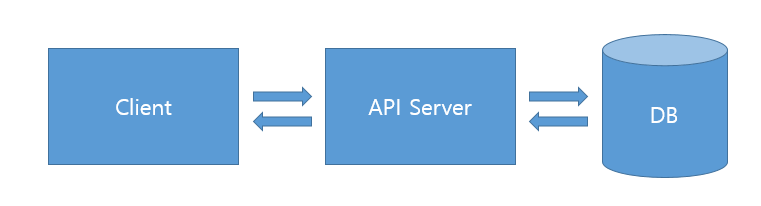
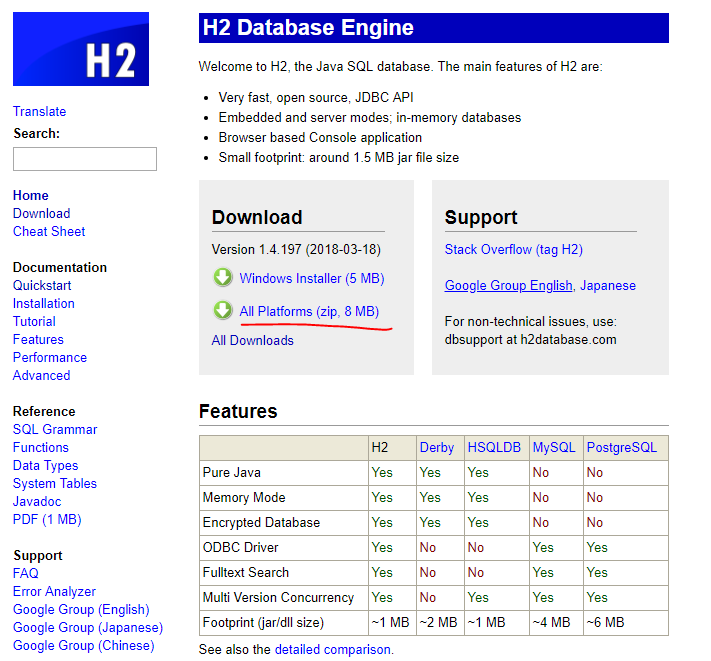
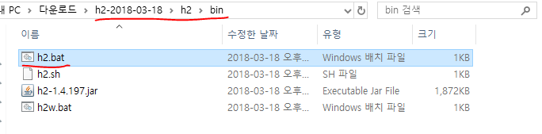
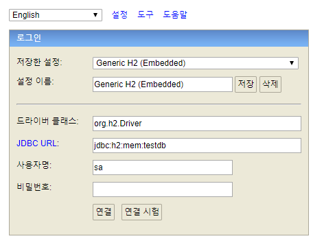

# 6. 스프링 부트 데이터 레스트

1. 배경 지식

- **REST**
: Representational State Transfer의 약자로 웹의 장점을 극대화하는 통신 네트워크 아키텍쳐이며 분산 네트워크 프로그래밍의 아키텍쳐이다.

**REST의 특성**
- 클라이언트/서버 : 클라이언트와 서버가 서로 독립적으로 구분되어야 하고,
                서로간의 의존성 때문에 확장에 문제가 되는 일이 없어야한다.

- 상태 없음 : 클라이언트와 서버 간의 통신 시에 상태가 없어야한다.

- Layered Architencutre : 서버와 클라이언트 사이에 다계층 형태로 레이어를 추가하거나 수정하거나 제거할 수 있고 확장성이 있어야한다.

- 캐시 : 캐시를 가지고 있을 경우 클라이언트가 캐시를 통해 응답을 재사용할 수 있고,
        이를 통해서 서버의 부하를 낮추어서 서버의 성능이 향상될 수 있다.

- Code on demand : 요청이 오면 코드를 준다 -> 특정 시점에 서버가 특정 기능을 수행하는 스크립트 또는 플러그인을 클라이언트에 전달해서 해당 기능을 동작하도록 하는 것 (applet, javascript, flash …)

- 통합 인터페이스 : 서버와 클라이언트 간의 상호작용은 일관된 인터페이스 위에서 이뤄져야 한다.
1. 리소스 식별 :
    웹 안에서 서로 구분할 수 있는 개념 (URI와 같은 고유 식별자를 통해 표현할 수 있다)
2. 표현을 통한 리소스 처리 : 
    데이터에 대해서 표현할 때 JSON, XML, HTML 페이지와 같이 다양한 콘텐츠 유형으로 표현할 수 있다. 그렇지만 데이터는 변경되지 않는다.
3. 자기 묘사 메시지 :
    HTTP 통신을 할 때 header에 메타 데이터 정보를 추가하여 실제 데이터와는 관련이 없지만 데이터에 대한 설명을 나타내는 정보를 담을 수 있다.
4. HATEOAS (Hypermedia As The Engine Of Application State) :
    웹은 여러 페이지들과 그 페이지를 이동할 수 있는 링크 정보들로 구성되어 있다.
    REST API를 개발할 때도 단순히 데이터만 전달하지 않고 링크 정보까지 포함한다면 더 웹에 친숙한 API가 될 것이다.

- 반드시 위의 REST의 특성을 준수해야할 의무는 없다. 다만 REST의 특성을 지켜 개발을 진행하면 보다 더 확장성 있는 서버 app을 개발할 수 있다.

API 구조가 위에서 언급한 REST 요건들에 적합한 경우 RESTful 하다고 말하고 이러한 API를 REST API라 한다.

#### 인터페이스의 일관성

1. 자원 식별

: 리소스 접근은 URI를 사용한다. 즉, 각각의 리소스는 요청에서 무엇인지 식별 가능하다.

e.g.)
```
/board/1 <- 보드 리스트 중 1번
```

2. 메시지를 통한 리소스 조작

: 클라이언트가 특정 메시지나 메타데이터를 가지고 있으면 리소스를 수정, 삭제하려는 충분한 정보를 가지고 있다.

e.g.)
```
/board/1
content-type : application/json <- 리소스의 형식을 지정
```

3. 자기 서술적 메시지

: 메시지는 자신을 어떻게 처리해야 하는지 충분한 정보를 포함해야한다.

웹 기반 REST에서는 HTTP Method와 Header를 활용한다.

e.g.)
```
GET /board/1 <- GET(정보를 조회한다.)
content-type : application/json
```

4. 애플리케이션 상태에 대한 엔진으로서의 하이퍼미디어 (HATEOAS)

클라이언트에 응답할 때 단순히 결과 데이터를 제공해주기보다는 관련 URI를 함께 제공해야한다는 원칙

```
예제 코드 1: 전형적인 REST API의 응답 데이터

{
  “accountId”:12345,
  “accountType”:”saving”,
  “balance”:350000”,
  “currency”:”KRW”
}
```

```
예제 코드 2: HATEAOS가 도입되어 자원에 대한 추가 정보가 제공되는 응답 데이터

{
  “accountId”:12345,
  “accountType”:”saving”,
  “balance”:350000”,
  “currency”:”KRW”
  “links”: [
       {
       “rel”: “self”
       “href”: “http://localhost:8080/accounts/1”
       },
       {
       “rel”: “withdraw”,
       “href”: “http://localhost:8080/accounts/1/withdraw”
       },
       {
       “rel”:”transfer”,
         “href”:”http://localhost:8080/accounts/1/transfer”
       }
  ]
}
```

---

- **REST API 설계하기**

REST API는 다음과 같이 구성해야 한다.

- resource : URI
- verb : HTTP method
- representation : HTTP Message Body (리소스에 대한 표현)

- URI 설계

URL (인터넷상에서 특정 자원이 어디에 위치하는지 식별하는 방법)

```
http://hello.world.com/api/book.pdf
```

URI (웹에 있는 자원의 이름과 위치를 식별)

```
http://hello.world.com/api/book/1
```

---

### 커뮤니티 게시판과 연동되는 REST API 설계



### 준비하기

- 기존 form.html에서 글 게시, 수정, 삭제용 자바스크립트 코드 추가

```html
<!DOCTYPE html>
<html xmlns:th="http://www.thymeleaf.org">
<head>
    <meta charset="UTF-8">
    <title>Board Form</title>
    <link rel="stylesheet" th:href="@{/css/base.css}">
    <link rel="stylesheet" th:href="@{/css/bootstrap.min.css}">
</head>
<body>

<div th:replace="layout/header::header"></div>

<div class="container">
    <div class="page-header">
        <h1>게시글 등록</h1>
    </div>
    <br>

    <!-- ${...?} null 체크 : null인 경우 빈값 출력 -->
    <input id="board_index" type="hidden" th:value="${board?.index}">
    <!-- board 생성 날짜 -->
    <input id="board_create_date" type="hidden" th:value="${board?.createdDate}">

    <table class="table">
        <tr>
            <th style="padding: 13px 0 0 15px;">게시판 선택</th>
            <td>
                <div class="pull-left">
                    <select id="board_type" class="form-control input-sm">
                        <option>--분류--</option>
                        <option th:value="notice" th:selected="${board?.boardType?.name() == 'notice'}">공지사항</option>
                        <option th:value="free" th:selected="${board?.boardType?.name() == 'free'}">자유게시판</option>
                    </select>
                </div>
            </td>
        </tr>

        <tr>
            <th style="padding: 13px 0 0 15px;">생성 날짜</th>
            <td>
                <input type="text" class="col-md-1 form-control input-sm" readonly="readonly"
                       th:value="${board?.createdDate} ? ${#temporals.format(board.createdDate, 'yyyy-MM-dd HH:mm')} : ${board?.createdDate}">
            </td>
        </tr>

        <tr>
            <th style="padding: 13px 0 0 15px;">제목</th>
            <td>
                <input id="board_title" type="text" class="col-md-1 form-control input-sm"
                       th:value="${board?.title}">
            </td>
        </tr>

        <tr>
            <th style="padding: 13px 0 0 15px;">부제목</th>
            <td>
                <input id="board_sub_title" type="text" class="col-md-1 form-control input-sm"
                       th:value="${board?.subTitle}">
            </td>
        </tr>

        <tr>
            <th style="padding: 13px 0 0 15px;">내용</th>
            <td>
                    <textarea id="board_content" type="text" class="col-md-1 form-control input-sm"
                              maxlength="140" rows="7" style="height: 200px;" th:text="${board?.content}"></textarea>
                <span class="help-block"></span>
            </td>
        </tr>

        <tr>
            <td></td>
            <td></td>
        </tr>
    </table>

    <div class="pull-left">
        <a href="/board/list" class="btn btn-default">목록으로</a>
    </div>

    <div class="pull-right">
        <!-- index 없으면 작성 form이기 때문에 저장 버튼 활성화 -->
        <button id="insert" th:if="!${board?.index}" type="button" class="btn btn-primary">저장</button>
        <button id="update" th:if="${board?.index}" type="button" class="btn btn-info" >수정</button>
        <button id="delete" th:if="${board?.index}" type="button" class="btn btn-danger">삭제</button>
    </div>
</div>

<div th:replace="layout/footer::footer"></div>

<script th:src="@{/js/jquery.min.js}"></script>

<script th:if="!${board?.index}">
    // 글 작성의 경우
    $("#insert").click(function() {
        var insertData = {
            title: $("#board_title").val(),
            subTitle: $("#board_sub_title").val(),
            content: $("#board_content").val(),
            boardType: $("#board_type option:selected").val()
        }

        $.ajax({
            url: "http://localhost:8081/api/boards",
            type: "POST",
            data: JSON.stringify(insertData),
            contentType: "application/json",
            dataType: "json"
        }).done(function(data) {
            alert("저장 성공!");
            location.href = "/board/list";
        }).fail(function() {
            alert("저장 실패!");
        });
    });
</script>

<script th:if="${board?.index}">
    // 글 조회의 경우
    $("#update").click(function() {
        var updateData = {
            title: $("#board_title").val(),
            subTitle: $("#board_sub_title").val(),
            content: $("#board_content").val(),
            boardType: $("#board_type option:selected").val()
        }

        $.ajax({
            url: "http://localhost:8081/api/boards/" + $("#board_index").val(),
            type: "PUT",
            data: JSON.stringify(updateData),
            contentType: "application/json",
            dataType: "json"
        }).done(function(data) {
            alert("수정 성공!");
            location.href = "/board/list";
        }).fail(function() {
            alert("수정 실패!");
        });
    });

    $("#delete").click(function() {
        $.ajax({
            url: "http://localhost:8081/api/boards/" + $("#board_index").val(),
            type: "DELETE",
        }).done(function(data) {
            alert("삭제 성공!");
            location.href = "/board/list";
        }).fail(function() {
            alert("삭제 실패!");
        });
    });
</script>
</body>
</html>
```

- H2 DB 다운로드

http://www.h2database.com/html/main.html



h2/bin/h2.bat 실행



8082 port



- 외부 H2 서버 접속 설정

application.yml

```yaml
spring:
  security:
    oauth2:
      client:
        registration:
          google:
            client-id: google-client-id
            client-secret: google-client-secret
          facebook:
            client-id: facebook-client-id
            client-secret: facebook-client-secret
  datasource: # <- 추가
    url: jdbc:h2:tcp://localhost:8082,/mem:testdb
    driverClassName: org.h2.Driver
    username: sa
    password:
```