# 스프링 부트 배치

- 배치 (batch)
    - `프로그램의 흐름에 따라 순차적으로 자료를 처리한다`는 뜻
- 배치 처리 (batch processing)
    - `일괄 처리`와 같은 말

### 스프링 부트 배치의 장점
- 대용량 데이터 처리에 최적화
- 효과적인 로깅, 통계 처리, 트랜잭션 관리 등 재사용 가능한 필수 기능을 지원
- 자동화 (수동화 X)
- 예외사항, 비정상 동작에 대한 방어기능

### 스프링 부트 배치 주의사항
- 최대한 단순화하여 복잡한 구조와 로직을 피해야 한다.
- 데이터를 직접 사용하는 작업이 주로 일어나기 때문에 데이터 무결성을 유지하는 유효성 검사 등의 방어책이 있어야한다.
- 배치 처리 시 시스템 I/O 사용을 최소화 해야한다. 가능한 한 번에 데이터를 조회하여 처리한 후, 그 결과를 한 번에 저장하는 편이 좋다.
- 배치 처리가 진행되는 동안 다른 프로젝트 요소에 영향을 주는 경우가 없는지 주의를 기울여야한다.
- 스케쥴러를 제공하지 않는다. 이 기능은 Quartz 프레임워크 등을 사용해야한다.

### 스프링 부트 배치 이해하기

배치의 일반적인 시나리오
1. 읽기 (read) : 데이터 저장소에서 특정 데이터 레코드를 읽는다.
2. 처리 (processing) : 원하는 방식으로 데이터를 가공/처리한다.
3. 쓰기 (write) : 수정된 데이터를 다시 저장소에 저장한다.

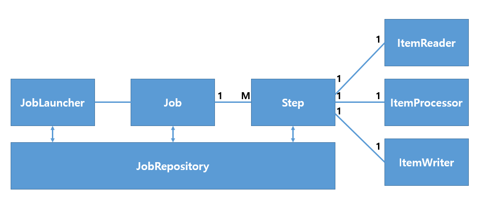

Job : Step = 1 : M

Job이라는 하나의 큰 일감(Job)에 여러 단계(Step)를 두고, 각 단계의 배치의 기본 흐름대로 구현한다.

### Job

Job 객체는 여러 Step 인스턴스를 포함하는 컨테이너이다.

- JobInstance

배치에서 Job이 실행될 때 하나의 Job 실행 단위
하루 한 번 배치가 실행될 경우 어제, 오늘 실행된 각각의 Job은 JobInstance라고 부를 수 있다.
Job이 실패할 경우 해당 JobInstance가 끝난 것으로 간주하지 않기 때문에 동일한 JobInstance로 다시 실행한다.

- JobExecution

JobInstance에 대한 한 번의 실행을 나타내는 객체.
JobInstance가 같아도 (e.g. 어제 실패한 JobInstance가 오늘 다시 실행될 때) JobExecution은 새로 생성된다.
JobExecution은 해당 Job에 대한 정보들을 담고 있다.

```java
public class JobExecution extends Entity {
    private final JobParameters jobParameters;
    private JobInstance jobInstance;
    private volatile Collection<StepExecution> stepExecutions = Collections.synchronizedSet(new LinkedHashSet<>());
    private volatile BatchStatus status = BatchStatus.STARTING;
    private volatile Date startTime = null;
    private volatile Date createTime = new Date(System.currentTimeMillis());
    private volatile Date endTime = null;
    private volatile Date lastUpdated = null;
    private volatile ExitStatus exitStatus = ExitStatus.UNKNOWN;
    private volatile ExecutionContext executionContext = new ExecutionContext();
    private transient volatile List<Throwable> failureExceptions = new CopyOnWriteArrayList<>();
    private final String jobConfigurationName;
```

- JobParameter

Job이 실행될 때 필요한 파라미터들을 Map 타입으로 저장하는 객체이다.

### Step

Job을 처리하는 실질적인 단위로, 모든 Job에는 1개 이상의 Step이 있어야한다.

- StepExecution

Job에는 JobExecution이라는 Job 실행 정보가 있다면 Step에는 StepExecution이라는 Step 실행 정보를 담는 객체가 있다.
각각의 Step이 실행될 때 마다 StepExecution이 생성된다.

```java
public class StepExecution extends Entity {
    private final JobExecution jobExecution;
    private final String stepName;
    private volatile BatchStatus status = BatchStatus.STARTING;
    private volatile int readCount = 0;
    private volatile int writeCount = 0;
    private volatile int commitCount = 0;
    private volatile int rollbackCount = 0;
    private volatile int readSkipCount = 0;
    private volatile int processSkipCount = 0;
    private volatile int writeSkipCount = 0;
    private volatile Date startTime = new Date(System.currentTimeMillis());
    private volatile Date endTime = null;
    private volatile Date lastUpdated = null;
    private volatile ExecutionContext executionContext = new ExecutionContext();
    private volatile ExitStatus exitStatus = ExitStatus.EXECUTING;
    private volatile boolean terminateOnly;
    private volatile int filterCount;
    private transient volatile List<Throwable> failureExceptions = new CopyOnWriteArrayList<Throwable>();
}
```

### JobRepository

어떤 Job이 실행되었으며 몇 번 실행되었고 언제 끝났는지 등 배치 처리에 대한 메타데이터를 저장한다.

### JobLauncher

Job, JobParameters와 함께 배치를 실행하는 인터페이스이다.

### ItemReader

대상이 되는 배치 데이터를 읽어오는 인터페이스.
File, XML, DB 등 여러 타입의 데이터를 읽어올 수 있다.

### ItemProcessor

ItemReader로 읽어온 배치 데이터를 변환하는 역할을 수행한다.

### ItemWriter

배치 데이터를 저장한다.

---

## 휴면회원 배치 설계하기

가입한 회원 중 1년이 지나도록 상태 변화가 없는 회원을 휴면회원으로 전환하는 배치구조를 만들어보자.

- 프로젝트 생성

com.community.batch
dependency : JPA, H2, Batch, Lombok

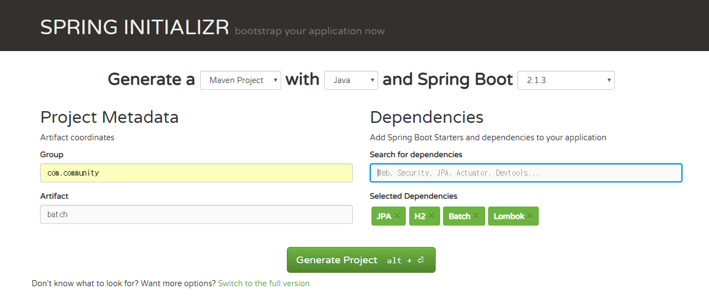

- settings 에서 lombok annotation 관련 설정
- spring boot version 2.0.3으로 변경

### 스프링 부트 배치 설정하기

```java
package com.community.batch.domain.enums;

import lombok.Getter;

@Getter
public enum SocialType {
    FACEBOOK("facebook"),
    GOOGLE("google"),
    KAKAO("kakao");

    private String name;
    private static final String ROLE_PREFIX = "ROLE_";

    SocialType(String name) {
        this.name = name;
    }

    public String getRoleType() {
        return ROLE_PREFIX + name.toUpperCase();
    }

    public boolean isEquals(String authority) {
        return this.name.equals(authority);
    }
}
```

```java
package com.community.batch.domain.enums;

// 추가 됨
public enum Grade {
    VIP, GOLD, FAMILY
}
```

```java
package com.community.batch.domain.enums;

// 추가 됨
public enum UserStatus {
    ACTIVE, INACTIVE
}
```

```java
package com.community.batch.domain;

import com.community.batch.domain.enums.Grade;
import com.community.batch.domain.enums.SocialType;
import com.community.batch.domain.enums.UserStatus;
import lombok.Builder;
import lombok.EqualsAndHashCode;
import lombok.Getter;
import lombok.NoArgsConstructor;

import javax.persistence.*;
import java.time.LocalDateTime;

@Entity
@Getter
@NoArgsConstructor
@EqualsAndHashCode(of = {"index", "email"}) // 추가
public class User {
    @Id
    @GeneratedValue(strategy = GenerationType.IDENTITY)
    private Long index;

    // 신상
    private String name;
    private String password;
    private String email;

    private LocalDateTime createdDate;
    private LocalDateTime updatedDate;

    // Security
    private String principal;
    @Enumerated(EnumType.STRING)
    private SocialType socialType;

    // Batch
    @Enumerated(EnumType.STRING)
    private UserStatus status; // 추가
    @Enumerated(EnumType.STRING)
    private Grade grade; // 추가

    public User setInactive() { // 추가
        this.status = UserStatus.INACTIVE;
        return this;
    }

    @Builder // 변경
    public User(String name, String password, String email, LocalDateTime createdDate, LocalDateTime updatedDate, String principal, SocialType socialType, UserStatus status, Grade grade) {
        this.name = name;
        this.password = password;
        this.email = email;
        this.createdDate = createdDate;
        this.updatedDate = updatedDate;
        this.principal = principal;
        this.socialType = socialType;
        this.status = status;
        this.grade = grade;
    }

}
```

```java
package com.community.batch.repository;

import com.community.batch.domain.User;
import com.community.batch.domain.enums.UserStatus;
import org.springframework.data.jpa.repository.JpaRepository;

import java.time.LocalDateTime;
import java.util.List;

public interface UserRepository extends JpaRepository<User, Long> {
    List<User> findByUpdatedDateBeforeAndStatusEquals(LocalDateTime localDateTime, UserStatus userStatus);
}
```

---

### 스프링 부트 휴면회원 배치 구현하기

- 휴면회원 배치 테스트 코드 작성

`test`에 코드를 작성한다.

```java
package com.community.batch.config;

import org.springframework.batch.core.configuration.annotation.EnableBatchProcessing;
import org.springframework.batch.test.JobLauncherTestUtils;
import org.springframework.context.annotation.Bean;
import org.springframework.context.annotation.Configuration;

@Configuration
@EnableBatchProcessing // Spring Boot batch starter에 미리 정의된 설정들을 실행시킨다.
public class TestJobConfig {

    // JobLauncherTestUtils : 배치의 Job을 실행해 테스트하는 유틸리티 클래스
    @Bean
    public JobLauncherTestUtils jobLauncherTestUtils() {
        return new JobLauncherTestUtils();
    }
}
```

```java
package com.community.batch;

import com.community.batch.domain.enums.UserStatus;
import com.community.batch.repository.UserRepository;
import org.junit.Test;
import org.junit.runner.RunWith;
import org.springframework.batch.core.BatchStatus;
import org.springframework.batch.core.JobExecution;
import org.springframework.batch.test.JobLauncherTestUtils;
import org.springframework.beans.factory.annotation.Autowired;
import org.springframework.boot.test.context.SpringBootTest;
import org.springframework.test.context.junit4.SpringRunner;

import java.time.LocalDateTime;

import static org.hamcrest.Matchers.*;
import static org.junit.Assert.*;

@RunWith(SpringRunner.class)
@SpringBootTest
public class InactiveUserJobTest {
    @Autowired
    private JobLauncherTestUtils jobLauncherTestUtils;
    @Autowired
    private UserRepository userRepository;

    @Test
    public void 휴면_회원_전환_테스트() throws Exception {
        JobExecution jobExecution = jobLauncherTestUtils.launchJob();

        assertThat(jobExecution.getStatus(), is(BatchStatus.COMPLETED));

        // 업데이트 날짜가 1년 전 and User 상태값이 ACTIVE인 사용자 find
        int size = userRepository.findByUpdatedDateBeforeAndStatusEquals(LocalDateTime.now().minusYears(1), UserStatus.ACTIVE)
                        .size();
        assertThat(size, is(0)); // batch가 돌아간 후에 위 조건의 User는 없어야한다.
    }
}
```

아래 부터는 `main`에 추가

- 휴면회원 배치 정보 설정

```java
package com.community.batch.jobs;

import com.community.batch.domain.User;
import lombok.AllArgsConstructor;
import org.springframework.batch.core.Job;
import org.springframework.batch.core.Step;
import org.springframework.batch.core.configuration.annotation.JobBuilderFactory;
import org.springframework.batch.core.configuration.annotation.StepBuilderFactory;
import org.springframework.context.annotation.Bean;
import org.springframework.context.annotation.Configuration;

@AllArgsConstructor
@Configuration
public class InactiveUserJobConfig {
    // Job bean 등록
    @Bean
    public Job inactiveUserJob(JobBuilderFactory jobBuilderFactory, Step inactiveJobStep) {
        return jobBuilderFactory.get("inactiveUserJob") // inactiveUserJob 이라는 이름의 JobBuilder를 생성
                .preventRestart() // Job의 재실행을 막는다.
                .start(inactiveJobStep) // inactiveJobStep이 제일 먼저 실행하도록 설정
                .build();
    }
    
    // Step bean 등록
    @Bean
    public Step inactiveUserJobStep(StepBuilderFactory stepBuilderFactory) {
        return stepBuilderFactory.get("inactiveUserStep") // inaciveUserStep 이라는 이름의 StepBuilder를 생성
                .<User, User> chunk(10) // chunk의 I/O 타입 설정, 커밋 단위 10
                .reader(inactiveUserReader()) // Step의 reader, processor, writer 설정
                .processor(inactiveProcessor())
                .writer(activeUserWriter())
                .build();
    }
}
```

```java
package com.community.batch.jobs.readers;

import org.springframework.batch.item.ItemReader;
import org.springframework.batch.item.NonTransientResourceException;
import org.springframework.batch.item.ParseException;
import org.springframework.batch.item.UnexpectedInputException;

import java.util.LinkedList;
import java.util.List;
import java.util.Queue;

public class QueueItemReader<T> implements ItemReader<T> {
    private Queue<T> queue;

    public QueueItemReader(List<T> data) {
        this.queue = new LinkedList<>(data); // data를 큐에 담음
    }

    @Override
    public T read() throws Exception, UnexpectedInputException, ParseException, NonTransientResourceException {
        return this.queue.poll(); // queue에서 하나씩 데이터를 반환
    }
}
```

```java
package com.community.batch.jobs;

import com.community.batch.domain.User;
import com.community.batch.domain.enums.UserStatus;
import com.community.batch.jobs.readers.QueueItemReader;
import com.community.batch.repository.UserRepository;
import lombok.AllArgsConstructor;
import org.springframework.batch.core.Job;
import org.springframework.batch.core.Step;
import org.springframework.batch.core.configuration.annotation.JobBuilderFactory;
import org.springframework.batch.core.configuration.annotation.StepBuilderFactory;
import org.springframework.batch.core.configuration.annotation.StepScope;
import org.springframework.batch.item.ItemProcessor;
import org.springframework.batch.item.ItemWriter;
import org.springframework.context.annotation.Bean;
import org.springframework.context.annotation.Configuration;

import java.time.LocalDateTime;
import java.util.List;

@AllArgsConstructor
@Configuration
public class InactiveUserJobConfig {

    private UserRepository userRepository;

    @Bean
    public Job inactiveUserJob(JobBuilderFactory jobBuilderFactory, Step inactiveJobStep) {
        return jobBuilderFactory.get("inactiveUserJob") // inactiveUserJob 이라는 이름의 JobBuilder를 생성
                .preventRestart() // Job의 재실행을 막는다.
                .start(inactiveJobStep) // inactiveJobStep이 제일 먼저 실행하도록 설정
                .build();
    }

    @Bean
    public Step inactiveUserJobStep(StepBuilderFactory stepBuilderFactory) {
        return stepBuilderFactory.get("inactiveUserStep") // inaciveUserStep 이라는 이름의 StepBuilder를 생성
                .<User, User> chunk(10) // chunk의 I/O 타입 설정, 커밋 단위 10
                .reader(inactiveUserReader()) // Step의 reader, processor, writer 설정
                .processor(inactiveProcessor())
                .writer(inactiveUserWriter())
                .build();
    }

    @Bean
    @StepScope
    public QueueItemReader<User> inactiveUserReader() {
        // update 된 후 1년이 지난 유저 목록
        List<User> oldUsers =
                userRepository.findByUpdatedDateBeforeAndStatusEquals(LocalDateTime.now().minusYears(1), UserStatus.ACTIVE);

        return new QueueItemReader<>(oldUsers);
    }


    public ItemProcessor<User, User> inactiveProcessor() {
        return User::setInactive; // 휴면 전환
//        return new ItemProcessor<User, User>() {
//            @Override
//            public User process(User user) throws Exception {
//                return user.setInactive();
//            }
//        };
    }

    public ItemWriter<User> inactiveUserWriter() {
        return (List<? extends User> users) -> userRepository.saveAll(users);
    }
}
```

```java
package com.community.batch;

import org.springframework.batch.core.configuration.annotation.EnableBatchProcessing;
import org.springframework.boot.SpringApplication;
import org.springframework.boot.autoconfigure.SpringBootApplication;

// @EnableBatchProcessing를 통해 자동 등록된 bean인 JobBuilderFactory, StepBuilderFactory를 InactiveUserConfig에 주입할 수 있다. 
@EnableBatchProcessing
@SpringBootApplication
public class BatchApplication {

    public static void main(String[] args) {
        SpringApplication.run(BatchApplication.class, args);
    }

}
```

테스트용 데이터를 추가한다.

classpath:resources/import.sql

```sql
insert into user (index, email, name, password, social_type, status, grade, created_date, updated_date) values (1001, 'test@test.com', 'test1', 'test1', 'FACEBOOK', 'ACTIVE', 'VIP', '2016-03-01T00:00:00', '2018-03-01T00:00:00');
insert into user (index, email, name, password, social_type, status, grade, created_date, updated_date) values (1002, 'test@test.com', 'test2', 'test2', 'FACEBOOK', 'ACTIVE', 'VIP', '2016-03-01T00:00:00', '2018-03-01T00:00:00');
insert into user (index, email, name, password, social_type, status, grade, created_date, updated_date) values (1003, 'test@test.com', 'test3', 'test3', 'FACEBOOK', 'ACTIVE', 'VIP', '2016-03-01T00:00:00', '2016-03-01T00:00:00');
insert into user (index, email, name, password, social_type, status, grade, created_date, updated_date) values (1004, 'test@test.com', 'test4', 'test4', 'FACEBOOK', 'ACTIVE', 'GOLD', '2016-03-01T00:00:00', '2016-03-01T00:00:00');
insert into user (index, email, name, password, social_type, status, grade, created_date, updated_date) values (1005, 'test@test.com', 'test5', 'test5', 'FACEBOOK', 'ACTIVE', 'GOLD', '2016-03-01T00:00:00', '2016-03-01T00:00:00');
insert into user (index, email, name, password, social_type, status, grade, created_date, updated_date) values (1006, 'test@test.com', 'test6', 'test6', 'FACEBOOK', 'ACTIVE', 'GOLD', '2016-03-01T00:00:00', '2016-03-01T00:00:00');
insert into user (index, email, name, password, social_type, status, grade, created_date, updated_date) values (1007, 'test@test.com', 'test7', 'test7', 'FACEBOOK', 'ACTIVE', 'FAMILY', '2016-03-01T00:00:00', '2016-03-01T00:00:00');
insert into user (index, email, name, password, social_type, status, grade, created_date, updated_date) values (1008, 'test@test.com', 'test8', 'test8', 'FACEBOOK', 'ACTIVE', 'FAMILY', '2016-03-01T00:00:00', '2016-03-01T00:00:00');
insert into user (index, email, name, password, social_type, status, grade, created_date, updated_date) values (1009, 'test@test.com', 'test9', 'test9', 'FACEBOOK', 'ACTIVE', 'FAMILY', '2016-03-01T00:00:00', '2016-03-01T00:00:00');
insert into user (index, email, name, password, social_type, status, grade, created_date, updated_date) values (1010, 'test@test.com', 'test10', 'test10', 'FACEBOOK', 'ACTIVE', 'FAMILY', '2016-03-01T00:00:00', '2016-03-01T00:00:00');
insert into user (index, email, name, password, social_type, status, grade, created_date, updated_date) values (1011, 'test@test.com', 'test11', 'test11', 'FACEBOOK', 'ACTIVE', 'FAMILY', '2016-03-01T00:00:00', '2016-03-01T00:00:00');
```

sql 생성 후 테스트 진행

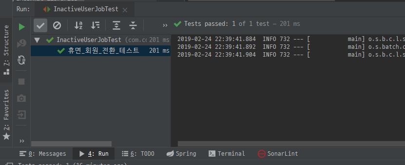

---

### 스프링 배치 심화학습

지금까지 만든 배치 처리 과정을 개선하여 더 능동적으로 테스트하는 환경으로 바꿔보자

- 다양한 ItemReader 구현 클래스

스프링 배치 프로젝트에서는 각각의 상황에 맞는 다양한 ItemReader 구현체를 제공한다.
그 중 하나가 리스트타입으로 Reader를 구현한 ListItemReader 객체이다.
(QueueItemReader 객체와 동일한 역할을 수행한다.)

`inactiveUserReader()` 메서드 변경

```java
package com.community.batch.jobs;

import com.community.batch.domain.User;
import com.community.batch.domain.enums.UserStatus;
import com.community.batch.repository.UserRepository;
import lombok.AllArgsConstructor;
import org.springframework.batch.core.Job;
import org.springframework.batch.core.Step;
import org.springframework.batch.core.configuration.annotation.JobBuilderFactory;
import org.springframework.batch.core.configuration.annotation.StepBuilderFactory;
import org.springframework.batch.core.configuration.annotation.StepScope;
import org.springframework.batch.item.ItemProcessor;
import org.springframework.batch.item.ItemWriter;
import org.springframework.batch.item.support.ListItemReader;
import org.springframework.context.annotation.Bean;
import org.springframework.context.annotation.Configuration;

import java.time.LocalDateTime;
import java.util.List;

@AllArgsConstructor
@Configuration
public class InactiveUserJobConfig {

    private UserRepository userRepository;

    @Bean
    public Job inactiveUserJob(JobBuilderFactory jobBuilderFactory, Step inactiveJobStep) {
        return jobBuilderFactory.get("inactiveUserJob") // inactiveUserJob 이라는 이름의 JobBuilder를 생성
                .preventRestart() // Job의 재실행을 막는다.
                .start(inactiveJobStep) // inactiveJobStep이 제일 먼저 실행하도록 설정
                .build();
    }

    @Bean
    public Step inactiveUserJobStep(StepBuilderFactory stepBuilderFactory) {
        return stepBuilderFactory.get("inactiveUserStep") // inaciveUserStep 이라는 이름의 StepBuilder를 생성
                .<User, User> chunk(10) // chunk의 I/O 타입 설정, 커밋 단위 10
                .reader(inactiveUserReader()) // Step의 reader, processor, writer 설정
                .processor(inactiveProcessor())
                .writer(inactiveUserWriter())
                .build();
    }

    @Bean
    @StepScope
    public ListItemReader<User> inactiveUserReader() {
        List<User> oldUsers =
                userRepository.findByUpdatedDateBeforeAndStatusEquals(LocalDateTime.now().minusYears(1), UserStatus.ACTIVE);

        return new ListItemReader<>(oldUsers);
    }


    public ItemProcessor<User, User> inactiveProcessor() {
        return User::setInactive; // 휴면 전환
//        return new ItemProcessor<User, User>() {
//            @Override
//            public User process(User user) throws Exception {
//                return user.setInactive();
//            }
//        };
    }

    public ItemWriter<User> inactiveUserWriter() {
        return (List<? extends User> users) -> userRepository.saveAll(users);
    }
}
```

ListItemReader 객체를 사용하면 모든 데이터를 메모리에 올려놓고 read() 메서드로 하나씩 배치 처리작업을 수행할 수 있다.

하지만 수십만개의 데이터라면?
-> `PagingItemReader` 구현체를 사용할 수 있다. 
모든 데이터를 지정한 단위로 가져와 배치 처리를 수행한다.

`CHUNK_SIZE`, `entityManagerFactory` 추가
`inactiveUserJobStep()`, `inactiveUserReader()` 메서드 변경

```java
package com.community.batch.jobs;

import com.community.batch.domain.User;
import com.community.batch.domain.enums.UserStatus;
import com.community.batch.repository.UserRepository;
import lombok.AllArgsConstructor;
import org.springframework.batch.core.Job;
import org.springframework.batch.core.Step;
import org.springframework.batch.core.configuration.annotation.JobBuilderFactory;
import org.springframework.batch.core.configuration.annotation.StepBuilderFactory;
import org.springframework.batch.core.configuration.annotation.StepScope;
import org.springframework.batch.item.ItemProcessor;
import org.springframework.batch.item.ItemWriter;
import org.springframework.batch.item.database.JpaPagingItemReader;
import org.springframework.context.annotation.Bean;
import org.springframework.context.annotation.Configuration;

import javax.persistence.EntityManagerFactory;
import java.time.LocalDateTime;
import java.util.HashMap;
import java.util.List;
import java.util.Map;

@AllArgsConstructor
@Configuration
public class InactiveUserJobConfig {

    private UserRepository userRepository;

    private final static int CHUNK_SIZE = 15; // ** 추가
    private final EntityManagerFactory entityManagerFactory; // ** 추가

    @Bean
    public Job inactiveUserJob(JobBuilderFactory jobBuilderFactory, Step inactiveJobStep) {
        return jobBuilderFactory.get("inactiveUserJob") // inactiveUserJob 이라는 이름의 JobBuilder를 생성
                .preventRestart() // Job의 재실행을 막는다.
                .start(inactiveJobStep) // inactiveJobStep이 제일 먼저 실행하도록 설정
                .build();
    }

    @Bean
    public Step inactiveUserJobStep(StepBuilderFactory stepBuilderFactory) {
        return stepBuilderFactory.get("inactiveUserStep") // inaciveUserStep 이라는 이름의 StepBuilder를 생성
                .<User, User> chunk(CHUNK_SIZE) // ** 변경
                .reader(inactiveUserReader()) // Step의 reader, processor, writer 설정
                .processor(inactiveProcessor())
                .writer(inactiveUserWriter())
                .build();
    }

    @Bean(destroyMethod = "") // destroyMethod: 삭제할 빈을 자동으로 추적한다. 현재 설정("")은 해당 기능 사용 안함(안하면 warning 메시지 뜬다.)
    @StepScope
    public JpaPagingItemReader<User> inactiveUserReader() {
        JpaPagingItemReader<User> jpaPagingItemReader = new JpaPagingItemReader<>();
        String oldUserSelectQuery = // JpaPagingItemReader를 사용하려면 쿼리를 직접 짜서 실행해야한다.
                "select u "
                + "from User as u "
                + "where u.updatedDate < :updatedDate and u.status = :status";
        jpaPagingItemReader.setQueryString(oldUserSelectQuery);

        Map<String, Object> map = new HashMap<>();
        map.put("updatedDate", LocalDateTime.now().minusYears(1));
        map.put("status", UserStatus.ACTIVE);

        jpaPagingItemReader.setParameterValues(map); // 쿼리에 사용할 파라미터 지정
        jpaPagingItemReader.setEntityManagerFactory(entityManagerFactory); // 트랜잭션 관리 EntityManagerFactory 지정
        jpaPagingItemReader.setPageSize(CHUNK_SIZE); // 한번에 읽어올 크기 지정

        return jpaPagingItemReader;
    }

    public ItemProcessor<User, User> inactiveProcessor() {
        return User::setInactive; // 휴면 전환
//        return new ItemProcessor<User, User>() {
//            @Override
//            public User process(User user) throws Exception {
//                return user.setInactive();
//            }
//        };
    }

    public ItemWriter<User> inactiveUserWriter() {
        return (List<? extends User> users) -> userRepository.saveAll(users);
    }
}
```

---

`271 page` 참고

JpaPagingItemReader는 page size 만큼 entityManager로부터 데이터를 읽어온다.
만약 inactiveJobStep에서 커밋(청크)단위가 5라고 한다면 5개 Item을 작업 후 writer까지 처리를 한다고 하면
이후 다시 처리를 수행하는데 이전에 진행한 5라는 인덱스값을 그대로 사용하여 로직에 문제가 생긴다.
쿼리 요청 시 offset 5 limit 5가 되어 다음 청크 단위인 5개의 Item을 건너뛰는 상황이 발생한다.

이 상황에서 가장 간단한 해결 방법은 조회용 인덱스값을 항상 0으로 반환하는 것이다.
그러면 Item 5개를 처리하고 다음 5개를 건너뛰지 않게된다.

```java
package com.community.batch.jobs;

@AllArgsConstructor
@Configuration
public class InactiveUserJobConfig {
    // ...

    @Bean(destroyMethod = "") // destroyMethod: 삭제할 빈을 자동으로 추적한다. 현재 설정("")은 해당 기능 사용 안함(안하면 warning 메시지 뜬다.)
    @StepScope
    public JpaPagingItemReader<User> inactiveUserReader() {
        // JpaPagingItemReader<User> jpaPagingItemReader = new JpaPagingItemReader<>();
        JpaPagingItemReader<User> jpaPagingItemReader = new JpaPagingItemReader() {
            @Override
            public int getPage() {
                return 0;
            }
        };

        // ...
    }

    // ...
}
```

---

코드 변경 후 테스트 재실행

- 다양한 ItemWriter 구현 클래스

ItemReader와 마찬가지로 ItemWriter도 여러 구현체를 제공한다.
여기서는 JpaItemWriter를 적용한다.

`inactiveUserWriter()` 메서드 변경

```java
package com.community.batch.jobs;

import com.community.batch.domain.User;
import com.community.batch.domain.enums.UserStatus;
import com.community.batch.repository.UserRepository;
import lombok.AllArgsConstructor;
import org.springframework.batch.core.Job;
import org.springframework.batch.core.Step;
import org.springframework.batch.core.configuration.annotation.JobBuilderFactory;
import org.springframework.batch.core.configuration.annotation.StepBuilderFactory;
import org.springframework.batch.core.configuration.annotation.StepScope;
import org.springframework.batch.item.ItemProcessor;
import org.springframework.batch.item.database.JpaItemWriter;
import org.springframework.batch.item.database.JpaPagingItemReader;
import org.springframework.context.annotation.Bean;
import org.springframework.context.annotation.Configuration;

import javax.persistence.EntityManagerFactory;
import java.time.LocalDateTime;
import java.util.HashMap;
import java.util.Map;

@AllArgsConstructor
@Configuration
public class InactiveUserJobConfig {

    private UserRepository userRepository;

    private final static int CHUNK_SIZE = 15;
    private final EntityManagerFactory entityManagerFactory;

    @Bean
    public Job inactiveUserJob(JobBuilderFactory jobBuilderFactory, Step inactiveJobStep) {
        return jobBuilderFactory.get("inactiveUserJob") // inactiveUserJob 이라는 이름의 JobBuilder를 생성
                .preventRestart() // Job의 재실행을 막는다.
                .start(inactiveJobStep) // inactiveJobStep이 제일 먼저 실행하도록 설정
                .build();
    }

    @Bean
    public Step inactiveUserJobStep(StepBuilderFactory stepBuilderFactory) {
        return stepBuilderFactory.get("inactiveUserStep") // inaciveUserStep 이라는 이름의 StepBuilder를 생성
                .<User, User>chunk(CHUNK_SIZE)
                .reader(inactiveUserReader()) // Step의 reader, processor, writer 설정
                .processor(inactiveProcessor())
                .writer(inactiveUserWriter())
                .build();
    }

    @Bean(destroyMethod = "") // destroyMethod: 삭제할 빈을 자동으로 추적한다. 현재 설정("")은 해당 기능 사용 안함(안하면 warning 메시지 뜬다.)
    @StepScope
    public JpaPagingItemReader<User> inactiveUserReader() {
//        JpaPagingItemReader<User> jpaPagingItemReader = new JpaPagingItemReader<>();
        JpaPagingItemReader<User> jpaPagingItemReader = new JpaPagingItemReader() {
            @Override
            public int getPage() {
                return 0;
            }
        };

        String oldUserSelectQuery = // JpaPagingItemReader를 사용하려면 쿼리를 직접 짜서 실행해야한다.
                "select u "
                        + "from User as u "
                        + "where u.updatedDate < :updatedDate and u.status = :status";
        jpaPagingItemReader.setQueryString(oldUserSelectQuery);

        Map<String, Object> map = new HashMap<>();
        map.put("updatedDate", LocalDateTime.now().minusYears(1));
        map.put("status", UserStatus.ACTIVE);

        jpaPagingItemReader.setParameterValues(map); // 쿼리에 사용할 파라미터 지정
        jpaPagingItemReader.setEntityManagerFactory(entityManagerFactory); // 트랜잭션 관리 EntityManagerFactory 지정
        jpaPagingItemReader.setPageSize(CHUNK_SIZE); // 한번에 읽어올 크기 지정

        return jpaPagingItemReader;
    }

    public ItemProcessor<User, User> inactiveProcessor() {
        return User::setInactive; // 휴면 전환
//        return new ItemProcessor<User, User>() {
//            @Override
//            public User process(User user) throws Exception {
//                return user.setInactive();
//            }
//        };
    }

    /**
     * 기존 ItemWriter 대체
     * EntityManagerFactory만 설정하면 Processor에서 넘어온 데이터를 청크 단위로 저장한다.
     * @return
     */
    private JpaItemWriter<User> inactiveUserWriter() {
        JpaItemWriter<User> jpaItemWriter = new JpaItemWriter<>();
        jpaItemWriter.setEntityManagerFactory(entityManagerFactory);
        return jpaItemWriter;
    }
}
```

- JobParameter 사용하기

JobParameter를 사용해 Step을 실행시킬 때 동적으로 파라미터를 주입시킬 수 있다.
`1년` 전 이라는 날짜값을 사용해 User를 조회했다. 이 경우 미세하게 날짜값이 차이날 수 있다.
JobParameter에 현재 시간을 주입하여 Reader가 실행될 때마다 모두 동일한 시간을 참조하게 설정해보자.

`test`

```java
package com.community.batch;

import com.community.batch.domain.enums.UserStatus;
import com.community.batch.repository.UserRepository;
import org.junit.Test;
import org.junit.runner.RunWith;
import org.springframework.batch.core.BatchStatus;
import org.springframework.batch.core.JobExecution;
import org.springframework.batch.core.JobParametersBuilder;
import org.springframework.batch.test.JobLauncherTestUtils;
import org.springframework.beans.factory.annotation.Autowired;
import org.springframework.boot.test.context.SpringBootTest;
import org.springframework.test.context.junit4.SpringRunner;

import java.time.LocalDateTime;
import java.util.Date;

import static org.hamcrest.Matchers.*;
import static org.junit.Assert.*;

@RunWith(SpringRunner.class)
@SpringBootTest
public class InactiveUserJobTest {
    @Autowired
    private JobLauncherTestUtils jobLauncherTestUtils;
    @Autowired
    private UserRepository userRepository;

    @Test
    public void 휴면_회원_전환_테스트() throws Exception {
//        JobExecution jobExecution = jobLauncherTestUtils.launchJob();
        Date nowDate = new Date();
        JobExecution jobExecution = jobLauncherTestUtils.launchJob(
                new JobParametersBuilder()
                        .addDate("nowDate", nowDate)
                        .toJobParameters()); // JobParameter 생성
        
        assertThat(jobExecution.getStatus(), is(BatchStatus.COMPLETED));

        // 업데이트 날짜가 1년 전 and User 상태값이 ACTIVE인 사용자 find
        int size = userRepository.findByUpdatedDateBeforeAndStatusEquals(LocalDateTime.now().minusYears(1), UserStatus.ACTIVE)
                .size();
        assertThat(size, is(0)); // batch가 돌아간 후에 위 조건의 User는 없어야한다.
    }
}
```

`main`

`inactiveUserJobStep()`, `inactiveUserReader()` 메서드 변경

```java
package com.community.batch.jobs;

import com.community.batch.domain.User;
import com.community.batch.domain.enums.UserStatus;
import com.community.batch.repository.UserRepository;
import lombok.AllArgsConstructor;
import org.springframework.batch.core.Job;
import org.springframework.batch.core.Step;
import org.springframework.batch.core.configuration.annotation.JobBuilderFactory;
import org.springframework.batch.core.configuration.annotation.StepBuilderFactory;
import org.springframework.batch.core.configuration.annotation.StepScope;
import org.springframework.batch.item.ItemProcessor;
import org.springframework.batch.item.database.JpaItemWriter;
import org.springframework.batch.item.support.ListItemReader;
import org.springframework.beans.factory.annotation.Value;
import org.springframework.context.annotation.Bean;
import org.springframework.context.annotation.Configuration;

import javax.persistence.EntityManagerFactory;
import java.time.LocalDateTime;
import java.time.ZoneId;
import java.util.Date;
import java.util.List;

@AllArgsConstructor
@Configuration
public class InactiveUserJobConfig {

    private UserRepository userRepository;

    private final static int CHUNK_SIZE = 15;
    private final EntityManagerFactory entityManagerFactory;

    @Bean
    public Job inactiveUserJob(JobBuilderFactory jobBuilderFactory, Step inactiveJobStep) {
        return jobBuilderFactory.get("inactiveUserJob") // inactiveUserJob 이라는 이름의 JobBuilder를 생성
                .preventRestart() // Job의 재실행을 막는다.
                .start(inactiveJobStep) // inactiveJobStep이 제일 먼저 실행하도록 설정
                .build();
    }

    @Bean
    public Step inactiveUserJobStep(StepBuilderFactory stepBuilderFactory, ListItemReader<User> inactiveUserReader) { // ** 변경
        return stepBuilderFactory.get("inactiveUserStep") // inaciveUserStep 이라는 이름의 StepBuilder를 생성
                .<User, User>chunk(CHUNK_SIZE)
                .reader(inactiveUserReader) // ** 변경
                .processor(inactiveProcessor())
                .writer(inactiveUserWriter())
                .build();
    }

    @Bean
    @StepScope
    public ListItemReader<User> inactiveUserReader(@Value("#{jobParameters[nowDate]}") Date nowDate,
                                                   UserRepository userRepository) {
        LocalDateTime now = LocalDateTime.ofInstant(nowDate.toInstant(), ZoneId.systemDefault());
        List<User> oldUsers =
                userRepository.findByUpdatedDateBeforeAndStatusEquals(now.minusYears(1), UserStatus.ACTIVE);

        return new ListItemReader<>(oldUsers);
    }

    public ItemProcessor<User, User> inactiveProcessor() {
        return User::setInactive; // 휴면 전환
//        return new ItemProcessor<User, User>() {
//            @Override
//            public User process(User user) throws Exception {
//                return user.setInactive();
//            }
//        };
    }

    /**
     * 기존 ItemWriter 대체
     * EntityManagerFactory만 설정하면 Processor에서 넘어온 데이터를 청크 단위로 저장한다.
     * @return
     */
    private JpaItemWriter<User> inactiveUserWriter() {
        JpaItemWriter<User> jpaItemWriter = new JpaItemWriter<>();
        jpaItemWriter.setEntityManagerFactory(entityManagerFactory);
        return jpaItemWriter;
    }
}
```

테스트 재실행

---

- 테스트 시에만 H2 데이터 베이스를 사용하도록 설정하기

```java
package com.community.batch;

import com.community.batch.domain.enums.UserStatus;
import com.community.batch.repository.UserRepository;
import org.junit.Test;
import org.junit.runner.RunWith;
import org.springframework.batch.core.BatchStatus;
import org.springframework.batch.core.JobExecution;
import org.springframework.batch.core.JobParametersBuilder;
import org.springframework.batch.test.JobLauncherTestUtils;
import org.springframework.beans.factory.annotation.Autowired;
import org.springframework.boot.jdbc.EmbeddedDatabaseConnection;
import org.springframework.boot.test.autoconfigure.jdbc.AutoConfigureTestDatabase;
import org.springframework.boot.test.context.SpringBootTest;
import org.springframework.test.context.junit4.SpringRunner;

import java.time.LocalDateTime;
import java.util.Date;

import static org.hamcrest.Matchers.*;
import static org.junit.Assert.*;

@RunWith(SpringRunner.class)
@SpringBootTest
@AutoConfigureTestDatabase(connection = EmbeddedDatabaseConnection.H2) // 테스트 시 내장 H2 DB 사용
public class InactiveUserJobTest {
    @Autowired
    private JobLauncherTestUtils jobLauncherTestUtils;
    @Autowired
    private UserRepository userRepository;

    @Test
    public void 휴면_회원_전환_테스트() throws Exception {
//        JobExecution jobExecution = jobLauncherTestUtils.launchJob(); // ** 주석 처리
        Date nowDate = new Date();
        JobExecution jobExecution = jobLauncherTestUtils.launchJob(
                new JobParametersBuilder()
                        .addDate("nowDate", nowDate)
                        .toJobParameters());

        assertThat(jobExecution.getStatus(), is(BatchStatus.COMPLETED));

        // 업데이트 날짜가 1년 전 and User 상태값이 ACTIVE인 사용자 find
        int size = userRepository.findByUpdatedDateBeforeAndStatusEquals(LocalDateTime.now().minusYears(1), UserStatus.ACTIVE)
                        .size();
        assertThat(size, is(0));
    }
}
```

- 청크 지향 프로세싱

트랜잭션 경계 내에서 청크 단위로 데이터를 읽고 생성하는 프로그래밍 기법
청크로 나누지 않을 경우 1개가 실패되도 전부 roll back이 되는데에 비해 청크 별로 나누게 되면 실패된 작업이 포함된 청크 외에는 영향을 받지않는다.
그렇기 때문에 스프링 배치에서는 청크 단위의 프로그래밍을 지향한다.
지금까지 했던 예제는 모두 청크 지향 프로세싱으로 배치 작업을 한 것이다.

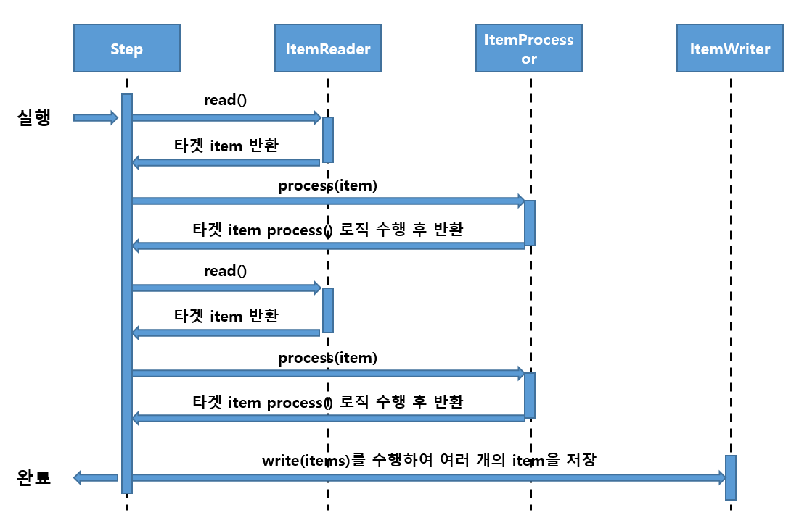

읽기, 처리, 쓰기로 나뉜 방식이 청크 지향 프로세싱이라면 이를 단일 작업으로 만드는 개념이 Tasklet이라 할 수 있다.

```java
package com.community.batch.jobs.tasklet;

import com.community.batch.domain.User;
import com.community.batch.domain.enums.UserStatus;
import com.community.batch.repository.UserRepository;
import org.springframework.batch.core.StepContribution;
import org.springframework.batch.core.scope.context.ChunkContext;
import org.springframework.batch.core.step.tasklet.Tasklet;
import org.springframework.batch.repeat.RepeatStatus;
import org.springframework.stereotype.Component;

import java.time.LocalDateTime;
import java.time.ZoneId;
import java.util.Date;
import java.util.List;
import java.util.stream.Collectors;

@Component
public class InactiveItemTasklet implements Tasklet {
    private final UserRepository userRepository;

    public InactiveItemTasklet(UserRepository userRepository) {
        this.userRepository = userRepository;
    }

    @Override
    public RepeatStatus execute(StepContribution contribution, ChunkContext chunkContext) throws Exception {
        Date nowDate = (Date) chunkContext.getStepContext().getJobParameters().get("nowDate");
        LocalDateTime now = LocalDateTime.ofInstant(nowDate.toInstant(), ZoneId.systemDefault());
        List<User> oldUsers = 
                userRepository.findByUpdatedDateBeforeAndStatusEquals(now.minusYears(1), UserStatus.ACTIVE);
        
        // processor
        oldUsers = oldUsers.stream()
                .map(User::setInactive)
                .collect(Collectors.toList());
        
        userRepository.saveAll(oldUsers);
        
        return RepeatStatus.FINISHED;
    }
}
```

- 배치의 인터셉터 Listener 설정하기

```java
package com.community.batch.jobs.listener;

import lombok.extern.slf4j.Slf4j;
import org.springframework.batch.core.JobExecution;
import org.springframework.batch.core.JobExecutionListener;
import org.springframework.stereotype.Component;

@Slf4j
@Component
public class InactiveJobListener implements JobExecutionListener {
    @Override
    public void beforeJob(JobExecution jobExecution) {
        log.info("Before Job");
    }

    @Override
    public void afterJob(JobExecution jobExecution) {
        log.info("After Job");
    }
}
```

`inactiveUserJob()` 메서드 변경

```java
package com.community.batch.jobs;

@AllArgsConstructor
@Configuration
public class InactiveUserJobConfig {

    private UserRepository userRepository;

    private final static int CHUNK_SIZE = 15;
    private final EntityManagerFactory entityManagerFactory;

    @Bean
    public Job inactiveUserJob(JobBuilderFactory jobBuilderFactory, Step inactiveJobStep,
                               InactiveJobListener inactiveJobListener) { // ** 추가
        return jobBuilderFactory.get("inactiveUserJob") // inactiveUserJob 이라는 이름의 JobBuilder를 생성
                .preventRestart() // Job의 재실행을 막는다.
                .listener(inactiveJobListener) // ** listener
                .start(inactiveJobStep) // inactiveJobStep이 제일 먼저 실행하도록 설정
                .build();
    }

    // ...
}
```

코드 추가 후 테스트 재실행

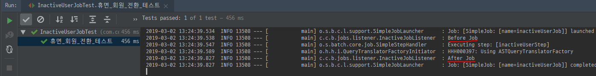

- 어노테이션 기반으로 Listener 설정하기

```java
package com.community.batch.jobs.listener;

import lombok.extern.slf4j.Slf4j;
import org.springframework.batch.core.annotation.AfterStep;
import org.springframework.batch.core.annotation.BeforeStep;
import org.springframework.stereotype.Component;

@Slf4j
@Component
public class InactiveStepListener {
    @BeforeStep
    public void beforeStep() {
        log.info("Before Step");
    }

    @AfterStep
    public void afterStep() {
        log.info("After Step");
    }
}
```

`inactiveUserJobStep()` 메서드 변경

```java
package com.community.batch.jobs;

@AllArgsConstructor
@Configuration
public class InactiveUserJobConfig {
    // ...

    @Bean
    public Step inactiveUserJobStep(StepBuilderFactory stepBuilderFactory, ListItemReader<User> inactiveUserReader,
                               InactiveStepListener inactiveStepListener) { // ** 추가
        return stepBuilderFactory.get("inactiveUserStep") // inaciveUserStep 이라는 이름의 StepBuilder를 생성
                .<User, User> chunk(CHUNK_SIZE) // chunk의 I/O 타입 설정, 커밋 단위 10
                .reader(inactiveUserReader) // Step의 reader, processor, writer 설정 // ** 변경
                .processor(inactiveProcessor())
                .writer(inactiveUserWriter())
                .listener(inactiveStepListener) // ** 추가
                .build();
    }

    // ...  
}
```

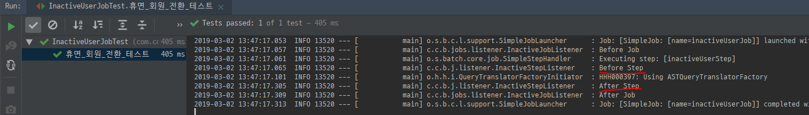

- Step의 흐름을 제어하는 Flow

지금까지 Step의 과정은 `읽기-처리-쓰기` 였다.
여기에서 좀 더 세부적인 조건이 추가된다면?
특정 조건에 따라 Step의 실행 여부를 정할 수 있다면?

스프링 배치에서는 흐름을 제어하는 Flow를 제공한다.

```java
package com.community.batch.jobs.decider;

import lombok.extern.slf4j.Slf4j;
import org.springframework.batch.core.JobExecution;
import org.springframework.batch.core.StepExecution;
import org.springframework.batch.core.job.flow.FlowExecutionStatus;
import org.springframework.batch.core.job.flow.JobExecutionDecider;

import java.util.Random;

@Slf4j
public class InactiveJobExecutionDecider implements JobExecutionDecider {

    @Override
    public FlowExecutionStatus decide(JobExecution jobExecution, StepExecution stepExecution) {
        if (new Random().nextInt() > 0) {
            log.info("FlowExecutionStatus.COMPLETED");
            return FlowExecutionStatus.COMPLETED;
        }
        
        log.info("FlowExecutionStatus.FAILED");
        return FlowExecutionStatus.FAILED;
    }
}
```

`inactiveUserJob()` 메서드 변경
`inactiveJobFlow()` 메서드 생성

```java
package com.community.batch.jobs;

import com.community.batch.domain.User;
import com.community.batch.domain.enums.UserStatus;
import com.community.batch.jobs.decider.InactiveJobExecutionDecider;
import com.community.batch.jobs.listener.InactiveJobListener;
import com.community.batch.jobs.listener.InactiveStepListener;
import com.community.batch.repository.UserRepository;
import lombok.AllArgsConstructor;
import org.springframework.batch.core.Job;
import org.springframework.batch.core.Step;
import org.springframework.batch.core.configuration.annotation.JobBuilderFactory;
import org.springframework.batch.core.configuration.annotation.StepBuilderFactory;
import org.springframework.batch.core.configuration.annotation.StepScope;
import org.springframework.batch.core.job.builder.FlowBuilder;
import org.springframework.batch.core.job.flow.Flow;
import org.springframework.batch.core.job.flow.FlowExecutionStatus;
import org.springframework.batch.item.ItemProcessor;
import org.springframework.batch.item.database.JpaItemWriter;
import org.springframework.batch.item.support.ListItemReader;
import org.springframework.beans.factory.annotation.Value;
import org.springframework.context.annotation.Bean;
import org.springframework.context.annotation.Configuration;

import javax.persistence.EntityManagerFactory;
import java.time.LocalDateTime;
import java.time.ZoneId;
import java.util.Date;
import java.util.List;

@AllArgsConstructor
@Configuration
public class InactiveUserJobConfig {

    private UserRepository userRepository;

    private final static int CHUNK_SIZE = 15;
    private final EntityManagerFactory entityManagerFactory;

    @Bean
    public Job inactiveUserJob(JobBuilderFactory jobBuilderFactory, Step inactiveJobStep,
                               InactiveJobListener inactiveJobListener, Flow inactiveJobFlow) { // ** 추가
        return jobBuilderFactory.get("inactiveUserJob") // inactiveUserJob 이라는 이름의 JobBuilder를 생성
                .preventRestart() // Job의 재실행을 막는다.
                .listener(inactiveJobListener)
                .start(inactiveJobFlow) // ** 변경 :시작 시 Flow를 거쳐 step이 실행되도록 설정
                .end()
                .build();
    }

    /**
     * 추가
     * @param inactiveJobStep
     * @return
     */
    @Bean
    public Flow inactiveJobFlow(Step inactiveJobStep) {
        FlowBuilder<Flow> flowBuilder = new FlowBuilder<>("inactiveJobFlow");

        return flowBuilder
                .start(new InactiveJobExecutionDecider())
                .on(FlowExecutionStatus.FAILED.getName()).end() // 리턴이 FlowExecutionStatus.FAILED이면 end()를 하여 끝낸다.
                .on(FlowExecutionStatus.COMPLETED.getName()).to(inactiveJobStep).end(); // 리턴이 FlowExecutionStatus.COMPLETED면 inactiveJobStep을 실행 후 종료
    }

    @Bean
    public Step inactiveUserJobStep(StepBuilderFactory stepBuilderFactory, ListItemReader<User> inactiveUserReader,
                                    InactiveStepListener inactiveStepListener) { // ** 추가
        return stepBuilderFactory.get("inactiveUserStep") // inaciveUserStep 이라는 이름의 StepBuilder를 생성
                .<User, User> chunk(CHUNK_SIZE) // chunk의 I/O 타입 설정, 커밋 단위 10
                .reader(inactiveUserReader) // Step의 reader, processor, writer 설정 // ** 변경
                .processor(inactiveProcessor())
                .writer(inactiveUserWriter())
                .listener(inactiveStepListener) // ** 추가
                .build();
    }

    @Bean
    @StepScope
    public ListItemReader<User> inactiveUserReader(@Value("#{jobParameters[nowDate]}") Date nowDate,
                                                   UserRepository userRepository) {
        LocalDateTime now = LocalDateTime.ofInstant(nowDate.toInstant(), ZoneId.systemDefault());
        List<User> oldUsers =
                userRepository.findByUpdatedDateBeforeAndStatusEquals(now.minusYears(1), UserStatus.ACTIVE);

        return new ListItemReader<>(oldUsers);
    }

    public ItemProcessor<User, User> inactiveProcessor() {
        return User::setInactive; // 휴면 전환
//        return new ItemProcessor<User, User>() {
//            @Override
//            public User process(User user) throws Exception {
//                return user.setInactive();
//            }
//        };
    }

    /**
     * 기존 ItemWriter 대체
     * EntityManagerFactory만 설정하면 Processor에서 넘어온 데이터를 청크 단위로 저장한다.
     * @return
     */
    private JpaItemWriter<User> inactiveUserWriter() {
        JpaItemWriter<User> jpaItemWriter = new JpaItemWriter<>();
        jpaItemWriter.setEntityManagerFactory(entityManagerFactory);
        return jpaItemWriter;
    }
}
```

테스트 성공 시 (랜덤한 수가 양수일 때)
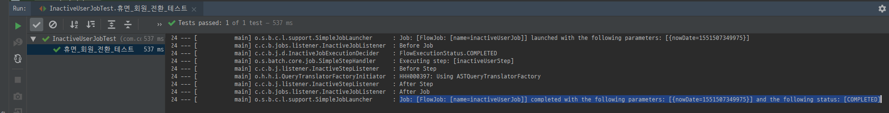

테스트 실패 시 (랜덤한 수가 음수일 때)
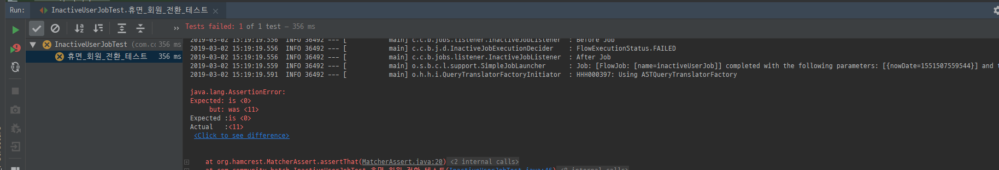

---

### 멀티 스레드로 여러 개의 Step 실행하기

- TaskExecutor를 사용해 여러 Step 동작시키기

TaskExecutor 인터페이스는 멀티 스레드로 Step을 실행하는 가장 기본적인 방법이다.

`inactiveUserJobStep()` 메서드 변경
`taskExecutor()` 메서드 생성

```java
package com.community.batch.jobs;

import com.community.batch.domain.User;
import com.community.batch.domain.enums.UserStatus;
import com.community.batch.jobs.decider.InactiveJobExecutionDecider;
import com.community.batch.jobs.listener.InactiveJobListener;
import com.community.batch.jobs.listener.InactiveStepListener;
import com.community.batch.repository.UserRepository;
import lombok.AllArgsConstructor;
import org.springframework.batch.core.Job;
import org.springframework.batch.core.Step;
import org.springframework.batch.core.configuration.annotation.JobBuilderFactory;
import org.springframework.batch.core.configuration.annotation.StepBuilderFactory;
import org.springframework.batch.core.configuration.annotation.StepScope;
import org.springframework.batch.core.job.builder.FlowBuilder;
import org.springframework.batch.core.job.flow.Flow;
import org.springframework.batch.core.job.flow.FlowExecutionStatus;
import org.springframework.batch.item.ItemProcessor;
import org.springframework.batch.item.database.JpaItemWriter;
import org.springframework.batch.item.support.ListItemReader;
import org.springframework.beans.factory.annotation.Value;
import org.springframework.context.annotation.Bean;
import org.springframework.context.annotation.Configuration;
import org.springframework.core.task.SimpleAsyncTaskExecutor;
import org.springframework.core.task.TaskExecutor;

import javax.persistence.EntityManagerFactory;
import java.time.LocalDateTime;
import java.time.ZoneId;
import java.util.Date;
import java.util.List;

@AllArgsConstructor
@Configuration
public class InactiveUserJobConfig {

    private UserRepository userRepository;

    private final static int CHUNK_SIZE = 15;
    private final EntityManagerFactory entityManagerFactory;

    @Bean
    public Job inactiveUserJob(JobBuilderFactory jobBuilderFactory, Step inactiveJobStep,
                               InactiveJobListener inactiveJobListener, Flow inactiveJobFlow) { // ** 추가
        return jobBuilderFactory.get("inactiveUserJob") // inactiveUserJob 이라는 이름의 JobBuilder를 생성
                .preventRestart() // Job의 재실행을 막는다.
                .listener(inactiveJobListener)
                .start(inactiveJobFlow) // ** 변경 :시작 시 Flow를 거쳐 step이 실행되도록 설정
                .end()
                .build();
    }

    /**
     * 추가
     * @param inactiveJobStep
     * @return
     */
    @Bean
    public Flow inactiveJobFlow(Step inactiveJobStep) {
        FlowBuilder<Flow> flowBuilder = new FlowBuilder<>("inactiveJobFlow");

        return flowBuilder
                .start(new InactiveJobExecutionDecider())
                .on(FlowExecutionStatus.FAILED.getName()).end() // 리턴이 FlowExecutionStatus.FAILED이면 end()를 하여 끝낸다.
                .on(FlowExecutionStatus.COMPLETED.getName()).to(inactiveJobStep).end(); // 리턴이 FlowExecutionStatus.COMPLETED면 inactiveJobStep을 실행 후 종료
    }

    @Bean
    public Step inactiveUserJobStep(StepBuilderFactory stepBuilderFactory, ListItemReader<User> inactiveUserReader,
                                    InactiveStepListener inactiveStepListener, TaskExecutor taskExecutor) { // ** 추가
        return stepBuilderFactory.get("inactiveUserStep") // inaciveUserStep 이라는 이름의 StepBuilder를 생성
                .<User, User> chunk(CHUNK_SIZE) // chunk의 I/O 타입 설정, 커밋 단위 10
                .reader(inactiveUserReader) // Step의 reader, processor, writer 설정
                .processor(inactiveProcessor())
                .writer(inactiveUserWriter())
                .listener(inactiveStepListener)
                .taskExecutor(taskExecutor) // ** 추가 : TaskExecutor 등록
                .throttleLimit(2) // ** 추가 : thread의 수 지정
                .build();
    }

    /**
     * 추가
     * @return
     */
    @Bean
    public TaskExecutor taskExecutor() {
        return new SimpleAsyncTaskExecutor("Batch_Task"); // Task에 할당되는 이름이 Batch_Task + 숫자 (1부터 하나 씩 증가한다.)
    }

    @Bean
    @StepScope
    public ListItemReader<User> inactiveUserReader(@Value("#{jobParameters[nowDate]}") Date nowDate,
                                                   UserRepository userRepository) {
        LocalDateTime now = LocalDateTime.ofInstant(nowDate.toInstant(), ZoneId.systemDefault());
        List<User> oldUsers =
                userRepository.findByUpdatedDateBeforeAndStatusEquals(now.minusYears(1), UserStatus.ACTIVE);

        return new ListItemReader<>(oldUsers);
    }

    public ItemProcessor<User, User> inactiveProcessor() {
        return User::setInactive; // 휴면 전환
//        return new ItemProcessor<User, User>() {
//            @Override
//            public User process(User user) throws Exception {
//                return user.setInactive();
//            }
//        };
    }

    /**
     * 기존 ItemWriter 대체
     * EntityManagerFactory만 설정하면 Processor에서 넘어온 데이터를 청크 단위로 저장한다.
     * @return
     */
    private JpaItemWriter<User> inactiveUserWriter() {
        JpaItemWriter<User> jpaItemWriter = new JpaItemWriter<>();
        jpaItemWriter.setEntityManagerFactory(entityManagerFactory);
        return jpaItemWriter;
    }
}
```

- 여러 개의 Flow 실행시키기

`inactiveUserJob()`, `inactiveJobFlow()` 메서드 변경
`multiFlow()` 메서드 생성

```java
package com.community.batch.jobs;

import com.community.batch.domain.User;
import com.community.batch.domain.enums.UserStatus;
import com.community.batch.jobs.decider.InactiveJobExecutionDecider;
import com.community.batch.jobs.listener.InactiveJobListener;
import com.community.batch.jobs.listener.InactiveStepListener;
import com.community.batch.repository.UserRepository;
import lombok.AllArgsConstructor;
import org.springframework.batch.core.Job;
import org.springframework.batch.core.Step;
import org.springframework.batch.core.configuration.annotation.JobBuilderFactory;
import org.springframework.batch.core.configuration.annotation.StepBuilderFactory;
import org.springframework.batch.core.configuration.annotation.StepScope;
import org.springframework.batch.core.job.builder.FlowBuilder;
import org.springframework.batch.core.job.flow.Flow;
import org.springframework.batch.core.job.flow.FlowExecutionStatus;
import org.springframework.batch.item.ItemProcessor;
import org.springframework.batch.item.database.JpaItemWriter;
import org.springframework.batch.item.support.ListItemReader;
import org.springframework.beans.factory.annotation.Value;
import org.springframework.context.annotation.Bean;
import org.springframework.context.annotation.Configuration;
import org.springframework.core.task.SimpleAsyncTaskExecutor;
import org.springframework.core.task.TaskExecutor;

import javax.persistence.EntityManagerFactory;
import java.time.LocalDateTime;
import java.time.ZoneId;
import java.util.Date;
import java.util.List;
import java.util.stream.IntStream;

@AllArgsConstructor
@Configuration
public class InactiveUserJobConfig {

    private UserRepository userRepository;

    private final static int CHUNK_SIZE = 15;
    private final EntityManagerFactory entityManagerFactory;

    @Bean
    public Job inactiveUserJob(JobBuilderFactory jobBuilderFactory, Step inactiveJobStep,
                               InactiveJobListener inactiveJobListener, Flow multiFlow) { // ** 변경
        return jobBuilderFactory.get("inactiveUserJob") // inactiveUserJob 이라는 이름의 JobBuilder를 생성
                .preventRestart() // Job의 재실행을 막는다.
                .listener(inactiveJobListener)
                .start(multiFlow) // ** 변경
                .end()
                .build();
    }

    /**
     * 생성
     * @param inactiveUserJobStep
     * @return
     */
    @Bean
    public Flow multiFlow(Step inactiveUserJobStep) {
        Flow[] flows = new Flow[5];

        IntStream.range(0, flows.length).forEach(i -> {
            flows[i] = new FlowBuilder<Flow>("MultiFlow" + i)
                    .from(inactiveJobFlow(inactiveUserJobStep))
                    .end();
        });

        return new FlowBuilder<Flow>("MultiFlowTest")
                .split(taskExecutor())
                .add(flows)
                .build();
    }

    /**
     * @Bean 어노테이션 삭제
     * @param inactiveJobStep
     * @return
     */
    public Flow inactiveJobFlow(Step inactiveJobStep) {
        FlowBuilder<Flow> flowBuilder = new FlowBuilder<>("inactiveJobFlow");

        return flowBuilder
                .start(new InactiveJobExecutionDecider())
                .on(FlowExecutionStatus.FAILED.getName()).end() // 리턴이 FlowExecutionStatus.FAILED이면 end()를 하여 끝낸다.
                .on(FlowExecutionStatus.COMPLETED.getName()).to(inactiveJobStep).end(); // 리턴이 FlowExecutionStatus.COMPLETED면 inactiveJobStep을 실행 후 종료
    }

    @Bean
    public Step inactiveUserJobStep(StepBuilderFactory stepBuilderFactory, ListItemReader<User> inactiveUserReader,
                                    InactiveStepListener inactiveStepListener, TaskExecutor taskExecutor) {
        return stepBuilderFactory.get("inactiveUserStep") // inaciveUserStep 이라는 이름의 StepBuilder를 생성
                .<User, User> chunk(CHUNK_SIZE) // chunk의 I/O 타입 설정, 커밋 단위 10
                .reader(inactiveUserReader) // Step의 reader, processor, writer 설정
                .processor(inactiveProcessor())
                .writer(inactiveUserWriter())
                .listener(inactiveStepListener)
                .taskExecutor(taskExecutor) // ** 추가 : TaskExecutor 등록
                .throttleLimit(2) // ** 추가 : thread의 수 지정
                .build();
    }

    /**
     * 추가
     * @return
     */
    @Bean
    public TaskExecutor taskExecutor() {
        return new SimpleAsyncTaskExecutor("Batch_Task"); // Task에 할당되는 이름이 Batch_Task + 숫자 (1부터 하나 씩 증가한다.)
    }

    @Bean
    @StepScope
    public ListItemReader<User> inactiveUserReader(@Value("#{jobParameters[nowDate]}") Date nowDate,
                                                   UserRepository userRepository) {
        LocalDateTime now = LocalDateTime.ofInstant(nowDate.toInstant(), ZoneId.systemDefault());
        List<User> oldUsers =
                userRepository.findByUpdatedDateBeforeAndStatusEquals(now.minusYears(1), UserStatus.ACTIVE);

        return new ListItemReader<>(oldUsers);
    }

    public ItemProcessor<User, User> inactiveProcessor() {
        return User::setInactive; // 휴면 전환
//        return new ItemProcessor<User, User>() {
//            @Override
//            public User process(User user) throws Exception {
//                return user.setInactive();
//            }
//        };
    }

    /**
     * 기존 ItemWriter 대체
     * EntityManagerFactory만 설정하면 Processor에서 넘어온 데이터를 청크 단위로 저장한다.
     * @return
     */
    private JpaItemWriter<User> inactiveUserWriter() {
        JpaItemWriter<User> jpaItemWriter = new JpaItemWriter<>();
        jpaItemWriter.setEntityManagerFactory(entityManagerFactory);
        return jpaItemWriter;
    }
}
```

코드 변경 후 테스트 재실행

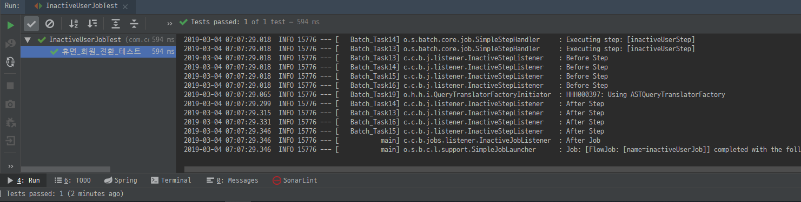

- 파티셔닝을 사용한 병렬 프로그래밍

파티셔닝 : 파티셔너(partioner)로 구분된 각 Step에 스레드를 할당하여 병렬적으로 실행시키는 방법

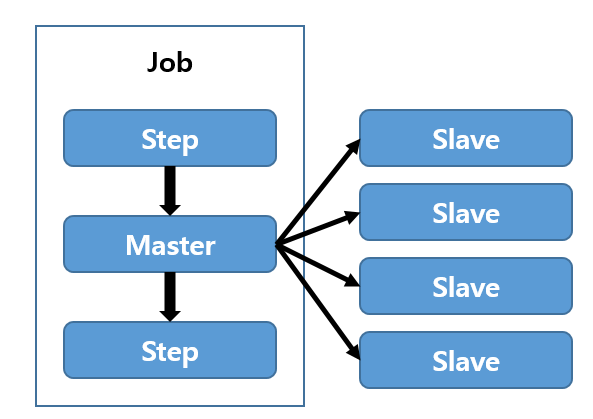

일련의 Step 절차 중 마스터가 있는데, 마스터를 여러 슬레이브로 나눈다.
슬레이브는 일반적으로 실행되는 스레드라고 생각할 수 있다.
슬레이브, 마스터는 모두 Step의 인스턴스이다.
모든 슬레이브 작업이 완료되면 결과가 합져서 마스터가 완료되고 Step이 마무리된다.

```java
package org.springframework.batch.core.partition.support;

public interface Partitioner {
    Map<String, ExecutionContext> partition(int gridSize); // gridSize : Step의 최대 분할 수를 지정하는 파라미터
}
```

Partitioner 인터페이스를 직접 구현하여 등급에 따라 Step을 할당하도록 만들어보자.

```java
package com.community.batch.jobs;

import com.community.batch.domain.enums.Grade;
import org.springframework.batch.core.partition.support.Partitioner;
import org.springframework.batch.item.ExecutionContext;

import java.util.HashMap;
import java.util.Map;

public class InactiveUserPartitioner implements Partitioner {

    private static final String GRADE = "grade";
    private static final String INACTIVE_USER_TASK = "InactiveUserTask";

    @Override
    public Map<String, ExecutionContext> partition(int gridSize) {
        Map<String, ExecutionContext> map = new HashMap<>(gridSize);
        Grade[] grades = Grade.values();

        for (int i = 0, loop = grades.length; i < loop; i++) {
            ExecutionContext context = new ExecutionContext();
            context.putString(GRADE, grades[i].name());
            map.put(INACTIVE_USER_TASK + i, context);
        }
        
        return map;
    }
}
```

`inactiveUserJob()` `inactiveUserReader()` 메서드 변경
`partitionerStep()` 메서드 생성
`Flow` 관련 메서드 삭제

```java
package com.community.batch.jobs;

import com.community.batch.domain.User;
import com.community.batch.domain.enums.Grade;
import com.community.batch.domain.enums.UserStatus;
import com.community.batch.jobs.listener.InactiveJobListener;
import com.community.batch.jobs.listener.InactiveStepListener;
import com.community.batch.repository.UserRepository;
import lombok.AllArgsConstructor;
import lombok.extern.slf4j.Slf4j;
import org.springframework.batch.core.Job;
import org.springframework.batch.core.Step;
import org.springframework.batch.core.configuration.annotation.JobBuilderFactory;
import org.springframework.batch.core.configuration.annotation.JobScope;
import org.springframework.batch.core.configuration.annotation.StepBuilderFactory;
import org.springframework.batch.core.configuration.annotation.StepScope;
import org.springframework.batch.item.ItemProcessor;
import org.springframework.batch.item.database.JpaItemWriter;
import org.springframework.batch.item.support.ListItemReader;
import org.springframework.beans.factory.annotation.Value;
import org.springframework.context.annotation.Bean;
import org.springframework.context.annotation.Configuration;
import org.springframework.core.task.SimpleAsyncTaskExecutor;
import org.springframework.core.task.TaskExecutor;

import javax.persistence.EntityManagerFactory;
import java.time.LocalDateTime;
import java.util.List;

@AllArgsConstructor
@Configuration
@Slf4j // ** 추가
public class InactiveUserJobConfig {

    private UserRepository userRepository;

    private final static int CHUNK_SIZE = 15;
    private final EntityManagerFactory entityManagerFactory;

    @Bean
    public Job inactiveUserJob(JobBuilderFactory jobBuilderFactory,
                               InactiveJobListener inactiveJobListener, Step partitionerStep) { // ** 추가 및 변경
        return jobBuilderFactory.get("inactiveUserJob") // inactiveUserJob 이라는 이름의 JobBuilder를 생성
                .preventRestart() // Job의 재실행을 막는다.
                .listener(inactiveJobListener)
                .start(partitionerStep) // ** 변경
                .build();
    }

    /**
     * 추가
     * @param stepBuilderFactory
     * @param inactiveUserJobStep
     * @return
     */
    @Bean
    @JobScope // Job 실행 때 마다 Bean을 생성
    public Step partitionerStep(StepBuilderFactory stepBuilderFactory, Step inactiveUserJobStep) {
        return stepBuilderFactory
                .get("partitionerStep")
                .partitioner("partitionerStep", new InactiveUserPartitioner()) // 생성한 InactiveUserPartitioner를 등록
                .gridSize(5)
                .step(inactiveUserJobStep)
                .taskExecutor(taskExecutor())
                .build();
    }

    @Bean
    public Step inactiveUserJobStep(StepBuilderFactory stepBuilderFactory, ListItemReader<User> inactiveUserReader,
                                    InactiveStepListener inactiveStepListener, TaskExecutor taskExecutor) {
        return stepBuilderFactory.get("inactiveUserStep") // inaciveUserStep 이라는 이름의 StepBuilder를 생성
                .<User, User> chunk(CHUNK_SIZE) // chunk의 I/O 타입 설정, 커밋 단위 10
                .reader(inactiveUserReader) // Step의 reader, processor, writer 설정
                .processor(inactiveProcessor())
                .writer(inactiveUserWriter())
                .listener(inactiveStepListener)
                .taskExecutor(taskExecutor)
                .throttleLimit(2)
                .build();
    }

    /**
     * 추가
     * @return
     */
    @Bean
    public TaskExecutor taskExecutor() {
        return new SimpleAsyncTaskExecutor("Batch_Task"); // Task에 할당되는 이름이 Batch_Task + 숫자 (1부터 하나 씩 증가한다.)
    }

    // ** 변경
    @Bean
    @StepScope
    public ListItemReader<User> inactiveUserReader(@Value("#{stepExecutionContext[grade]}") String grade,
                                                   UserRepository userRepository) {
        log.info("current thread name is {}", Thread.currentThread().getName());

        List<User> oldUsers =
                userRepository
                        .findByCreatedDateBeforeAndStatusEqualsAndGradeEquals(LocalDateTime.now().minusYears(1), UserStatus.ACTIVE, Grade.valueOf(grade));

        return new ListItemReader<>(oldUsers);
    }

    public ItemProcessor<User, User> inactiveProcessor() {
        return User::setInactive; // 휴면 전환
//        return new ItemProcessor<User, User>() {
//            @Override
//            public User process(User user) throws Exception {
//                return user.setInactive();
//            }
//        };
    }

    /**
     * 기존 ItemWriter 대체
     * EntityManagerFactory만 설정하면 Processor에서 넘어온 데이터를 청크 단위로 저장한다.
     * @return
     */
    private JpaItemWriter<User> inactiveUserWriter() {
        JpaItemWriter<User> jpaItemWriter = new JpaItemWriter<>();
        jpaItemWriter.setEntityManagerFactory(entityManagerFactory);
        return jpaItemWriter;
    }
}
```

Grade가 3개(VIP, GOLD, FAMILY) 이므로 3개가 실행되어야한다.

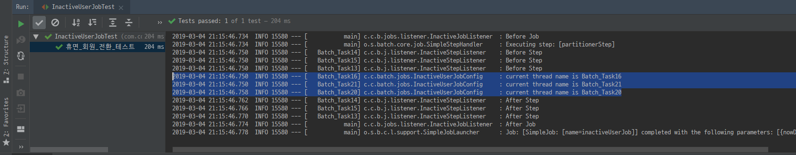