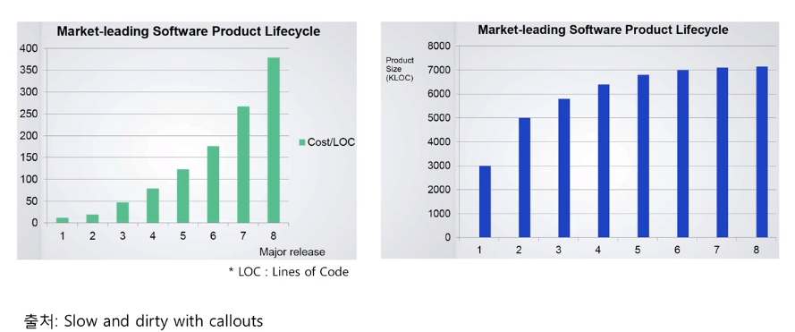
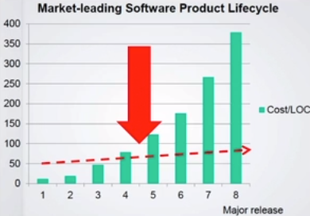

# 들어가며

> Sortware maintenance is not "keep it working like before".
> It is `"keep being useful in a changing world"`.

## 비용 



- 릴리즈를 할 수록 코드 한 줄을 변경하는데 비용이 점점 증가하게된다.
- 하지만 코드의 수는 크게 변하지 않는다.

> 코드의 분석/변경 시간이 갈수록 증가하기 때문이다.

### 코드 분석/변경 시간을 증가시키는 코드 예시

- 예 1

```java
long start = System.currentTimeMillis();
// ...
long end = System.currentTimeMillis();
long processTime = end - start;
```

```java
long start = System.nanoTime();
// ...
long end = System.nanoTime();
long processTime = end - start;
```

- 예 2

```java
if (value == 10) {
    // 수십 줄의 코드
}

if (value == 20) {
    // 수십 줄의 코드
}
```

```java
if (value == 10) {
    // 수십 줄의 코드
    if (새로운 조건 2) {
        value = 20;
    }
    // 수십 줄의 코드
}

// 위 조건 추가로 인해 아래 코드를 파악하기 위해
// 머릿 속에 위 조건에 대한 정보를 계속 담고 있어야한다.
if (value == 20) {
    // 수십 줄의 코드
}
```

- 예 3

```java
if (account.getMembership() == Membership.REGULAR &&
    account.getExpireDate().isAfter(now())) {
    // 유료 회원 기능
}
```

```java
if ((account.getMembership() == Membership.REGULAR || account.getMembership == Membership.PRO) &&
        account.getExpireDate().isAfter(now())) {
    // 유료 회원 기능
}
```

### 낮은 비용으로 변화할 수 있어야한다.



- 패러다임
    - 객체 지향, 함수형, 리액티브
- 코드, 설계, 아키텍쳐
    - DRY (Don't Repeat Yourself), TDD, SOLID, DDD
    - Clean Architecture, MSA
- 업무 프로세스/문화
    - 애자일
    - DevOps