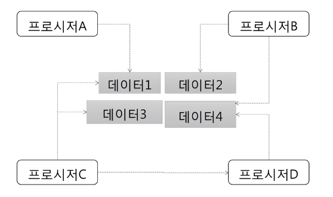
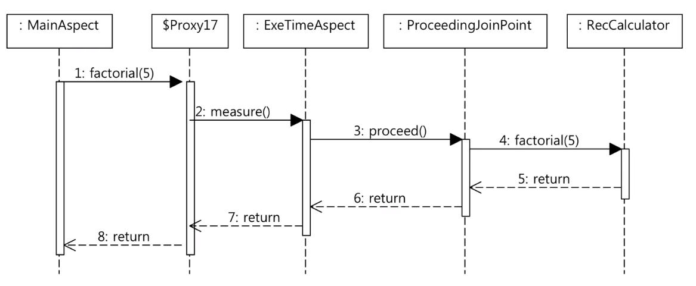

# 객체

## 절차지향



- 프로시저들이 서로 데이터를 공유하는 방식
    - 처음 개발은 쉽지만 코드 구조를 복잡하게 만들고
    - 수정을 어렵게 만드는 요인이된다.

### 절차 지향과 비용

사용자가 삭제되었는지를 확인하는 코드

```java
// 인증 API
Member member = memberRepository.findById(id);
if (member.getState() == MemberState.DELETED) {
    // ...
}

// 암호 변경 API
Member member = memberRepository.findById(id);
if (member.getState() == Member.State.DELETED) {
    // ...
}
```
기능 추가 : block을 당했는지 확인

```java
// 인증 API
Member member = memberRepository.findById(id);
if (member.getState() == MemberState.DELETED ||
    member.getBlockCount() > 0) {
    // ...
}

// 암호 변경 API
Member member = memberRepository.findById(id);
if (member.getState() == Member.State.DELETED ||
    member.getBlockCount() > 0) {
    // ...
}
```

여기서 추가 기능이 더 추가되면 변경을 각 코드마다 추가해줘야한다.

> 시간이 갈수록 복잡해지고 수정이 어려워지는 코드

## 객체 지향


객체끼리 데이터를 주고 받는 것이 아니라 객체가 데이터를 갖고 객체의 상태를 묻는다.

### 객체란

- 객체는 제공하는 기능으로 정의
    - 내부 필드로 정의하지 않음
- 예
    - 회원
        - 암호 변경 기능
        - 차단 여부 확인 기능
    - 소리 제어기
        - 소리 크기 증가
        - 소리 크기 감소

### 기능 명세

- 메서드를 이용해서 기능을 명세
    - 이름, 파라미터, 결과로 구성

```java
public class VolumeController {
    public void increase(int vol) {
        // ...
    }

    public void decrease(int vol) {
        // ...
    }

    public void volume() {
        // ...
    }
}
```

```java
public class Member {
    public void changePassword(String currentPassword, String newPassword) {
        // ...
    }
}
```

### 객체와 객체

- 객체와 객체는 기능을 사용해서 연결
    - 기능 사용 = 메서드 호출

```java
Member member = memberRepository.findById(id);

member.changePassword(currentPassword, newPassword);
```

- 메시지
    - 객체와 객체의 상호 작용: 메시지를 주고 받는다고 표현
    - 


```java
// 객체라기보다는 데이터에 가깝다
@Getter
@Setter
public class Member {
    private String name;
    private String id;
}
```