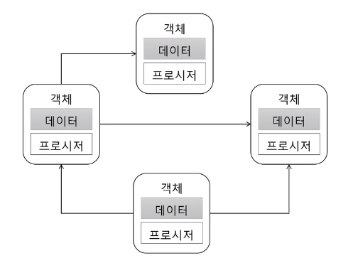

# 캡슐화 (Encapsulation)

- 데이터 + 관련 기능 묶기
- 객체가 기능을 어떻게 구현했는지 외부에 감추는 것
    - 구현에 사용된 데이터의 상세 내용을 외부에 감춤
- 정보 은닉(Information Hiding)의 의미 포함
- 외부에 영향 없이 객체 내부 구현 변경 가능

## 캡슐화하지 않으면

```java
if (account.getMembership() == Membership.REGULAR && account.getExpiredDate().isAfter(now())) {
    // .. 유료 회원 기능
}
```

- 조건 추가 : 인증 여부 확인

```java
if (account.getMembership() == Membership.REGULAR && account.getExpiredDate().isAfter(now()) &&
    account.getCertificationMethod() != CertificationMethod.NONE) {
    // .. 유료 회원 기능
}
```


## 캡슐화를 하면

```java
public class Account {
    private Membership membership;
    private Date expiredDate;

    public boolean hasRegularPermission() {
        return this.membership == Membership.REGULAR && this.expiredDate.isAfter(now());
    }
}

// ...

if (account.hasRegularPermission()) {
    // .. 유료 회원 기능
}
```

> 기능을 제공하고 상세를 감춘다.

- 조건 추가 : 인증 여부 확인

```java
public class Account {
    private Membership membership;
    private Date expiredDate;
    private CertificationMethod certificationMethod;

    public boolean hasRegularPermission() {
        return this.membership == Membership.REGULAR && this.expiredDate.isAfter(now()) &&
            this.certificationMethod != CertificationMethod.NONE;
    }
}

// ...

if (account.hasRegularPermission()) {
    // .. 유료 회원 기능
}
```



## 캡슐화와 기능

- 캡슐화 시도는 기능에 대한 의도/이해를 높인다.

```java
// 멤버쉽이 REGULAR 인지 확인 하는 것은 무엇 때문에 비교하는 건지?
if (account.getMembership() == Membership.REGULAR && 
    account.getExpiredDate().isAfter(now())) {
// 만료 일자를 지금이랑 비교하는 것은 무엇 때문인지?
    // ...
}
```

```java
public class Account {

    public boolean hasRegularPermission() {
        return this.membership == Membership.REGULAR && this.expiredDate.isAfter(now()) &&
            this.certificationMethod != CertificationMethod.NONE;
    }
}
```

> 검사하는 이유는 만료되지 않은 계정이 REGULAR 권한을 가졌는지 확인하기 위함

## 캡슐화를 위한 규칙

### Tell, Don't Ask

- 데이터를 달라고 하지 말고, 해달라고 하기

```java
if (account.getMembership() == Membership.REGULAR && account.getExpiredDate().isAfter(now())) {
    // .. 유료 회원 기능
}
```

```java
public class Account {
    private Membership membership;
    private Date expiredDate;

    public boolean hasRegularPermission() {
        return this.membership == Membership.REGULAR && this.expiredDate.isAfter(now());
    }
}

// 데이터를 가져오지 않고 Account 객체에 권한을 갖고 있는지 요청한다.
if (account.hasRegularPermission()) {
    // .. 유료 회원 기능
}
```

### Demeter's Law

- 메서드에서 생성한 객체의 메서드만을 호출한다.
- 파라미터로 받은 객체의 메서드만을 호출한다.
- 필드로 참조하는 객체의 메서드만을 호출한다.

```java
// not cool
account.getExpiredDate().isAfter(now());

// cool
account.isExpired();
account.isValid(now());
```