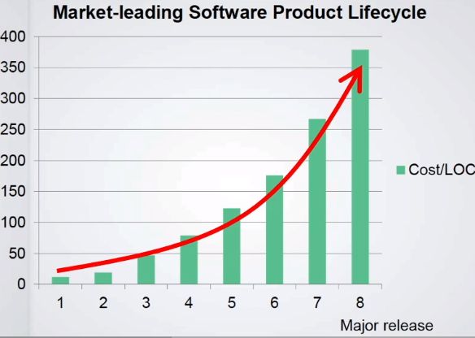
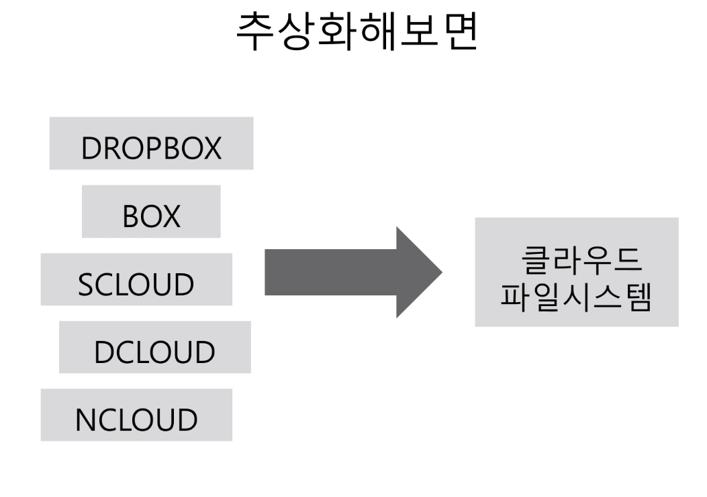
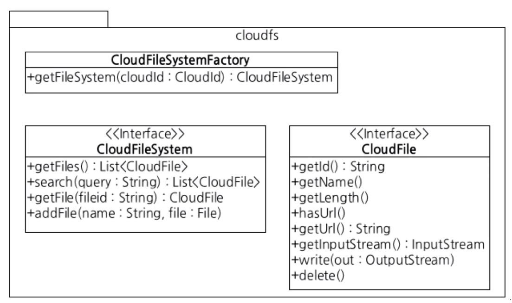
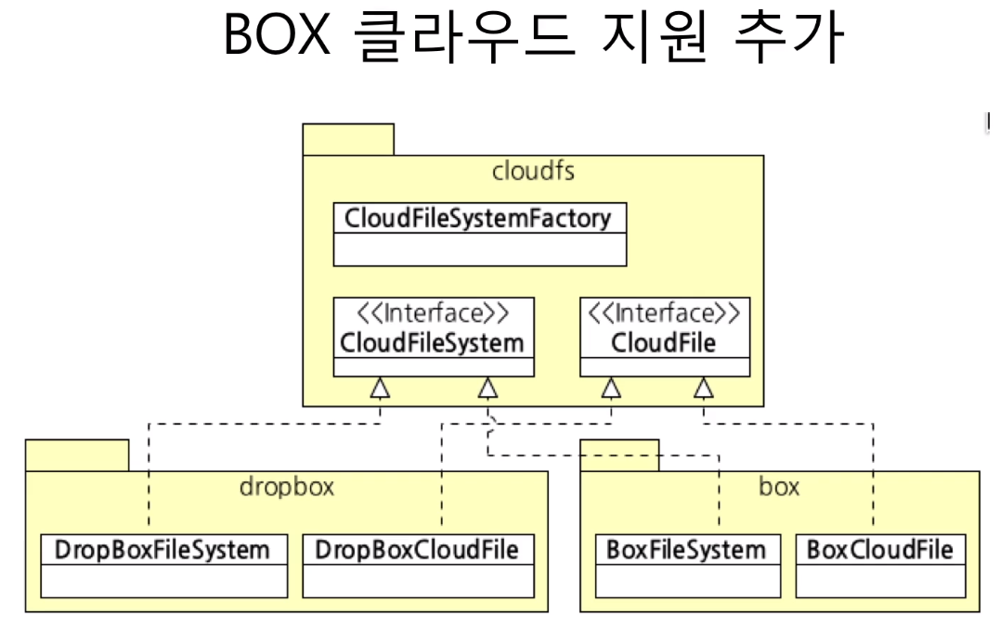
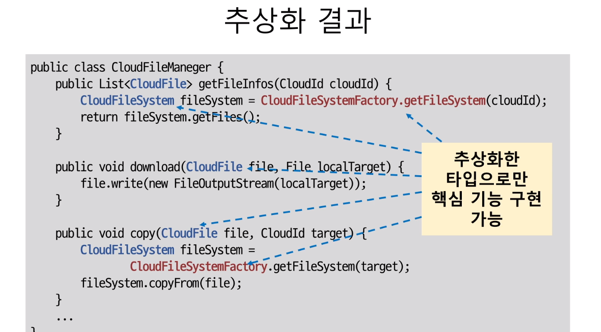
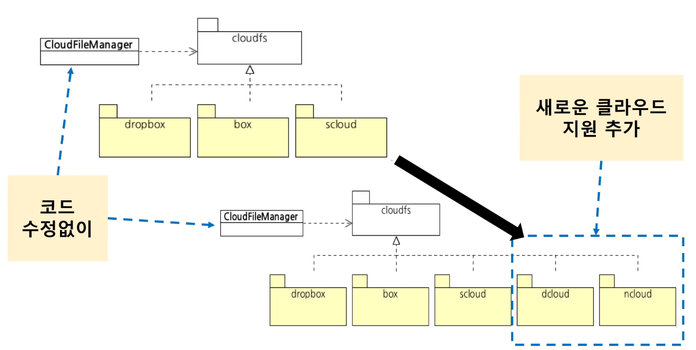
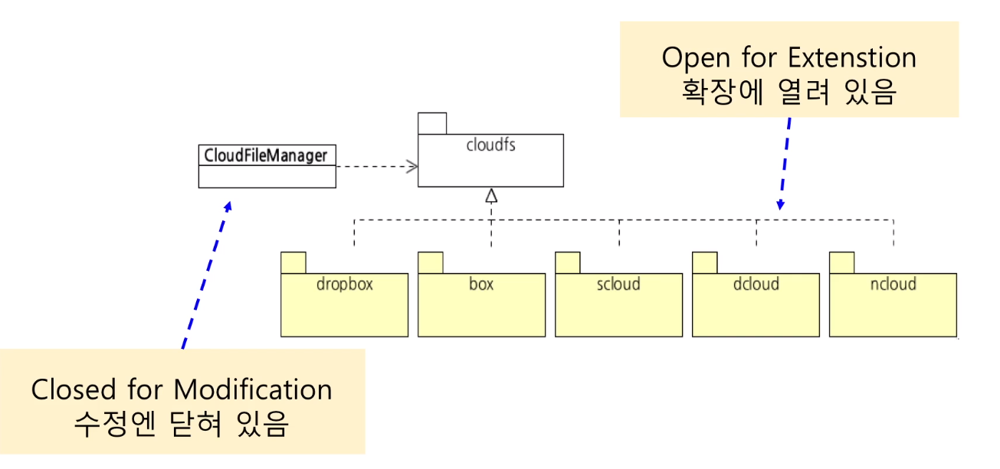

# 클라우드 파일 통합 관리 기능 개발

- 대상 클라우드
    - 드롭박스
    - 박스
- 주요 기능
    - 각 클라우드 파일 목록 조회, 다운로드, 업로드, 삭제, 검색

---

## 추상화하지 않은 구현

```java
public enum CloudId {
    DROPBOX,
    BOX;
}

@Getter
public class FileInfo {
    private CloudId cloudId;
    private String fileId;
    private String fileName;
    private long length;
}

public class CloudFileManager {
    public List<FileInfo> getFileInfos(CloudId cloudId) {
        if (cloudId == CloudId.DROPBOX) {
            DropboxClient dbClient = getDropboxClient(...);
            List<DbFile> dbFiles = dbClient.getFiles();

            return dbFiles.stream()
                    .map(FileInfo::new)
                    .collect(Collectors.toList());
        }

        if (cloudId == CloudId.BOX) {
            boxService.~~(...); 
        }
    }
}
```

```java
public class CloudFileManager {
    // 파일 다운로드 기능
    public void download(FileInfo file, File downloadTarget) {
        if (file.getCloudId() == CloudId.DROPBOX) {
            try (FileOutputStream out = Files.newOutputStream(downloadTarget)) {
                DropboxClient dbClient = getDropboxClient(...);
                dbClient.copy(file.getFileId, out);
            }

            return;
        }

        if (file.getCloudId() == CloudId.BOX) {
            try (InputStream input = boxService.getInputStream(file.getId());
                FileOutputStream out = Files.newOutputStream(downloadTarget)) {
                CopyUtil.copy(input, out);
            }
        }
    }
}
```

> 여기서 기능이 추가되면?

```java
public class CloudFileManager {
    public void download(FileInfo file, File downloadTarget) {
        if (file.getCloudId() == CloudId.DROPBOX) {
            ...
        }

        if (file.getCloudId() == CloudId.BOX) {
            ...
        }
    }

    public void upload(FileInfo file, File downloadTarget) {
        if (file.getCloudId() == CloudId.DROPBOX) {
            ...
        }

        if (file.getCloudId() == CloudId.BOX) {
            ...
        }
    }

    public void delete(FileInfo file, File downloadTarget) {
        if (file.getCloudId() == CloudId.DROPBOX) {
            ...
        }

        if (file.getCloudId() == CloudId.BOX) {
            ...
        }
    }

    public void search(FileInfo file, File downloadTarget) {
        if (file.getCloudId() == CloudId.DROPBOX) {
            ...
        }

        if (file.getCloudId() == CloudId.BOX) {
            ...
        }
    }
}
```

> 여기서 클라우드가 추가되면?

```java
public class CloudFileManager {
    public void download(FileInfo file, File downloadTarget) {
        if (file.getCloudId() == CloudId.DROPBOX) {
            ...
        }

        if (file.getCloudId() == CloudId.BOX) {
            ...
        }

        if (file.getCloudId() == CloudId.NDRIVE) {
            ...
        }

        if (file.getCloudId() == CloudId.GOOGLE_DRIVE) {
            ...
        }
    }

    public void upload(FileInfo file, File downloadTarget) {
        if (file.getCloudId() == CloudId.DROPBOX) {
            ...
        }

        if (file.getCloudId() == CloudId.BOX) {
            ...
        }

        if (file.getCloudId() == CloudId.NDRIVE) {
            ...
        }

        if (file.getCloudId() == CloudId.GOOGLE_DRIVE) {
            ...
        }
    }

    public void delete(FileInfo file, File downloadTarget) {
        if (file.getCloudId() == CloudId.DROPBOX) {
            ...
        }

        if (file.getCloudId() == CloudId.BOX) {
            ...
        }

        if (file.getCloudId() == CloudId.NDRIVE) {
            ...
        }

        if (file.getCloudId() == CloudId.GOOGLE_DRIVE) {
            ...
        }
    }

    public void search(FileInfo file, File downloadTarget) {
        if (file.getCloudId() == CloudId.DROPBOX) {
            ...
        }

        if (file.getCloudId() == CloudId.BOX) {
            ...
        }

        if (file.getCloudId() == CloudId.NDRIVE) {
            ...
        }

        if (file.getCloudId() == CloudId.GOOGLE_DRIVE) {
            ...
        }
    }
}
```

### 클라우드 간 복사 기능

```java
public FileInfo copy(FileInfo fileInfo, CloudId to) {
    CloudId from = fileInfo.getCloudId();

    if (to == CloudId.DROPBOX) {
        DropboxClient dbClient = getDropboxClient(...);

        if (from == CloudId.DROPBOX) {
            ...
        } else if (from == CloudId.BOX) {

        } else if (from == CloudId.NDRIVE) {

        } else if (from == CloudId.GOOGLE_CLOUD) {

        }
    } else if (to == CloudId.BOX) {
        ...

        if (from == CloudId.DROPBOX) {
            ...
        } else if (from == CloudId.BOX) {

        } else if (from == CloudId.NDRIVE) {

        } else if (from == CloudId.GOOGLE_CLOUD) {

        }
    } else if (to == CloudId.NDRIVE) {
        ...

        if (from == CloudId.DROPBOX) {
            ...
        } else if (from == CloudId.BOX) {

        } else if (from == CloudId.NDRIVE) {

        } else if (from == CloudId.GOOGLE_CLOUD) {

        }
    } else if (to == CloudId.GOOGLE_CLOUD {
        ...

        if (from == CloudId.DROPBOX) {
            ...
        } else if (from == CloudId.BOX) {

        } else if (from == CloudId.NDRIVE) {

        } else if (from == CloudId.GOOGLE_CLOUD) {

        }
}
```



### 개발 시간의 증가

- 코드 구조가 길어지고 복잡해짐
    - 새로운 클라우드 추가시 모든 메서드에 새로운 if 블록 추가
        - 중첩 if-else문은 복잡도를 배로 증가 시킴
        - if-else가 많을 수록 진행이 더뎌짐
- 관련 코드가 여러 곳에 분산됨
    - 한 클라우드 처리와 관련된 코드가 여러 메서드에 흩어짐
- 결과적으로, 코드 가독성/분석 속도 저하
    - 코드 추가에 따른 노동 시간 증가
    - 실수하기 쉽고 이로 인한 불필요한 디버깅 시간 증가

---

## 추상화한 구현



### 클라우드 파일 시스템 설계



```java
public interface CloudFileSystem {
    List<CloudFile> getFiles();
    List<CloudFile> search(String query);
    CloudFile getFile(String fileId);
    void addFile(String name, File file);
}

public interface CloudFile {
    String getId();
    String getName();
    boolean hasUrl();
    String getUrl();
    InputStream getInputStream();
    void write(OutputStream out);
    void delete();
}

public class CloudFileSystemFactory {
    public CloudFileSystem getFileSystem(CloudId cloudId) {
        switch (cloudId) {
            case DROPBOX:
                return ...;
            case BOX:
                return ...;
            case NDRIVE:
                return ...;
            case GOOGLE_DRIVE:
                return ...;
            default:
                throw new IllegalArgumentException();
        }
    }
}
```

- Dropbox 용 파일 시스템 구현

```java
public class DropboxFileSystem implements CloudFileSystem {
    private DropboxClient dbClient = getDropboxClient(...);

    @Override
    public List<CloudFile> getFiles() {
        List<DbFile> dbFiles = dbClient.getFiles();

        return dbFiles.stream()
                .map(dbFile -> new DropboxCloudFile(dbFile, dbClient))
                .collect(Collectors.toList());
    }
}
```

```java
public class DropboxCloudFile implements CloudFile {
    private DbFile dbFile;
    private DropboxClient dbClient;

    public DropboxCloudFile(DbFile dbFile, DropboxClient dbClient) {
        this.dbFile = dbFile;
        this.dbClient = dbClient;
    }

    @Override
    String getId() {
        return this.dbFile.getId();
    }
    
    @Override
    String getName() {
        return this.dbFile.getName();
    }

    @Override
    boolean hasUrl() {
        return true;
    }

    @Override
    String getUrl() {
        return this.dbFile.getFileUrl();
    }

    @Override
    InputStream getInputStream() {
        this.dbClient.createStreamOfFile(dbFile);
    }

    @Override
    void write(OutputStream out) {
        ...
    }

    @Override
    void delete() {
        this.dbClient.deleteFile(dbFile.getId());
    }
}
```

- 파일 목록, 다운로드 기능 구현

```java
public class CloudFileManager {
    public List<CloudFile> getFileInfos(CloudId cloudId) {
        CloudFileSystem fileSystem = CloudFileSystemFactory.getFileSystem(cloudId);
        return fileSystem.getFiles();
    }

    public void download(CloudFile file, File downloadTarget) {
        file.write(Files.newOutputStream(downloadTarget));
    }
}
```

### 클라우드 지원 추가



- 클라우드 추가 후 파일 목록, 다운로드 기능 구현의 변화

```java
public class CloudFileManager {
    public List<CloudFile> getFileInfos(CloudId cloudId) {
        CloudFileSystem fileSystem = CloudFileSystemFactory.getFileSystem(cloudId);
        return fileSystem.getFiles();
    }

    public void download(CloudFile file, File downloadTarget) {
        file.write(Files.newOutputStream(downloadTarget));
    }
}
```

> 변경은 없다!

### 파일 복사 기능 추가

```java
public class DropboxCloudFile implements CloudFile {
    private DbFile dbFile;
    private DropboxClient dbClient;

    @Override
    public void copyFrom(CloudFile file) {
        if (file.hasUrl()) {
            this.dbClient.copyFromUrl(file.getUrl());
        }

        file.dbClient.copyFromInputStream(file.getInputStream(), file.getName());
    }
}

public class GoogleDriveCloudFile implements CloudFile {
    private GoogleCloudClient gcClient = getGcClient(...);

    @Override
    public void copyFrom(CloudFile file) {
        File tempFile = File.createTemp();
        file.write(Files.newOutputStream(tempFile));
        gcClient.upload(tempFile, file.getName());
    }
}
```

### 추상화 결과





### 이것이 바로 OCP



- CloudFileManager 코드 수정엔 닫혀 있지만
- CloudFileSystem, CloudFile 구현체를 추가함으로서 확장에는 열려있는 구조