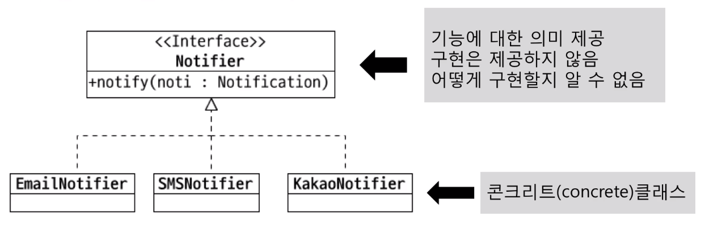
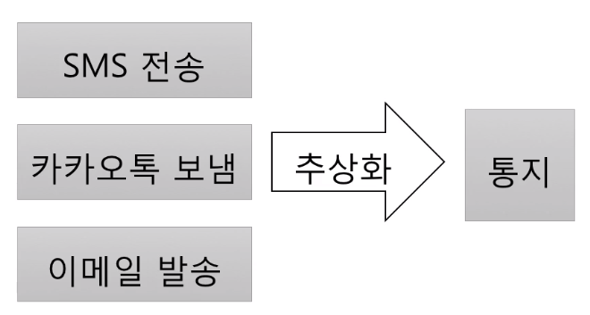
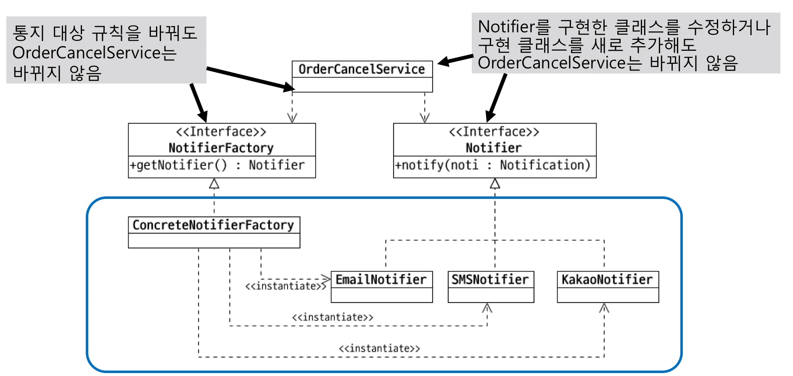

# 다형성 (Polymorphism)

- 여러(poly) 모습(morph)을 갖는 것
- 객체 지향에서는 한 객체가 여러 타입을 갖는 것
    - 한 객체가 여러 타입의 기능을 제공
    - `타입 상속`으로 다형성 구현

```java
public class Timer {
    public void start() {...}
    public void stop() {...}
}

public interface Rechargeable {
    void charge();
}
```

```java
public class RechargeableTimer extends Timer implements Rechargeable {
    @Override
    public void charge() {...}
}

public static void main(String[] args) {
    // RechargeableTimer 타입
    RechargeableTimer timer = new RechageableTimer();
    timer.start();    
    timer.stop();  

    // Timer 타입의 기능 제공 가능
    Timer timer = new RechageableTimer();
    timer.start();    
    timer.stop();  

    // Rechargeable 타입의 기능 제공 가능
    Rechargeable timer = new RechageableTimer();
    timer.charge();
}
```

# 추상화 (Abstraction)

- 데이터나 프로세스 등을 의미가 비슷한 개념이나 의미있는 표현으로 정의하는 과정
- 두 가지 방식의 추상화
    - `특정한` 성질, `공통` 성질(일반화)
- 간단한 예
    - DB의 USER 테이블 : ID, NAME, EMAIL
    - Money 클래스 : 통화, 금액
    - 노트북 : LG gram, Apple macbook

## 타입 추상화

- 여러 구현 클래스를 대표하는 상위 타입 도출
    - 흔히 인터페이스 타입으로 추상화
    - 추상화 타입과 구현은 타입 상속으로 연결



## 추상 타입 사용

- 추상 타입은 구현을 감춤
    - 기능의 구현이 아닌 의도를 더 잘 드러냄

### 추상 타입의 사용에 따른 이점 : `유연함`

- 콘크리트 클래스를 직접 사용하면

```java
// 1. 기능 구현
// 주문 취소
public class OrderCancleService {
    private SmsSender smsSender;

    public void cancel(long orderId) {
        // 주문 취소 로직

        this.smsSender.sendSms();
    }
}

// 2. 요구사항 추가 : Push 기능 추가
// 주문 취소
public class OrderCancleService {
    private SmsSender smsSender;
    private KakaoPush kakaoPush;

    public void cancel(long orderId) {
        // 주문 취소 로직

        if (pushEnabled) {
            this.kakaoPush.push();
        } else {
            this.smsSender.sendSms();
        }     
    }
}

// 3. 요구사항 추가 : Mail 기능 추가
// 주문 취소
public class OrderCancleService {
    private SmsSender smsSender;
    private KakaoPush kakaoPush;
    private MailService mailService;

    public void cancel(long orderId) {
        // 주문 취소 로직

        if (pushEnabled) {
            this.kakaoPush.push();
        } else {
            this.smsSender.sendSms();
        }     

        this.mailService.sendMail();
    }
}
```

> 요구 사항 변경에 따라 주문 취소 코드도 함께 변경된다.

- 공통점을 도출



- 도출한 추상 타입 사용

```java
public class OrderCancleService {

    public void cancel(long orderId) {
        // 주문 취소 로직

        Notifier notifier = getNotifier(...);
        notifier.notify();
    }

    private Notifier getNotifier(...) {
        if (pushEnabled) {
            return new KakaoNotifier();
        }

        return new SmsNotifier();
    }
}
```

- 사용할 대상 접근도 추상화

```java
public interface NotifierFactory {
    Notifier getNotifier(...);

    static NotifierFactory newInstance() {
        return new DefaultNotifierFactory();
    }
}

public class DefaultNotifierFactory implements NotifierFactory {
    public Notifier getNotifier(...) {
        if (pushEnabled) {
            return new KakaoNotifier();
        }

        return new SmsNotifier();
    }
}
```

```java
public class OrderCancleService {

    public void cancel(long orderId) {
        // 주문 취소 로직

        Notifier notifier = NotifierFactory.newInstance().getNotifier(...);
        notifier.notify();
    }
}
```

> 주문 취소 로직은 그대로 유지하면서 통지하는 방식을 바꿔줄 수 있다.



## 추상화는 의존 대상이 변경되는 시점에

- 추상화 -> 추상 타입 증가 -> 복잡도 증가
    - 아직 존재하지 않는 기능에 대한 이른 추상화는 주의
        - 잘못된 추상화 가능성 및 복잡도 증가
    - 실제 변경,확장이 발생할 때 추상화 시도

## 추상화를 잘 하려면

- 구현을 한 이유가 무엇 때문인지 생각해야 함

- SmsSender, KakaoPush, MailService
    - 통지
    - 메시징