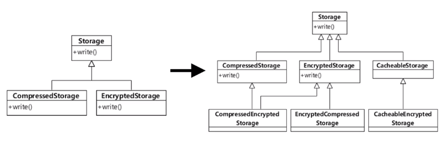

# 상속보단 조립

## 상속과 재사용


> 상속을 통해 상위 클래스의 기능을 재사용하고 확장할 수 있다.


## 상속을 통한 재사용의 단점

### 상위 클래스 변경이 어려움


- 상위 클래스를 변경하면 그 변경이 모든 하위 클래스에도 적용된다.
- 상위 클래스 입장에서는 하위 클래스가 어떤 것이 추가될 지 모르기 때문에 상위 클래스 변경이 어려워진다.

### 클래스 증가



- Storage: 저장소 기능
    - Cache 기능이 필요해졌을 경우
    - 압축과 암호화 기능이 가능한 저장소가 필요한 경우
    - ...
    
> 기능이 추가될 때 마다 클래스가 추가된다.
> 혹은 어떤 클래스를 상속받아야할 지 애매해질 경우가 생긴다.


### 상속 오용

```java
public class Container extends ArrayList<Luggage> {
    private int maxSize;
    private int currentSize;

    public Container(int maxSize) {
        this.maxSize = maxSize;
    }

    public void put(Luggage luggage) {
        if (!hasSpace()) {
            throw new IllegalStateException();
        }

        super.add(luggage);
        this.currentSize++;
    }

    public void extract(Luggage luggage) {
        super.remove(luggage);
        this.currentSize--;
    }

    public boolean hasSpace() {
        return this.currentSize < this.maxSize;
    }
}
```

```java
// ArrayList의 인터페이스가 외부에 노출되어
// 원하는 작동을 하지 않는 코드가 생길 수 있다.
Container container = new Container(1);

container.put(luggage1) // Container의 인터페이스
container.clear(); // ArrayList의 인터페이스
container.put(luggage2); // IllegalStateException;
```

## 조립

> 상속의 단점 해결 방법

- 여러 객체를 묶어서 더 복잡한 기능을 제공
- 조립되는 객체의 기능을 변경하기에도 부담이 없다.
- 보통 여러 필드로 다른 객체를 참조하는 방식으로 조립
    또는 객체를 필요 시점에 생성하거나 구함

```java
public class Container {
    private int maxSize;
    // private int currentSize;
    private List<Luggage> luggages; // 필드로 조립

    public Container(int maxSize) {
        this.maxSize = maxSize;
        this.luggages = new ArrayList<>(maxSize);
    }

    public void put(Luggage luggage) {
        if (!hasSpace()) {
            throw new IllegalStateException();
        }

        this.luggages.add(luggage);
        // this.currentSize++;
    }

    public void extract(Luggage luggage) {
        this.luggages.remove(luggage);
        // this.currentSize--;
    }

    public boolean hasSpace() {
        // return this.currentSize < this.maxSize;
        return this.luggages.size() < this.maxSize;
    }
}
```

### 상속보다는 조립 (Composition over inheritance)

- 상속하기에 앞서 조립으로 풀 수 없는지 검토
- 진짜 하위 타입인 경우에만 상속 사용
    - `is-a`인지 `has-a` 인지를 검토