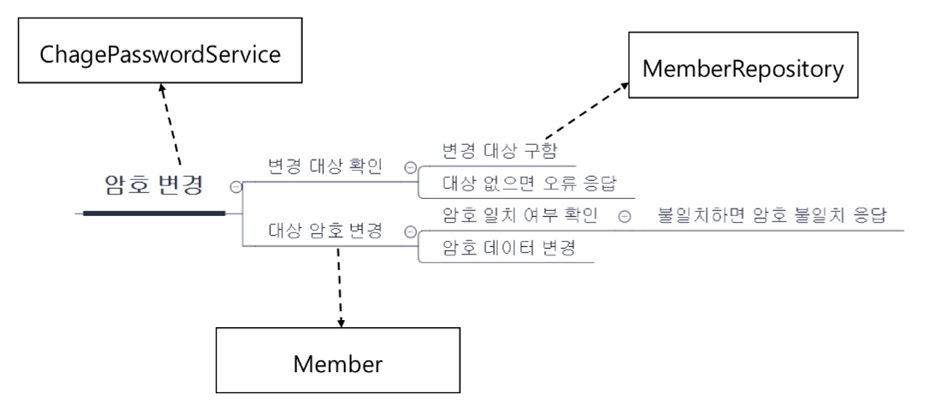
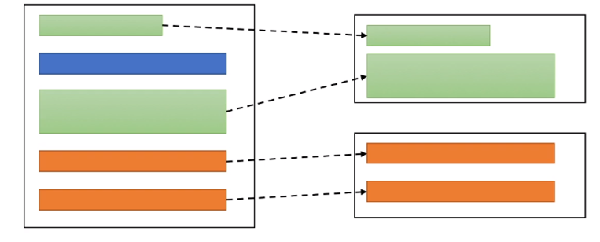
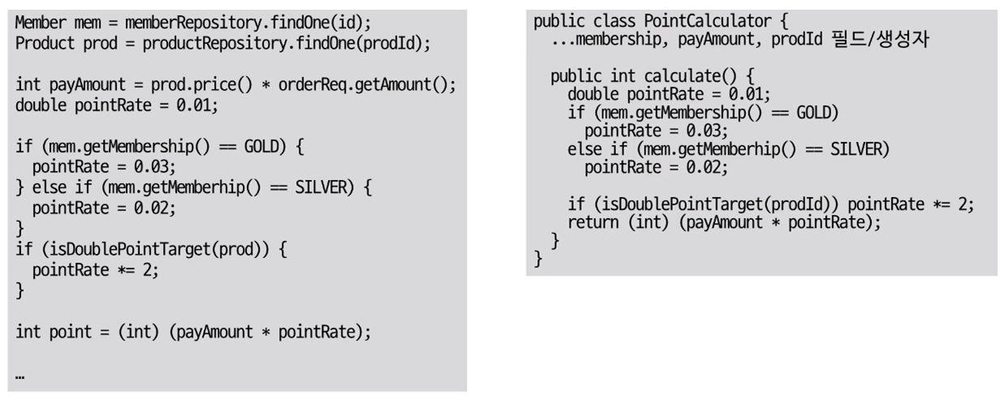
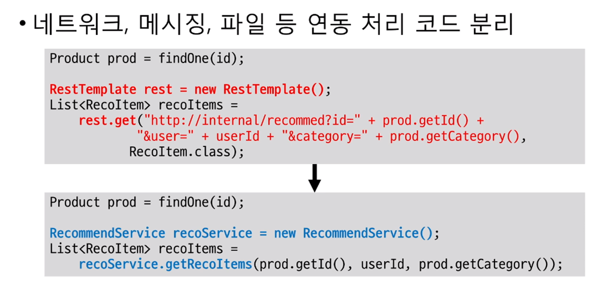
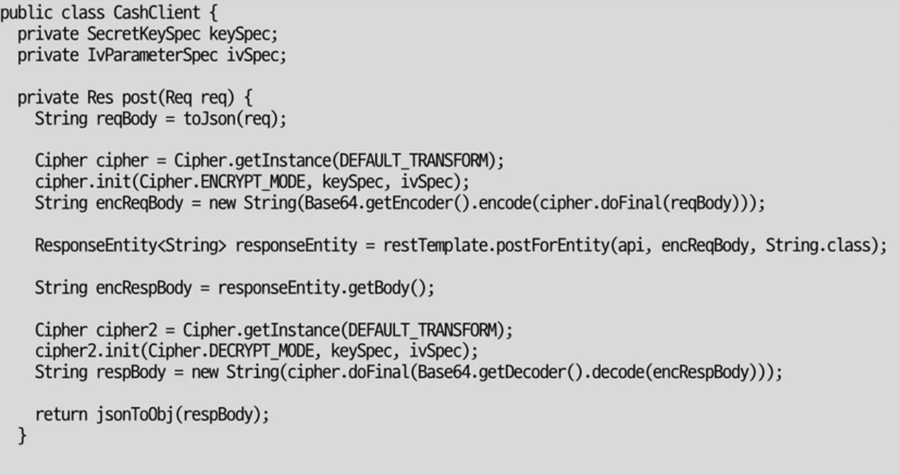
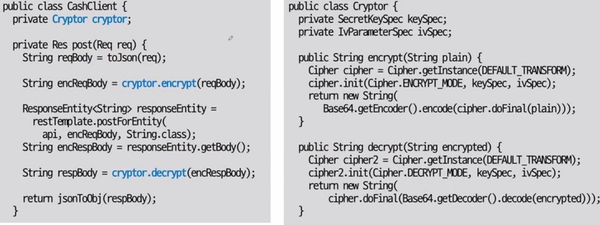
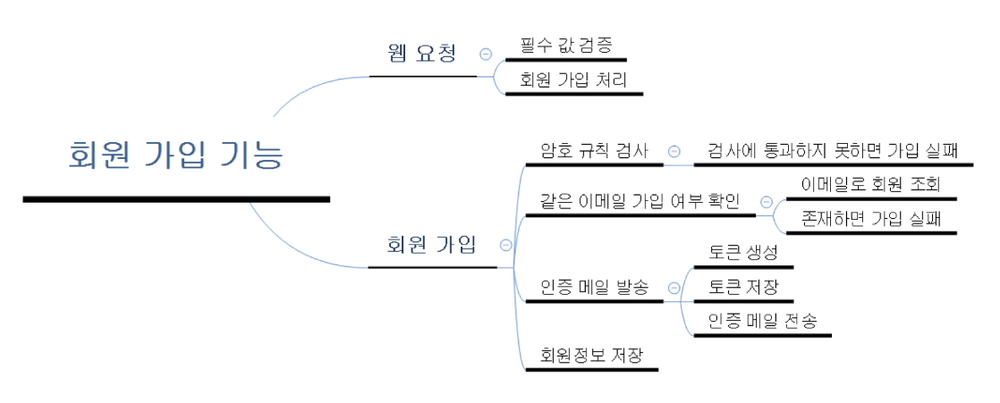
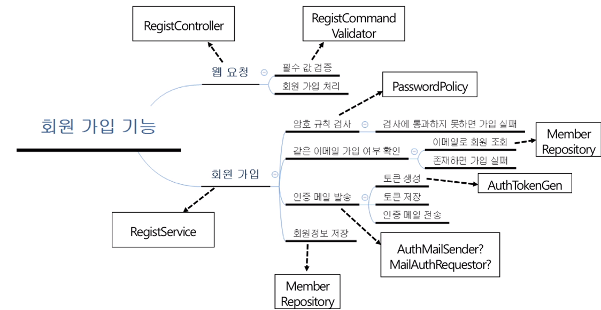

# 기능과 책임 분리

## 기능 분해

> 하나의 기능은 여러 하위 기능을 이용해서 구현하게 된다.


### 기능을 누가 제공할 것인가?

- 기능은 곧 책임
    - 분리한 각 기능을 알맞게 분배해야한다.



> 분리한 기능을 누가 제공할지 결정하는 것
> => 객체지향 설계의 기본 과정

```java
public class ChangePasswordService {
    // 암호 변경
    public Result changePassword(String id, String oldPassword, String newPassword) {
        Member member = memberRepository.findById(id); // 변경 대상 조회
        member.changePassword(oldPassword, newPassword); // 대상 암호 변경
    }
}
```

### 큰 클래스, 큰 메서드

- 클래스나 메서드가 너무 크면 (소스 코드가 길어지면) 절차지향과 동일한 문제가 생긴다.
    - 큰 클래스 => 많은 필드를 많은 메서드가 공유
    - 큰 메서드 => 많은 변수를 많은 코드가 공유
    - 여러 기능이 한 클래스/메서드에 섞여 있을 가능성이 높다.

> 책임에 따라 알맞은 코드 분리가 필요하다.



## 책임 분배 / 분리 방법

### 패턴 적용

- 간단한 웹
    - 컨트롤러, 서비스, DAO
- 복잡한 도메인
    - 엔티티, VO, 레파지토리, 도메인 서비스
- AOP
    - Aspect
- GOF
    - 팩토리, 빌더, 전략, 프록시/데코레이터 등..

### 계산 분리

- 분리 전

```java
Member member = memberRepository.findById(memberId);
Product product = productRepository.findById(productId);

// 계산 시작
int payAmount = product.price() * orderRequest.getAmount();
double pointRate = 0.01;

if (member.getMembership() == GOLD) {
    pointRate = 0.03;
} else if (member.getMembership() == SILVER) {
    pointRate = 0.02;
}

if (isDoublePointTarget(product)) {
    pointRate *= 2;
}

int point = (int) (payAmount * pointRate);
// 계산 끝
```

- 분리 후

```java
public class PointCalculator {
    private final Membership membership;
    private final Product product;
    private final int amount;

    public PointCalculator(Membership membership, Product product, int amount) {
        this.membership = membership;
        this.product = product;
        this.amount = amount;
    }

    public int calculate() {
        int payAmount = product.price() * amount;
        double pointRate = 0.01;

        if (this.membership == GOLD) {
            pointRate = 0.03;
        } else if (this.membership == SILVER) {
            pointRate = 0.02;
        }

        if (isDoublePointTarget(this.product)) {
            pointRate *= 2;
        }

        return (int) (payAmount * pointRate);
    }
}
```

```java
Member member = memberRepository.findById(memberId);
Product product = productRepository.findById(productId);

PointCalculator pointCalculator = new PointCalculator(member.getMembership(), product, request.getAmount());
int point = pointCalculator.calculate();

```

#### 역할 분리와 테스트

역할 분리가 잘 되면 해당 객체의 테스트도 편해진다.



### 연동 분리



### 조건 분기 추상화

if 문에서 비교하는 조건이 비슷하다면 이를 추상화할 수 있다.

- 분리 전

```java
String fileUrl = null;

if (fileId.startsWith("local:")) {
    fileUrl = "/files/" + fileId.substring(6);
} else if (fileId.startsWith("ss:")) {
    fileUrl = "http://fileserver/files/" + fileId.substring(3);
}
```

- 분리 후

```java
public interface FileInfo {
    String getUrl();

    static FileInfo getFileInfo(String fileId) {
        if (fileId.startsWith("local:")) {
            return new LocalFileInfo(fileId);
        } 
        
        if (fileId.startsWith("ss:")) {
            return new SSFileInfo(fileId);
        }

        throw new IllegalArgumentException();
    }
}

public class LocalFileInfo implements FileInfo {
    private final String fileId;

    public LocalFileInfo(String fileId) {
        this.fileId = fileId;
    }

    @Override
    public String getUrl() {
        return "/files/" + fileId.substring(6);
    }
}

public class SSFileInfo implements FileInfo {
    private final String fileId;

    public SSFileInfo(String fileId) {
        this.fileId = fileId;
    }

    @Override
    public String getUrl() {
        return "http://fileserver/files/" + fileId.substring(3);
    }
}
```

```java
FileInfo fileInfo = FileInfo.getFileInfo(fileId);
String fileUrl = fileInfo.getUrl();
```

> ※ 주의: 의도가 잘 드러나는 이름 사용하기

## 분리 예

### 1번 예제





### 2번 예제

- 기능: 회원 가입
    - 사용자는 이메일, 이름, 암호 입력
        - 모두 필수
    - 암호가 다음 규칙을 통과하지 않으면 다시 입력
        - 규칙1, 규칙2, 규칙3
    - 같은 이메일로 가입한 회원이 있으면 다시 입력
    - 이메일 인증을 위한 메일 발송
        - 유효성 검증을 위해 암호화 된 토큰을 사용
    - 회원 가입 완료



