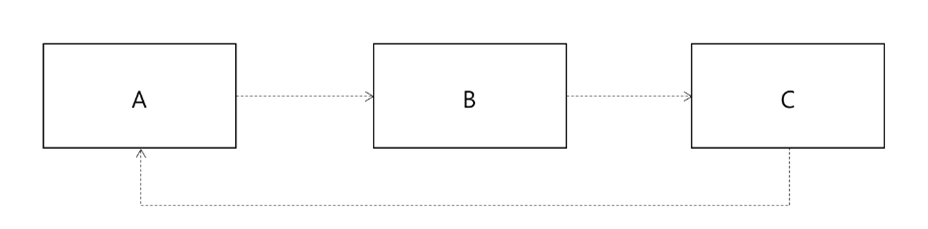
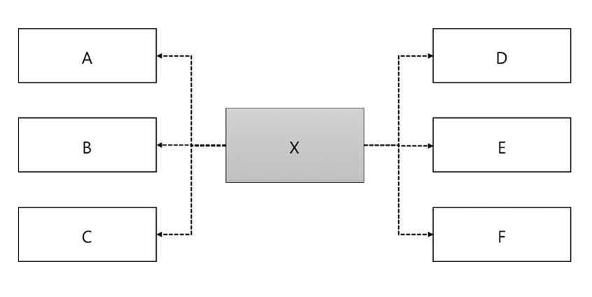
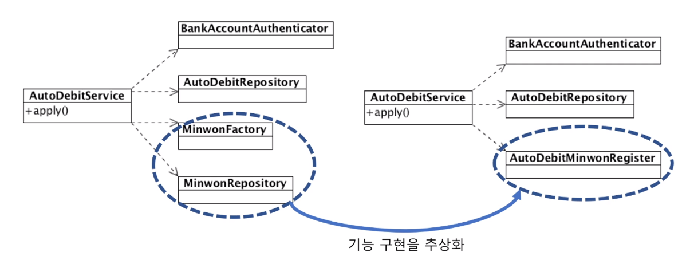

# 의존과 DI

## 의존

- 기능 구현을 위해 다른 구성 요소를 사용하는 것
    - e.g.) 객체 생성, 메서드 호출, 데이터 사용
- 의존은 변경이 전파될 가능성을 의미
    - e.g.) 호출 메서드의 인자 변경
    - e.g.) throw Exception
    
### 순환 의존

- 순환 의존 -> 변경 연쇄 전파 가능성
    - 클래스, 패키지, 모듈 등 모든 수준에서 순환 의존이 없도록





### 의존하는 대상이 많을 때

A, B, C, D, E, F 중 하나라도 바뀌면 X의 기능이 바뀔 가능성이 높다

> 의존은 적을 수록 좋다.

#### 기능이 많은 경우

```java
public class UserService {
    public void regist(RegistRequest registRequest) {
        // ...
    }
    
    public void changePassword(ChangeRequest changeRequest) {
        // ...
    }

    public void blockUser(BlockRequest blockRequest) {
        // ...
    }
}
```

- 각 기능마다 의존하는 대상이 다를 수 있다.
- 한 기능 변경이 다른 기능에 영향을 줄 수 있다.

> 한 클래스가 하는 일이 많다면 기능별로 나누는 것을 고려해볼 수 있다.

```java
public class UserRegistService {
    public void regist(RegistRequest registRequest) {
        // ...
    }
}

public void ChangePasswordService {
    public void changePassword(ChangeRequest changeRequest) {
        // ...
    }
}

public class UserBlockService {
    public void blockUser(BlockRequest blockRequest) {
        // ...
    }
}
```

#### 묶어보기

> 몇 가지 의존 대상을 단일 기능으로 묶어서 생각해보면 의존 대상을 줄일 수 있다.



- 클래스는 늘지만 클래스별 의존도는 낮아진다.
- 개별 기능을 테스트하는 것도 더 수월해진다.

### 의존 대상 객체를 직접 생성하면?

- 생성 클래스가 바뀌면 의존 코드도 바뀜
- 의존 대상 객체를 직접 생성하지 않는 방법
    - 팩토리, 빌더
    - 의존 주입 (Dependency Injection)

## 의존 주입 (Dependency Injection)

- 외부에서 의존 객체를 주입
    - 의존하는 객체를 직접 생성하지 않고 생성자나 메서드를 이용해서 주입

```java
public class UserMembershipSerivce {
    private final UserRepository userRepository;
    private final MembershipCalculator membershipCalculator;

    public UserMembershipSerivce(UserRepository userRepository, MembershipCalculator membershipCalculator) {
        this.userRepository = userRepository;
        this.membershipCalculator = membershipCalculator;
    }
}
```

### 조립기 (Assembler)

- 조립기가 객체 생성, 의존 주입을 처리

```java
@Configuration
public class UserConfig {
    @Bean
    public UserMembershipSerivce userMembershipSerivce() {
        return new UserMembershipSerivce(userRepository(), membershipCalculator());
    }

    @Bean
    public UserRepository userRepository() {
        return new UserRepository(...);
    }

    @Bean
    public MembershipCalculator membershipCalculator() {
        return new MembershipCalculator(...);
    }
}
```

### DI 장점

#### 의존대상이 바뀌면 조립기(설정)만 변경하면 된다.

```java
@Configuration
public class UserConfig {
    @Bean
    public UserMembershipSerivce userMembershipSerivce() {
        return new UserMembershipSerivce(userRepository(), membershipCalculator());
    }

    @Bean
    public UserRepository userRepository() {
        return new UserRepository(...);
    }

    @Bean
    public MembershipCalculator membershipCalculator() {
        return new EventMembershipCalculator(...);
    }

    // @Bean
    // public MembershipCalculator membershipCalculator() {
    //     return new MembershipCalculator(...);
    // }
}
```

####  의존하는 객체 없이 Mock 객체를 사용해서 테스트 가능

Repository 같이 일정한 테스트 결과를 얻기 어려운 경우 Mock 객체를 사용할 수 있다.

```java
private UserRepository userRepository = new MockUserRepository();
private MembershipCalculator membershipCalculator = new MembershipCalculator();

@Test
public void UserMembershipSerivce_blar_test() {
    UserMembershipSerivce userMembershipSerivce = new UserMembershipSerivce(userRepository, membershipCalculator);

    // Test logic...
}
```